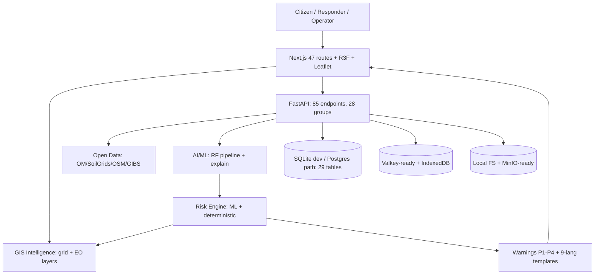

# DRISHTI-X — AI Disaster Intelligence Command Center

A free-first, GIS-driven disaster intelligence platform combining Earth observation, weather, terrain, AI/ML risk analysis, incident intelligence, early warning, emergency response, and resilience workflows.

> **Working prototype — not a certified emergency-warning system.** It does not replace official government warnings or professional disaster-response procedures. Live, demo, and unavailable integrations are labeled as such throughout.

[](https://nextjs.org/)
[](https://react.dev/)
[](https://www.typescriptlang.org/)
[](https://www.python.org/)
[](https://fastapi.tiangolo.com/)
[](#-license)

**Live Demo:** https://drishti-ai-command-center.vercel.app/ (frontend; backend-dependent panels degrade to labeled DEMO when the API is unreachable — verified on `/model-health`)
**GitHub Repository:** https://github.com/hemanthhemanth1834-bit/drishti-ai-command-center.git

## Table of Contents

- [Overview](#-overview) · [Why DRISHTI-X](#-why-drishti-x) · [Key Capabilities](#-key-capabilities)
- [Disaster Coverage](#-disaster-coverage) · [Sector Coverage](#-sector-coverage) · [Geographic Coverage](#-geographic-coverage)
- [AI/ML](#-aiml) · [Risk Intelligence](#-risk-intelligence) · [GIS](#-gis) · [Earth Observation](#-earth-observation)
- [Weather & Rainfall](#-weather--rainfall) · [Terrain](#-terrain) · [Incident Management](#-incident-management)
- [Emergency Response](#-emergency-response) · [Offline Capability](#-offline-capability) · [Multilingual Support](#-multilingual-support)
- [Data Sources](#-data-sources) · [Technology Stack](#-technology-stack) · [Project Structure](#-project-structure)
- [Installation](#-installation) · [Environment Variables](#-environment-variables) · [Docker](#-docker) · [Development](#-development)
- [API](#-api) · [Database](#-database) · [Authentication & RBAC](#-authentication--rbac) · [Testing](#-testing)
- [Deployment](#-deployment) · [Data Integrity](#-data-integrity) · [Security](#-security) · [Performance](#-performance)
- [Limitations](#-limitations) · [Roadmap](#-roadmap) · [Contributing](#-contributing) · [License](#-license) · [Acknowledgements](#-acknowledgements)

## 🌐 Overview

**DRISHTI-X**
**AI DISASTER INTELLIGENCE COMMAND CENTER**

See Early. Understand Better. Act Faster. Save Lives.

DRISHTI-X is a Next.js + FastAPI platform where **GIS + AI/ML + weather + terrain + sensors + citizen reports** read and write the same intelligence loop, served through a cinematic command-center UI (`/`), an operator deck (`/command`), a 17-module intelligence hub (`/intelligence`), and a NE-India 3D center (`/nesafe`). Designed for citizens, field responders, operators, emergency-management teams, authorities, and researchers — with prototype/demo capabilities explicitly separated from operational ones.

## ❓ Why DRISHTI-X

Disaster response fails fastest at the seams: rainfall data lives apart from terrain maps, terrain apart from road status, roads apart from field reports, and all of it apart from the citizens at risk. DRISHTI-X connects them: open data in → validation → features → AI/ML + transparent rules → GIS heatmap → warnings → authority + citizen interfaces → field verification → database → continuous learning.

## ✨ Key Capabilities

| Capability | Description | Status |
|---|---|---|
| GIS Risk Map (`/risk-map`) | Leaflet heatmap + live NASA GIBS satellite layers + incidents/sensors/roads/shelters | IMPLEMENTED (risk values DEMO) |
| Weather & Rainfall (`/weather`) | Open-Meteo current/forecast, observed-vs-forecast split, thresholds | LIVE/EXTERNAL |
| Satellite (`/satellite`) | GIBS layers live; Sentinel/Copernicus/ISRO adapters | Provider-dependent |
| ML Risk (`/prediction`, `/ml`) | RandomForest pipeline, explanations, model lab | Demo/Synthetic |
| Terrain (`/terrain`) | Elevation/slope/aspect + twin params | SIMULATED (procedural DEM) |
| Incidents (`/incidents`) | Photo/video/GPS reports, verify workflow, offline queue | IMPLEMENTED |
| Response (`/response`) | Transparent P1–P4 triage with WHY | IMPLEMENTED (DEMO data) |
| Offline PWA (`/offline`) | IndexedDB queue, receipts, auto-sync (no Background Sync) | IMPLEMENTED |
| Notifications | In-app live; SMS/push/email | NOT_CONFIGURED |
| 3D Twin (`/twin`, `/nesafe`) | Three.js/R3F terrain, sensors, simulation | SIMULATED |
| Auth/RBAC | PyJWT roles, gateway key, audit log | Prototype-grade |

## 🌪️ Disaster Coverage

Configured taxonomy (`src/config/disasters.ts`, 15 types): Landslide, Flash/River/Urban Flood, Cyclone, Storm, Heavy Rain, Earthquake, Drought, Heatwave, Wildfire (+erosion/slope-failure/road-blockage via incident types). Types drive filtering, icons, and sector mapping — **they are not separate live detection models**.

## 🏭 Sector Coverage

7 sectors (`agri, urban, industrial, health, coastal, transport` + natural): `/api/v1/sectors/impact` derives per-sector impact rows (CALCULATED from registry geometry + caller probability, `NOT_AVAILABLE` where no model exists, e.g. storm surge). Flood → agriculture/transport/health/infrastructure example included in the endpoint response.

## 🗺️ Geographic Coverage

DB-driven hierarchy Country → State → District → City → Locality → GPS (`/regions`, `/api/regions/*`): 20 Indian states, **AP 26/26 + Telangana 33/33 districts** (verified over API), 12 showcase cities with verified coordinates, US/GB/AU/JP stub rows. AP/Telangana are showcase data, not hardcoded logic. Boundary overlays are labeled schematic.

## 🧠 AI/ML

Pipeline (`backend/ml/`): 22-feature schema → feature engineering → RandomForest train (`python -m ml.train`, stratified split, `--csv` for real data) → joblib artifacts + `metrics.json` + `version.json` → inference registry (DEMO-heuristic fallback when untrained) → monitoring (honest NOT AVAILABLE drift). **The included model `Landslide-RF-v1` is trained on synthetic data; its metrics are not real-world accuracy.**

Metrics on file (`backend/ml/artifacts/metrics.json`, SYNTHETIC-DEMO): accuracy **0.8867** · precision **0.9766** · recall **0.8895** · F1 **0.931** · ROC-AUC **0.9408** · 2400 train / 600 test · confusion matrix `[[73, 11], [57, 459]]` · top feature `rainfall_24h` (0.338).

## 🎯 Risk Intelligence

Two engines, never mixed silently: ML probability (`/api/v1/ml/*`) and a deterministic weighted fallback (`/api/v1/risk/assess`, weights sum to 1.0, DEMO-labeled) shown side-by-side. Risk grid (`/api/v1/grid/risk-cells`) persists cells for the map. Every prediction returns contributions + model version + `simulated` flag.

## 🗺️ GIS

Leaflet (1.9.4) heatmaps/circles/markers/popups + MapLibre 3D GIS (`/nesafe`) + OSM tiles, Nominatim search, Overpass POIs, OSRM routing (all keyless). NER grid + region presets + click-to-inspect satellite panel. Haversine math locally; PostGIS path documented.

## 🛰️ Earth Observation

| Source | Purpose | Status | Auth | Fallback |
|---|---|---|---|---|
| NASA GIBS (VIIRS/MODIS True Color, 7-2-1) | live map tiles (HTTP-200-verified) | LIVE | none | base map |
| NASA Worldview/FIRMS/GPM | browser/API fire & rain | EXTERNAL / NOT_CONFIGURED (FIRMS key, Earthdata login) | free login | demo/OM |
| Copernicus Sentinel-1/-2, Landsat | tasking/analysis | NOT_CONFIGURED | free account | GIBS |
| ISRO/Bhuvan/Bhoonidhi | India layers | NOT_CONFIGURED | varies | GIBS/Esri |
| Historical NASA EO photos (5 vendored, public domain) | reference library | HISTORICAL | — | — |

## 🌧️ Weather & Rainfall

Open-Meteo primary (no key, live-verified): current + hourly/daily, observed-vs-forecast split, 7-day sums, anomaly vs climatology, env-tunable thresholds. IMD is an opt-in stub reporting NOT_CONFIGURED — never synthesized. Soil hierarchy: ISRO → SoilGrids (live) → Open-Meteo → DEMO, chain recorded.

## ⛰️ Terrain

Procedural Himalayan-scale DEM (slopes verified 5–40°) with elevation/slope/aspect/curvature/roughness/drainage/hill-cutting — **SIMULATED**, SRTM/Copernicus swap documented. Feeds ML + twin params.

## 📝 Incident Management

Multipart photo/video + GPS + type/severity → validation → UNVERIFIED → UNDER_REVIEW → VERIFIED/REJECTED (back-compat `verified` flag kept), AI hint (demo, labeled), duplicate-safe offline sync with per-item receipts, field verify + audit.

## 🚨 Emergency Response

Warnings WATCH→CRITICAL (INFO/ADVISORY/SEVERE/EMERGENCY included) with decision-support wording, affected villages/roads/infrastructure, forecast windows (never fixed times). P1–P4 queue explains every score. No real dispatch backend — triage aid only.

## 📴 Offline Capability

PWA shell cache + IndexedDB queue/cache + localStorage fallback + receipts + `online`-event auto-sync (`/offline`). **Background Sync API not implemented** (manual + event sync).

## 🌐 Multilingual Support

9 app langs (EN/TE/HI/AS/BN/NE/MNI/MIZO/KH) for nav/modes; EN+TE platform strings; 9-language reviewed alert templates (+TE); EN/HI/TE operator titles. Static templates, never raw MT for life-safety.

## 📡 Data Sources

Full catalog with licenses: `/data-sources` in-app + `docs/DATA-SOURCES.md`. Keyless-live: Open-Meteo, SoilGrids, OSM/Nominatim/Overpass, GIBS, Esri, CartoDB, OpenTopoMap. Credential-gated (honest stubs): IMD, Copernicus, Earthdata, FIRMS, ISRO, SMS/push/email, JWT/Ollama/Postgres.

## 🛠️ Technology Stack

| Layer | Technology |
|---|---|
| Frontend | Next.js 14.2.5, React 18.3.1, TypeScript 5.5, Tailwind 3.4, framer-motion, lucide-react |
| 3D / GIS | three 0.169, R3F 8.18, drei 9.122, Leaflet 1.9.4, MapLibre 6.10 |
| Backend | FastAPI 0.116.1, Uvicorn, Pydantic 2.11.7, SQLAlchemy 2.0.54 |
| AI/ML | scikit-learn 1.9.1, pandas 3.0.5, PyJWT 2.14.0 |
| Data | SQLite fallback; PostgreSQL/PostGIS-ready; Valkey/MinIO/Mailpit via compose `--profile full` |
| Maps/Data | OSM ecosystem, Open-Meteo, SoilGrids, NASA/Copernicus/ISRO adapters |

## 🏗️ System Architecture



Weather + Rainfall + Satellite + Terrain + Soil + Sensors + History + Incidents → Validation → Feature Engineering → AI/ML + Rules → Risk Assessment → GIS → Warning → Response → Evacuation → Recovery.

## 📁 Project Structure (actual)

```text
drishti-ai-command-center/
├── src/app/            # 46 route dirs + page.tsx (index) + layout + globals.css
├── src/components/     # home/ auth/ visuals/ layout/ cinematic/ maps/ 3d/ alerts/ ...
├── src/config/         # navigation, regions, disasters, imageSources, disasterVisuals
├── src/platform/       # api client, provenance, offlineDb, regionStore, i18n, __tests__
├── src/{store,hooks,utils,i18n,data,nesafe}/
├── public/img/         # 26 original SVGs + poster.jpg
├── public/assets/drishti-x/real-world/  # 30 pack folders (metadata) + 5 NASA photos + manifest
├── backend/app/        # main, routers (26), services, models (29 tables), seed_*
├── backend/ml/         # schemas/features/datasets/train/inference/monitoring + artifacts/
├── backend/tests/      # test_api.py, test_platform.py, test_universal.py
├── docs/ (12) · data/README · FREE-STACK.md · THIRD-PARTY-LICENSES.md
├── docker-compose.yml · backend/Dockerfile · .env.example · vercel.json
└── README.md
```

## 💻 Installation

```bash
git clone https://github.com/hemanthhemanth1834-bit/drishti-ai-command-center.git
cd drishti-ai-command-center
npm install
cp .env.example .env.local   # all keys optional
npm run dev                  # http://localhost:3000
```
```bash
cd backend
pip install -r requirements.txt
python -m ml.train --samples 3000   # or --csv data/verified.csv
uvicorn app.main:app --host 0.0.0.0 --port 8000  # docs: http://localhost:8000/docs
```

## 🔑 Environment Variables (48 in `.env.example`, all optional)

Application (`NEXT_PUBLIC_API_BASE/WS_URL/GATEWAY_KEY`, `NEXT_PUBLIC_MAP_STYLE`), Database (`DATABASE_URL`, `REDIS_URL`), Auth (`JWT_SECRET`, `OPERATOR_KEYS`, `CORS_STRICT`), Weather (`WEATHER_PROVIDER`, `IMD_API_KEY`, `RAIN_*`, `WARN_PROB_*`), Satellite (`SATELLITE_PROVIDER`, `COPERNICUS_USER`, `EARTHDATA_TOKEN`), AI (`AI_PROVIDER`, `OLLAMA_*`), Notifications (`SMS_*`, `PUSH_*`, `WEB_PUSH_*`, `SMTP_*`), Storage (`STORAGE_*`), Uploads/ML (`MAX_UPLOAD_MB`, `ML_SERVICE_URL`, `ML_MODEL_DIR`). No secrets committed (gitignored; verified by scan).

## 🐳 Docker

```bash
docker compose up --build                    # keyless demo stack (FastAPI + Next.js + SQLite)
docker compose --profile full up --build     # + PostGIS:16-3.4, Valkey:8, MinIO, Mailpit
```

## 👩‍💻 Development

Start backend first (`:8000`), then frontend (`:3000`); set `NEXT_PUBLIC_API_BASE=http://localhost:8000` to go live, otherwise pages show labeled DEMO. Train before using ML lab. See `docs/LOCAL-DEVELOPMENT.md`.

## 🔌 API (85 endpoints, 28 groups — from live OpenAPI)

ML `ml/*`, model-health, weather, rainfall, sensors (+legacy `GET /api/v1/sensors`, preserved), satellite, terrain, history, warnings, roads, response, notifications, incidents, vision, grid, risk, alerts, sync, admin, nesafe, regions (10), ai, resources, sectors, ops, auth, api_v1, ws. Mutations need `Authorization: Bearer` (gateway key or JWT); honest 400/401/403/429/503. Details: `docs/API.md`.

## 🗄️ Database

29 tables across `platform.py` (17: sensors/readings, weather, terrain, satellite, history, predictions, risk_cells, alerts, notifications, field_reports, roads, places, response_units, users, audit, model_versions) and `geo.py` (12: countries→localities, disasters, sectors, agencies, resources, shelters, risk/evacuation zones). SQLite dev file (gitignored, lazy-init + additive migration shim + DEMO/geo seeds); Postgres/PostGIS documented path (`docs/DATABASE.md`).

## 🔐 Authentication & RBAC

PyJWT HS256 (12h, `require exp`), 16 roles (citizen→sys_admin, least-privilege), gateway-key bootstrap + `OPERATOR_KEYS`, rate-limited + audited login (`/api/v1/auth/*`), in-memory frontend token. Prototype-grade: dev key default, open CORS unless `CORS_STRICT=true`.

## ✅ Testing (executed 2026-09-16)

```bash
cd backend && python -m pytest -q   # 51 passed (9 legacy + 26 platform + 16 universal/auth)
npm test                             # 7 passed (vitest: templates, geo config, region store)
npm run typecheck                    # clean
npm run lint                         # clean
npm run build                        # 47/47 routes static
```
GitHub Actions: `pr-check.yml` (Node 20 typecheck+lint, Python 3.11 compile) and `deploy.yml` (full build) run on PRs/pushes to main. Tests verify contracts and honesty flags — not real-world prediction skill.

## 🚀 Deployment

- **Demo/live:** Vercel serves the **frontend** (auto-linked repo). Verified live: `/` index, `/regions`, `/risk-map` (live GIBS panel), `/history` (photo library), `/model-health` (honest NOT AVAILABLE without backend).
- **Local/production:** FastAPI via uvicorn/Docker; set `NEXT_PUBLIC_API_BASE` + keys in Vercel env for a fully live frontend; tighten `CORS_ORIGINS` + `CORS_STRICT=true`.

## 🏷️ Data Integrity

Every value carries `LIVE / FORECAST / EXTERNAL / DEMO / SIMULATION / OFFLINE / STALE / NOT_CONFIGURED / NOT_AVAILABLE` (+`CACHED`, `MODEL`, `HISTORICAL REFERENCE`). Demo can never silently become live: flags ride every API response into badge UI and are asserted in tests.

## 🔒 Security

RBAC, rate limits, upload type/size guards + scanner hook, path-traversal-safe storage, security headers, env-only secrets, audit logging. Known dev-only items: default gateway key, open CORS default, SQLite, minimal-JWT-already-PyJWT. See `SECURITY.md`.

## ⚡ Performance

Code-split 3D/maps (`ssr:false`), server-side grid, bounded queries (≤100–500 rows), lazy images, 1 req/s Nominatim throttle + cache, 12s API timeouts, in-memory ops stats (200-sample window). No paid monitoring.

## ⚠️ Limitations (verified)

Synthetic ML data (87% positive skew); sparse demo geography outside showcases; procedural terrain; no bulk satellite ingestion; SMS/push/email unconfigured; no Background Sync; JWT without refresh rotation; SQLite default; duplicate incidents possible; CI on Python 3.11 vs local 3.14.

## 🗺️ Roadmap

- [x] Universal geo + sectors + TE-first + free providers + offline + visual layer
- [ ] Verified historical dataset + retrain + calibration + drift baselines
- [ ] SRTM DEM swap + PostGIS deploy + live sensor fleet
- [ ] VAPID push E2E + SMS/email providers + duplicate detection + Background Sync
- [ ] E2E browser tests + production observability

## 🤝 Contributing

See `CONTRIBUTING.md` (additive PRs, no synthetic-as-live, typecheck+lint+build+pytest green, real-capture screenshots).

## 📄 License

**Not yet specified** — no LICENSE file in the repository. Educational/hackathon use; contact the author for other uses.

## 🙏 Acknowledgements

NASA (Worldview/GIBS/FIRMS/GPM/Earth Observatory/JPL), Copernicus, ISRO/Bhuvan, OpenStreetMap/Overpass/Nominatim, Open-Meteo, SoilGrids/ISRIC, Esri/CARTO/OpenTopoMap, U-Tokyo DMEWS, ready.gov/fema.gov/usa.gov (reference links), scikit-learn, FastAPI, Next.js, Leaflet, three.js. Full licenses: `THIRD-PARTY-LICENSES.md`.

## 🆕 DRISHTI-X Command-Center Upgrade (2026-09)

Integrated the UI/UX + 3D + live-data upgrade **additively** — no working route, API, or backend workflow was removed.

**New modules (all adapted to this repo's structure, not blindly copied):**

| Design reference | Real implementation | Notes |
|---|---|---|
| `src/styles/tokens.css` | `src/app/globals.css` (upgrade-tokens layer) | Severity + feed-state colors, responsive grid, focus states |
| `src/data/mockData.js` | `src/data/operational.ts` | Typed DEMO fallback only; backend APIs keep priority |
| `src/services/liveServices.js` | `src/lib/liveServices.ts` | Open-Meteo + USGS live; GIBS LATEST_AVAILABLE; FIRMS NOT_CONFIGURED; 12s timeout + abort + TTL cache |
| `src/components/map/DisasterMap.js` | `src/components/map/DisasterMap.tsx` | 8 layers (RISK/EVACUATION/RESPONDERS/INFRA/SAT/WX/QUAKE/FIRE), position preserved in localStorage |
| `src/components/intelligence/SituationBrief.js` | `src/components/intelligence/SituationBrief.tsx` | Observed → Analysis → Recommendation; analyses never stated as facts |
| `src/components/3d/DisasterGlobe.js` | `src/components/3d/DisasterGlobe.tsx` | R3F globe, India focus, quality + performance mode, reduced-motion, 2D fallback |
| `src/components/live/LiveImagery.js` | `src/components/live/LiveImagery.tsx` | 6-panel wall with SOURCE/LOCATION/TIMESTAMP/STATUS; NO LIVE FEED where none exists |
| — | `src/components/command/LiveStatusStrip.tsx` | Feed-status strip on `/command` |
| — | `src/app/reports/page.tsx`, `src/app/settings/page.tsx` | Missing command-center routes added |

**Live vs Demo (honest states):** `LIVE` (Open-Meteo, USGS, backend when reachable) · `RECENT`/`STALE` (TTL cache) · `LATEST_AVAILABLE` (GIBS daily NRT) · `OFFLINE` (unreachable) · `DEMO` (local fallback rows) · `NO_FEED` (drone fleet — none connected) · `NOT_CONFIGURED` (FIRMS/Copernicus/SMS — keys absent).

**New routes:** `/reports` (ledger + CSV export) · `/settings` (local prefs + source transparency). **No new dependencies** — Leaflet, Three.js/R3F, and Tailwind were already present and are reused.
