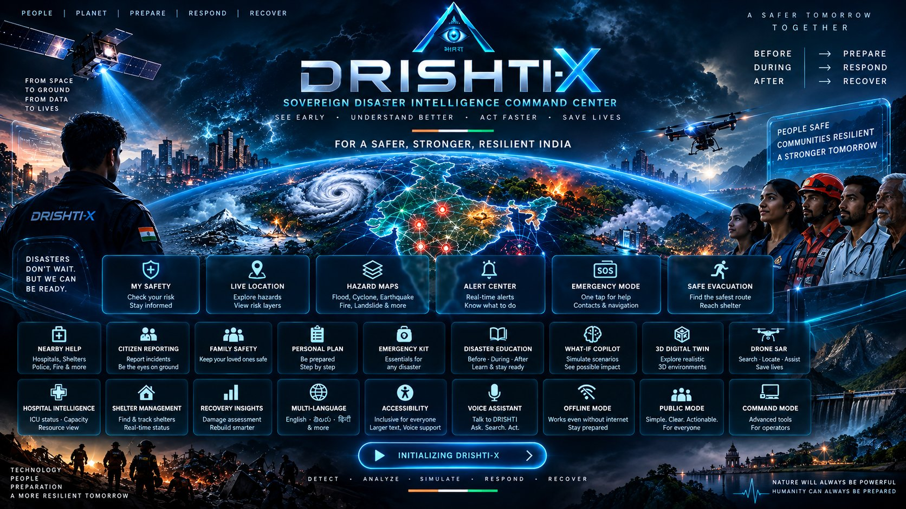

<div align="center">

# DRISHTI-X

### Sovereign Real-Time Disaster Intelligence Command Center

A unified disaster intelligence platform connecting citizens, geospatial risk intelligence, emergency response, drone SAR, hospitals, shelters, 3D digital twins, simulation, and recovery.


**[🚀 LIVE DEMO](https://drishti-ai-command-center.vercel.app/welcome) · [🛰️ COMMAND CENTER](https://drishti-ai-command-center.vercel.app/command) · [🛡️ CITIZEN SAFETY](https://drishti-ai-command-center.vercel.app/safety) · [🎬 DEMO MODE](https://drishti-ai-command-center.vercel.app/demo) · [💻 GITHUB](https://github.com/hemanthhemanth1834-bit/drishti-ai-command-center)**

</div>

---

## 🚀 Project Status

| Area | Status |
|---|---|
| Routes | ✅ 28/28 verified (27 pages + root redirect) |
| TypeScript | ✅ PASS (`tsc --noEmit` clean) |
| ESLint | ✅ PASS (`next/core-web-vitals`, zero warnings) |
| Backend Tests | ✅ 9/9 PASS (pytest contract suite) |
| Production Build | ✅ PASS (cloud build, all routes prerendered) |
| Production Routes | ✅ 28/28 |
| Security Audit | ✅ CLEAN (no secrets in repo, CHANGE_ME examples) |
| PWA / Offline | ✅ Service worker + offline banner |
| Accessibility | ✅ Toolbar, skip link, reduced-motion, read-aloud |
| Multilingual | ✅ EN / TE / HI dictionary + full Learn translation |

---

## 🖼️ Hero Visual



*Official project artwork (`public/poster.jpg`) — also the live welcome hero. Replace it with any 16:9 JPG to re-skin; no code change needed.*

---

## 🎬 60-Second Demo

**WELCOME → DEMO SCENARIO → RISK ESCALATION → CITIZEN SAFETY → SAFE EVACUATION → DRONE SAR → 3D TWIN → COMMAND OPS → RECOVERY**

| Step | Do this | See this |
|---|---|---|
| 1 | Open [/welcome](https://drishti-ai-command-center.vercel.app/welcome), press ENTER | Poster → safety dashboard |
| 2 | [/demo](https://drishti-ai-command-center.vercel.app/demo) → START flood | DemoBar appears on every route |
| 3 | Watch [/command](https://drishti-ai-command-center.vercel.app/command) | Badge flips STABLE → CRITICAL, banner + ticker move |
| 4 | [/safety](https://drishti-ai-command-center.vercel.app/safety) → CHECK MY RISK | Personal risk + VIEW SAFE ROUTE |
| 5 | [/evacuate](https://drishti-ai-command-center.vercel.app/evacuate) | ★ SAFEST PICK + WHY THIS ROUTE |
| 6 | [/drones](https://drishti-ai-command-center.vercel.app/drones) | SAR grid + 2 km radius |
| 7 | [/twin](https://drishti-ai-command-center.vercel.app/twin) | Surge slider + click a hazard → RISK |
| 8 | [/ops](https://drishti-ai-command-center.vercel.app/ops) | KPIs + SYSTEM HEALTH |
| 9 | END DEMO | Everything back to nominal |

> ⚠️ **DEMO/SIMULATION DATA IS NOT LIVE EMERGENCY DATA.** Every drill number on screen carries a LIVE / DEMO / SIMULATION / LOCAL / OFFLINE badge with its source.

---

## 🖥️ Inside DRISHTI-X

Route screenshots live in [`docs/screenshots/`](docs/screenshots/) (contribution guide inside — captures must come from the real running app; no mockups are committed).

| Citizen Safety | Command Center |
|---|---|
| `/safety` — risk dashboard, hazard cards | `/command` — telemetry deck, banner, ticker |

| 3D Digital Twin | Drone SAR |
|---|---|
| `/twin` — satellite terrain, surge, VFX | `/drones` — grid, radius, fleet |

| Location Intelligence | Operations |
|---|---|
| `/location` — layers, GPS report, Google tab | `/ops` — KPIs, health, replay |

**Demo flow (text diagram — no fabricated GIF):**

```
NORMAL → WATCH → WARNING → CRITICAL → EVACUATION → RESCUE → RECOVERY
  │        │         │          │            │           │         │
  ▼        ▼         ▼          ▼            ▼           ▼         ▼
 calm   rain cell  risk↑   discharge   buses out   FLIR+boats  audit
```

---

## 🎯 The Problem

Disaster information is fragmented across weather bulletins, paper maps, WhatsApp rumors, hospital phone lines, shelter lists, rescue teams and sensor silos. Citizens get noise; operators get dashboards that don't talk to each other.

## ⚡ The DRISHTI-X Solution

One unified intelligence layer:

```
DETECT → ANALYZE → ALERT → EVACUATE → RESPOND → RESCUE → RECOVER
```

Live telemetry where it exists, clearly-labeled simulation where it doesn't, and provider interfaces so official feeds plug in later without touching a single page.

---

## 👥 Two Experiences. One Platform.

### 🛡️ Citizen Mode

Answers **AM I SAFE? · WHAT HAPPENED? · WHAT SHOULD I DO? · WHERE SHOULD I GO? · HOW DO I GET HELP?**

Routes: `/welcome` `/safety` `/risk` `/alerts` `/nearby` `/evacuate` `/emergency` `/report` `/family` `/plan` `/kit` `/learn` `/talk` — big buttons, plain language, no operator telemetry.

### 🛰️ Command Mode

Answers **WHAT IS HAPPENING? · WHERE? · HOW SEVERE? · WHO IS AFFECTED? · WHAT SHOULD RESPONDERS DO NEXT?**

Routes: `/command` `/ops` `/demo` `/drones` `/twin` `/location` `/simulation` `/resources` `/shelter` `/reunion` `/recovery` `/platform` `/sources` — telemetry, 3D, SAR, ICU, simulation, KPIs.

---

## 🧩 Core Capabilities

| Capability | Status |
|---|---|
| Citizen Safety dashboard | ✅ `/safety` |
| Risk Intelligence + WHY factors | ✅ `/safety` `/risk` |
| Multi-Hazard Alerts + notifications | ✅ `/alerts` |
| Safe Evacuation (≤30 km, exposure-ranked) | ✅ `/evacuate` |
| Location Intelligence (GPS, OSM, layers) | ✅ `/location` |
| Drone SAR (grid, radius, SIM telemetry) | ✅ `/drones` |
| 3D Digital Twin (satellite, VFX, picking) | ✅ `/twin` |
| Hospital Intelligence (SIM capacity) | ✅ `/resources` |
| Shelter Intelligence (DEMO status) | ✅ `/shelter` `/nearby` |
| What-If Simulation + impact model | ✅ `/simulation` |
| Demo Scenario + Mission Replay | ✅ `/demo` `/platform` |
| System Health (real probes) | ✅ `/ops` |
| Recovery & Audit ledger | ✅ `/recovery` |
| Citizen Reporting pipeline | ✅ `/report` |
| Family Safety | ✅ `/family` |
| Emergency Plan + Kit | ✅ `/plan` `/kit` |
| Disaster Education (trilingual) | ✅ `/learn` |
| Voice Assistant (Web Speech) | ✅ `/talk` |
| Offline / PWA | ✅ Service worker + banner |
| Accessibility toolbar | ✅ Text, contrast, motion, read-aloud |
| EN / TE / HI | ✅ Dictionary + full Learn pass |

---

## 🌊 Disaster Scenario (Vijayawada Flood Response · SIMULATION)

```
NORMAL → HEAVY RAIN → RIVER RISING → WATCH → WARNING → CRITICAL
→ EVACUATION → DRONE SAR → HOSPITAL RESPONSE → RESCUE → RECOVERY
```

One shared ops store drives scenario + spillway through 7 engine phases, so **Risk, Alerts, Maps, Hazard Zones, 3D Twin, Drones, Shelters, Hospitals, Citizen + Command dashboards, Ops KPIs and Replay stay synchronized**. Run it from `/demo`, `/platform` or `/ops`; the DemoBar persists on every route with auto-play.

---

## 🏗️ System Architecture

```
CITIZEN / OPERATOR
        ↓
NEXT.JS 14 APPLICATION (App Router, 27 pages)
        ↓
DOMAIN SERVICES (riskEngine · alertRules · opsStore · geocode · overpass)
        ↓
RISK / ALERT / EVACUATION / TELEMETRY logic
        ↓
PROVIDER INTERFACES (Hazard · Weather · Alert · Shelter · Hospital · Evacuation · Incident · Drone)
        ↓
DEMO / LOCAL PROVIDERS (labeled cells · localStorage · sim telemetry · drill scripts)
        ↓
FUTURE OFFICIAL DATA SOURCES (plug in without touching pages)
```

See `/platform` in the app for the interactive version of this map.

---

## 🛠️ Technology Stack

**Frontend:** Next.js 14.2.5 · React 18 · TypeScript 5 · Tailwind CSS 3 · Three.js · Leaflet + OpenStreetMap · lucide-react
**Backend:** FastAPI · Python 3.11 · Uvicorn · WebSockets · Pydantic · pytest + httpx
**Data/Maps (free, no keys):** Nominatim · Overpass API · Browser Geolocation · Google Maps keyless embed (rich place data only with optional key)
**Platform:** PWA + Service Worker · localStorage (prefs, reports, checklists) · Web Speech API · Web Notifications API
**What we deliberately do NOT use:** no paid maps, no paid AI, no paid DB/auth, no IndexedDB (localStorage covers current needs), no secrets in code.

---

## 🔐 Data Trust Model

| Badge | Meaning |
|---|---|
| 🟢 LIVE | Real measured/streamed data (WS telemetry, OSM responses, probe results) |
| 🟡 DEMO | Illustrative data for drills (hazard cells, shelters, alerts, ICU numbers) |
| 🔵 SIMULATION | Model output (surge math, exposure ranking, ETAs, drill metrics) |
| 🟣 LOCAL | On-device only (prefs, reports, family, checklists) |
| ⚪ OFFLINE | Cached content shown without connectivity — never presented as live |

Every important panel shows **SOURCE · STATUS · LAST UPDATED**. Demo providers live behind interfaces in `src/data/providers.ts`.

---

## ♿ Designed for Real-World Conditions

- EN / TE / HI dictionary + fully translated Learn library (8 topics × Before/During/After + Emergency + Do/Don't)
- Keyboard navigation, `:focus-visible` rings, skip-to-content link, screen-reader labels
- `prefers-reduced-motion` respected globally + in-app Reduce-motion toggle; emergency info stays readable with animations off
- Large-text + high-contrast modes, read-aloud toolbar
- PWA offline shell: emergency/learn/safety pages cached; OFFLINE MODE + LAST SYNCHRONIZED banner; reconnect-friendly

---

## 🔌 Future Official Integrations (ROADMAP — not live)

IMD weather · NDMA/CAP alerts · Government disaster feeds · River/IoT sensors · Hospital HMIS · Shelter registries · Bhuvan satellite tiles · MAVLink drone link — each maps 1:1 onto an existing provider interface. **None of these are connected today, and the app never claims otherwise.**

---

## 🧪 Engineering Verification

| Check | Result |
|---|---|
| `npm run typecheck` | ✅ clean (also in CI) |
| `npx next lint --dir src` | ✅ zero warnings (`next/core-web-vitals`) |
| `cd backend` → `python -m pytest tests/ -q` | ✅ 9/9 (health, auth, packet shape, scenario, sensors, WS) |
| Production build | ✅ cloud build, all routes prerendered |
| Routes | ✅ 28/28 local + 28/28 production |
| Security | ✅ no secrets in repo, CHANGE_ME examples |

> Local `npm run build` requires the dev server stopped (shared `.next/`); every `vercel --prod` is the standing build proof.

---

## 🗺️ Routes

**WELCOME** `/` → `/welcome` (poster, ENTER-to-enter) · **COMMAND** `/command` deck · `/ops` KPIs+health · `/demo` presenter
**CITIZEN** `/safety` `/risk` `/emergency` `/alerts` `/nearby` `/evacuate` `/report` `/family` `/plan` `/kit` `/learn` `/talk`
**INTELLIGENCE** `/location` `/drones` `/twin` `/simulation` · **OPERATIONS** `/resources` `/shelter` `/reunion` `/recovery` · **PLATFORM** `/portal` `/platform` `/sources`

---

## ⚙️ Local Development Setup

<details>
<summary><b>First-time setup (backend + frontend + env)</b></summary>

```powershell
cd drishti-ai-command-center\backend
copy .env.example .env
```
Creates `.env` (`GATEWAY_KEY`, `CORS_ORIGINS`, `TELEMETRY_HZ`). Git-ignored — generate your own value (examples use `CHANGE_ME`).

```powershell
pip install -r requirements.txt
```
FastAPI, Uvicorn, Pydantic, pytest, httpx.

```powershell
cd drishti-ai-command-center
copy .env.local.example .env.local
```
Creates `.env.local` (`NEXT_PUBLIC_API_BASE`, `NEXT_PUBLIC_WS_URL`, `NEXT_PUBLIC_GATEWAY_KEY` = same value as backend). Optional `NEXT_PUBLIC_GOOGLE_MAPS_KEY` for rich place data; empty = free keyless map.

```powershell
npm install
```
Next.js, React, Leaflet, Three.js, Tailwind, lucide-react. `package-lock.json` pins versions.

</details>

<details>
<summary><b>Daily run (two terminals) + Docker + deploy</b></summary>

Terminal 1: `cd drishti-ai-command-center\backend` → `uvicorn app.main:app --host 0.0.0.0 --port 8000 --reload` (prove: `http://localhost:8000/api/health`; stream: `ws://localhost:8000/ws/telemetry`).
Terminal 2: `cd drishti-ai-command-center` → `npm run dev` → `http://localhost:3000` + **Ctrl+F5**.

Docker: `docker compose up --build` (API :8000, web :3000).
Ship: `railway up -y -d` (from `backend/`) · `vercel --prod --yes` (repo root; set `NEXT_PUBLIC_*` env first — baked at build time).
Commit: `git add -A` → `git commit -m "feat: ..."` → `git push origin main` (CI type-checks/builds).

</details>

<details>
<summary><b>📁 Project Structure</b></summary>

```text
drishti-ai-command-center/
├── .github/workflows/   # deploy.yml + pr-check.yml
├── backend/             # FastAPI (app/main.py, config, models, services, routers/api_v1+ws, tests/)
├── src/
│   ├── app/             # /, /welcome, /command, /ops, /demo, /sources + 10 tactical + 12 citizen routes
│   ├── components/      # TwinViewport, RadarMap overlays, AlertBanner, RiskChecker, DemoBar/Console/Replay,
│   │                    # SystemHealth, ArchitectureDiagram, TrustBadge, EmergencyFab, A11yBar, Navbar (modes+i18n)…
│   ├── data/            # providers.ts (8 interfaces + demo sets) + learn.ts (trilingual)
│   ├── store/           # opsStore (scenario/spillway/demo) + appStore (mode/lang/a11y)
│   ├── hooks/           # useTelemetrySocket (reconnecting WS) + useLocalList
│   ├── i18n/dict.ts     # EN/TE/HI dictionary
│   └── utils/           # apiClient, geofence, geocode+Nominatim/GPS, overpass, riskEngine,
│                        # alertRules, googlePlaces (keyed)
├── public/              # poster.jpg + manifest.json + sw.js + icon.svg
├── docs/screenshots/    # capture guide (real captures only, none fabricated)
├── tailwind.config.js + postcss.config.js + vercel.json + docker-compose.yml
```

</details>

---

## 🔒 Security

- Secrets live in git-ignored `.env` files + hosting dashboards only; examples use `CHANGE_ME`
- Repository audited for keys/tokens/passwords — clean; gateway auth guards REST, WS is local-HUD open
- Personal data (reports, family, checklists) in browser localStorage; shared coordinates rounded to ~100 m; inputs length-capped

## ⚠️ Limitations (honest)

- Demo/simulation content is clearly labeled and must never be mistaken for official warnings
- Learn TE/HI is functional, not professionally reviewed
- Overpass/Geolocation depend on third-party reachability; both degrade gracefully
- Local production build needs the dev server stopped; cloud build is the proof

## 📄 Project Information

DRISHTI-X — Sovereign Real-Time Disaster Intelligence Command Center.
No license file is committed yet — add one (e.g. MIT/Apache-2.0) before public release.
Maintainer: [@hemanthhemanth1834-bit](https://github.com/hemanthhemanth1834-bit)
