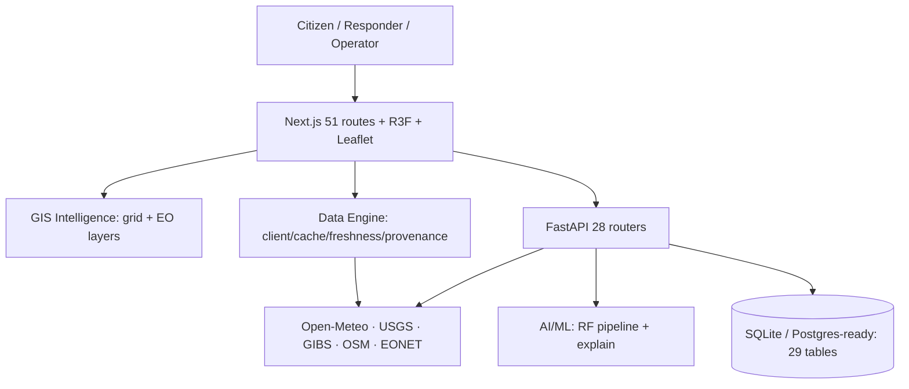
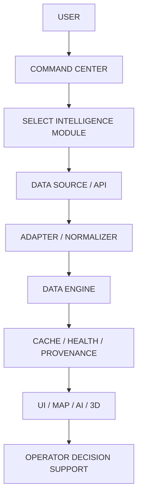
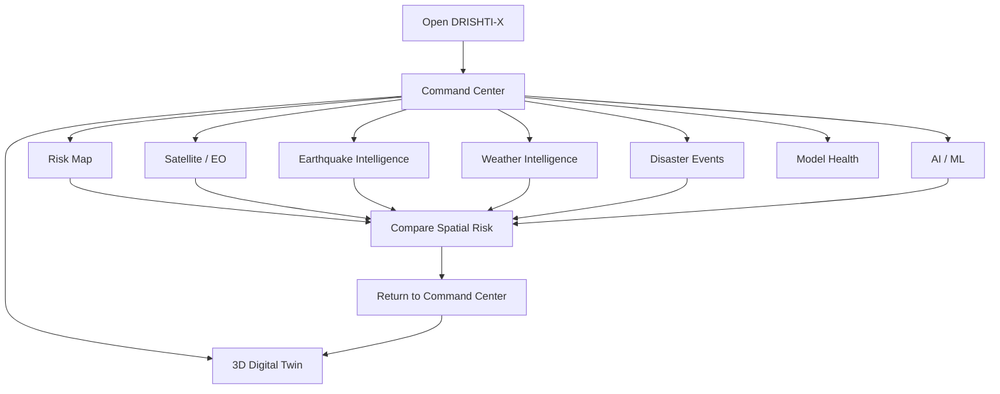

<div align="center">

# DRISHTI-X
## AI Disaster Intelligence Command Center

**See Early · Understand Better · Act Faster · Save Lives**

A free-first, GIS-driven disaster intelligence platform combining Earth observation, weather, terrain, AI/ML risk analysis, incident intelligence, early warning, emergency response, and resilience workflows — with honest LIVE / DEMO / SIMULATION / OFFLINE provenance on every value.

[](https://drishti-ai-command-center.vercel.app/)
[](https://github.com/hemanthhemanth1834-bit/drishti-ai-command-center)
[](https://github.com/hemanthhemanth1834-bit/drishti-ai-command-center/tree/main/docs)


[🌐 Live Demo](https://drishti-ai-command-center.vercel.app/) · [💻 GitHub](https://github.com/hemanthhemanth1834-bit/drishti-ai-command-center) · [📚 Documentation](https://github.com/hemanthhemanth1834-bit/drishti-ai-command-center/tree/main/docs) · [🏗 Architecture](https://github.com/hemanthhemanth1834-bit/drishti-ai-command-center/blob/main/docs/FINAL-ARCHITECTURE.md) · [🚀 Deployment](https://github.com/hemanthhemanth1834-bit/drishti-ai-command-center/blob/main/docs/DEPLOYMENT.md)

> **Working prototype — not a certified emergency-warning system.** It does not replace official government warnings. Live, demo, and unavailable integrations are labeled as such throughout. No `LICENSE` file is currently included in the repository.


> **Command artwork:** the cinematic poster rendered on the Command Center hero. Original project asset.

</div>

---

## What is DRISHTI-X?

DRISHTI-X is an AI Disaster Intelligence Command Center: a Next.js + FastAPI platform where **GIS + AI/ML + weather + terrain + sensors + citizen reports** read and write the same intelligence loop. It exists because disaster response fails fastest at the seams — rainfall data lives apart from terrain maps, terrain apart from road status, roads apart from field reports, and all of it apart from the citizens at risk. DRISHTI-X connects them.

Designed for citizens, field responders, operators, emergency-management teams, authorities, and researchers. What makes it different: **provenance honesty as architecture** — every value carries LIVE / DEMO / SIMULATION / OFFLINE / NOT_CONFIGURED status, demo can never silently become live (asserted in tests), and a post-launch truthfulness patch removed every fabricated operational number from the Command Center.

An operator can move from the [Command Center](https://drishti-ai-command-center.vercel.app/command) to the [Risk Map](https://drishti-ai-command-center.vercel.app/risk-map), inspect a geographic area, cross-reference [USGS earthquake events](https://drishti-ai-command-center.vercel.app/earthquakes), check [Open-Meteo weather](https://drishti-ai-command-center.vercel.app/weather), inspect [NASA GIBS imagery](https://drishti-ai-command-center.vercel.app/satellite), review [model health](https://drishti-ai-command-center.vercel.app/model-health), and open the [3D Digital Twin](https://drishti-ai-command-center.vercel.app/twin) — all routes verified live below.

## Quick Project Overview

| Area | DRISHTI-X Implementation |
|---|---|
| Frontend | Next.js 14.2.5 · React 18 · TypeScript 5.5 · Tailwind 3.4 |
| Backend | FastAPI 0.116.1 · 28 routers · SQLite dev / Postgres-ready (29 tables) |
| Database | SQLite file fallback; `DATABASE_URL` switch; seeds guarantee registry data |
| AI/ML | scikit-learn RandomForest `Landslide-RF-v1` (**SYNTHETIC-DEMO**, never field accuracy) |
| GIS | Leaflet 1.9.4 + MapLibre 6.10 + OSM/Nominatim/Overpass/OSRM |
| Satellite | NASA GIBS WMTS (4 layers, 14-day NRT, measured liveness) |
| Weather | Open-Meteo keyless (current/hourly/daily via data engine) |
| Earthquakes | USGS M2.5+/7d via data engine |
| Disaster Events | NASA EONET (100 records, polygons list-only) |
| 3D | Three.js 0.169 + R3F 8.18 (twin, globe, command views) |
| Deployment | GitHub `main` → Vercel Git integration (never `vercel --prod`) |
| Testing | Vitest 131/131 · Pytest 51/51 · typecheck/lint/build clean |

## System Architecture



Full version: [docs/FINAL-ARCHITECTURE.md](https://github.com/hemanthhemanth1834-bit/drishti-ai-command-center/blob/main/docs/FINAL-ARCHITECTURE.md).

## How the Project Works



1. **User** opens the Command Center and picks a module (risk, satellite, quakes, weather…).
2. **Module** requests through the **Data Engine** (`fetchDataset`), never raw `fetch()` in components.
3. **Adapter** normalizes the source payload (USGS GeoJSON, Open-Meteo, EONET, FIRMS-gated) into validated records; malformed rows are skipped and counted.
4. **Cache + freshness + health** decide HIT/STALE, FRESH/AGING/STALE, AVAILABLE/DEGRADED.
5. **UI** renders records with provenance badges; offline serves labeled stale cache or honest empty states.

## 🧭 How to Explore DRISHTI-X



1. Start at [`/command`](https://drishti-ai-command-center.vercel.app/command) — status header, KPI row, module grid.
2. Open [`/risk-map`](https://drishti-ai-command-center.vercel.app/risk-map) — layers, legend, inspect any point.
3. Open [`/satellite`](https://drishti-ai-command-center.vercel.app/satellite) — GIBS viewer, date/layer controls, fire panel.
4. Open [`/earthquakes`](https://drishti-ai-command-center.vercel.app/earthquakes) — USGS list, map, detail, timeline.
5. Open [`/weather`](https://drishti-ai-command-center.vercel.app/weather) — current vs forecast, hourly, 7-day.
6. Open [`/events`](https://drishti-ai-command-center.vercel.app/events) — EONET records, filters, map.
7. Open [`/model-health`](https://drishti-ai-command-center.vercel.app/model-health) — metrics, SYNTHETIC-DEMO banner.
8. Open [`/twin`](https://drishti-ai-command-center.vercel.app/twin) — 3D layers, cameras, timeline.

## 🚨 Intelligence Modules

| Module | Purpose · Data · State · Link |
|---|---|
| Command Center | Operational overview + per-module live status · backend + direct feeds · [open](https://drishti-ai-command-center.vercel.app/command) |
| Risk Map | GIS grid + 8-layer overlay, scale/coords/fullscreen · GIBS/OSM/grid API · [open](https://drishti-ai-command-center.vercel.app/risk-map) |
| Satellite / EO | GIBS viewer (4 layers, 14-day NRT), before/after slider · NASA · LATEST_AVAILABLE · [open](https://drishti-ai-command-center.vercel.app/satellite) |
| Fire Intelligence | FIRMS adapter, zero synthetic fires · NOT_CONFIGURED (no key) · on `/satellite` |
| Earthquake Intelligence | USGS list/map/detail/timeline · LIVE · [open](https://drishti-ai-command-center.vercel.app/earthquakes) |
| Weather Intelligence | OM current/hourly/daily, observed vs forecast · LIVE · [open](https://drishti-ai-command-center.vercel.app/weather) |
| Disaster Events | EONET records, filters, map · LIVE · [open](https://drishti-ai-command-center.vercel.app/events) |
| AI/ML | RF pipeline, playground, explanations · SYNTHETIC-DEMO · [open](https://drishti-ai-command-center.vercel.app/ml) |
| Model Health | Metrics, identity, drift honesty, timeline · OFFLINE-aware · [open](https://drishti-ai-command-center.vercel.app/model-health) |
| 3D Digital Twin | Layers, cameras, timeline, SIMULATION-labeled · [open](https://drishti-ai-command-center.vercel.app/twin) |

## 🔎 Real DRISHTI-X Examples

### Earthquake investigation
Open Command Center → Earthquake Intelligence → inspect USGS-derived events → select one → review magnitude/depth/time/location → follow provenance → [open the event on USGS](https://earthquake.usgs.gov/) via VIEW SOURCE.

### Weather intelligence
Open [`/weather`](https://drishti-ai-command-center.vercel.app/weather) → pick a verified showcase city → read OBSERVED current vs FORECAST hourly/7-day → check provenance (retrieved time, CC-BY attribution).

### Disaster event investigation
Open [`/events`](https://drishti-ai-command-center.vercel.app/events) → filter by EONET category → open detail → verify source link → view on map (point events only).

### Satellite imagery inspection
Open [`/satellite`](https://drishti-ai-command-center.vercel.app/satellite) → pick GIBS layer + nominal date → read acquisition vs retrieved times → try the Kerala before/after slider.

### Risk-map exploration
Open [`/risk-map`](https://drishti-ai-command-center.vercel.app/risk-map) → toggle layers → click any point for satellite intelligence → read per-tile measured status.

### 3D simulation exploration
Open [`/twin`](https://drishti-ai-command-center.vercel.app/twin) → toggle flood/fire/corridor layers → try camera presets → scrub the surge timeline (all SIMULATION).

### AI/model-health inspection
Open [`/model-health`](https://drishti-ai-command-center.vercel.app/model-health) → read the SYNTHETIC-DEMO banner → inspect artifact metrics → confirm calibration NOT AVAILABLE.

## Live Data vs Simulation

| Capability | State | Meaning |
|---|---|---|
| USGS earthquakes | LIVE | Measured feed, 5-min cache |
| NASA GIBS | LATEST_AVAILABLE | Daily NRT, per-tile measurement |
| Open-Meteo | LIVE | Keyless current + forecast |
| NASA EONET | LIVE | 100-record open feed |
| Backend APIs | OFFLINE | Railway trial expired; labeled fallbacks active |
| AI backend/model | OFFLINE / SYNTHETIC-DEMO | No simulated health; demo artifact labeled |
| NASA FIRMS | NOT_CONFIGURED | No key; zero synthetic fires |
| Copernicus/Sentinel | NOT_CONFIGURED | Live-probed: no public imagery path |
| 3D hazards/corridors | SIMULATION | Fixed scenario content |

## AI/ML

`Landslide-RF-v1` (scikit-learn RandomForest, 22 features) trained 2026-09-16 on synthetic data:

| Metric | Value |
|---|---:|
| Accuracy | 0.8867 |
| Precision | 0.9766 |
| Recall | 0.8895 |
| F1 | 0.931 |
| ROC-AUC | 0.9408 |
| Train / test | 2400 / 600 |
| Confusion matrix | [[73, 11], [57, 459]] |

Metrics describe the **demo artifact only**. Inference (`POST /api/v1/ml/predict`) returns probability + contributions; confidence shown only when returned. No LLM APIs. Details: [docs/AI-ML.md](https://github.com/hemanthhemanth1834-bit/drishti-ai-command-center/blob/main/docs/AI-ML.md).

## Data Engine

Typed client (12s timeout, bounded retry, in-flight dedup) → adapters (USGS/Open-Meteo/FIRMS-gated/EONET/GIBS) → validation → TTL cache → per-source freshness → provenance → health. Example: USGS GeoJSON → `adaptUsgsEarthquakes` → normalized event → 5-min cache → earthquake UI. Details: [docs/DATA-ENGINE.md](https://github.com/hemanthhemanth1834-bit/drishti-ai-command-center/blob/main/docs/DATA-ENGINE.md).

## GIS

Leaflet risk grid + 8-layer operational overlay (incidents/risk/weather/rainfall/satellite/terrain/responders/resources/drones/infra/citizen/evacuation/regions), scale control, cursor coordinates, fullscreen, click-to-inspect satellite panel, region presets; MapLibre 3D GIS on `/nesafe`; Nominatim search (1 req/s, cached), Overpass POIs, OSRM routing.

## Satellite / Earth Observation

GIBS WMTS viewer (VIIRS True Color, MODIS Terra True Color, MODIS 7-2-1, MODIS Aqua; 14-day window ending yesterday UTC); Kerala 2018 before/after reference pair; FirePanel (NOT_CONFIGURED, zero fires); honest adapters (Sentinel/FIRMS/Earthdata/ISRO gated). Sentinel stays NOT_CONFIGURED per live probe — never implied operational.

## 3D Digital Twin

Vanilla Three.js `TwinViewport` (procedural city, surge plane, pickable entities, amber corridor — all SIMULATION) + R3F globe + MapLibre command view. Operator flow: pick hazard layer → pick camera (Overview/Incident/Ground) → inspect scenario → scrub surge timeline → return to Command Center. Reduced-motion freezes decoration; WebGL failures fall back to 2D. Details: [docs/3D-DIGITAL-TWIN.md](https://github.com/hemanthhemanth1834-bit/drishti-ai-command-center/blob/main/docs/3D-DIGITAL-TWIN.md).

## Command Center

Status header (WebSocket-derived ONLINE/OFFLINE, measured-or-N/A stream rate, SIM FLEET without live count, no fabricated confidence) · feed strip · real-data KPI row · module grid with per-endpoint probing · twin viewport · rule-output AI panel · telemetry log · live map · imagery wall · globe · gallery. Full spec: [docs/COMMAND-CENTER.md](https://github.com/hemanthhemanth1834-bit/drishti-ai-command-center/blob/main/docs/COMMAND-CENTER.md).

## Route Map

51 route directories — complete inventory: [docs/ROUTE-INVENTORY.md](https://github.com/hemanthhemanth1834-bit/drishti-ai-command-center/blob/main/docs/ROUTE-INVENTORY.md). Key links in Quick Links below; fire intelligence lives in `/satellite` + the map layer (no duplicate `/fire` route by design).

## Tech Stack

| Area | Stack |
|---|---|
| Frontend | Next.js 14.2.5, React 18, TS 5.5, Tailwind 3.4, framer-motion, lucide-react |
| Backend | FastAPI 0.116.1, Uvicorn, Pydantic, SQLAlchemy, PyJWT |
| AI/ML | scikit-learn 1.9.1, pandas, joblib |
| GIS | Leaflet 1.9.4, MapLibre 6.10, OSM ecosystem |
| 3D | three 0.169, R3F 8.18, drei 9.122 |
| Data | SQLite fallback; Postgres-ready (`psycopg2-binary` pinned, dormant) |
| Testing | Vitest 1.6, pytest 8.3 |
| Deployment | Vercel Git integration; Docker; Railway-compatible |

## Repository Structure

```text
src/
├── app/          # 51 routes (page.tsx per route)
├── components/   # home/ command/ map/ 3d/ fire/ earthquake/ weather/ events/ satellite/ model/ twin/ ...
├── data/         # engine/ (client/cache/registry/adapters) + operational/regions/providers
├── platform/     # api client, provenance, maps, stores helpers
├── hooks/        # telemetry socket, dialog a11y, platform hooks
├── store/        # ops/intel/auth/app stores
├── utils/        # geocode, alerts, audio
├── config/       # navigation, regions, disasters, image sources
├── i18n/         # 9 languages
├── lib/          # liveServices (keyless feeds)
└── nesafe/       # NE-India center data/scenes
public/           # img/ (SVG set + verified NASA/FEMA/USN photos), poster.jpg
docs/             # 28 topic docs (see Documentation)
backend/          # FastAPI app (28 routers) + ml/ (schemas/train/inference) + tests/
```

## Installation

```bash
git clone https://github.com/hemanthhemanth1834-bit/drishti-ai-command-center.git
cd drishti-ai-command-center
npm install
cp .env.example .env.local   # all keys optional
npm run dev                  # http://localhost:3000
npm run lint && npm run typecheck && npm test && npm run build
```

```bash
cd backend
pip install -r requirements.txt
uvicorn app.main:app --port 8000
python -m pytest -q
```

## Environment

All optional; frontend reads only `NEXT_PUBLIC_*`. Details: [docs/ENVIRONMENT.md](https://github.com/hemanthhemanth1834-bit/drishti-ai-command-center/blob/main/docs/ENVIRONMENT.md). Never commit secrets.

## Testing

Vitest **131/131** · Pytest **51/51** · Lint clean · Typecheck clean · Build 50/50 static · production route QA + secret/fake-data scans. Details: [docs/TESTING.md](https://github.com/hemanthhemanth1834-bit/drishti-ai-command-center/blob/main/docs/TESTING.md).

## Deployment

Developer → commit → GitHub `main` → Vercel Git integration → production. Never `vercel --prod`. Live: https://drishti-ai-command-center.vercel.app/ · Details: [docs/DEPLOYMENT.md](https://github.com/hemanthhemanth1834-bit/drishti-ai-command-center/blob/main/docs/DEPLOYMENT.md).

## 📚 Documentation

[FINAL-ARCHITECTURE](https://github.com/hemanthhemanth1834-bit/drishti-ai-command-center/blob/main/docs/FINAL-ARCHITECTURE.md) · [DATA-SOURCES](https://github.com/hemanthhemanth1834-bit/drishti-ai-command-center/blob/main/docs/DATA-SOURCES.md) · [AI-ML](https://github.com/hemanthhemanth1834-bit/drishti-ai-command-center/blob/main/docs/AI-ML.md) · [GIS-SATELLITE](https://github.com/hemanthhemanth1834-bit/drishti-ai-command-center/blob/main/docs/GIS-SATELLITE.md) · [3D-DIGITAL-TWIN](https://github.com/hemanthhemanth1834-bit/drishti-ai-command-center/blob/main/docs/3D-DIGITAL-TWIN.md) · [COMMAND-CENTER](https://github.com/hemanthhemanth1834-bit/drishti-ai-command-center/blob/main/docs/COMMAND-CENTER.md) · [SECURITY](https://github.com/hemanthhemanth1834-bit/drishti-ai-command-center/blob/main/docs/SECURITY.md) · [TESTING](https://github.com/hemanthhemanth1834-bit/drishti-ai-command-center/blob/main/docs/TESTING.md) · [DEPLOYMENT](https://github.com/hemanthhemanth1834-bit/drishti-ai-command-center/blob/main/docs/DEPLOYMENT.md) · [LIMITATIONS](https://github.com/hemanthhemanth1834-bit/drishti-ai-command-center/blob/main/docs/LIMITATIONS.md) · [PROJECT-STATUS](https://github.com/hemanthhemanth1834-bit/drishti-ai-command-center/blob/main/docs/PROJECT-STATUS.md) · [ROUTE-INVENTORY](https://github.com/hemanthhemanth1834-bit/drishti-ai-command-center/blob/main/docs/ROUTE-INVENTORY.md) · [ENVIRONMENT](https://github.com/hemanthhemanth1834-bit/drishti-ai-command-center/blob/main/docs/ENVIRONMENT.md) · [FINAL-DELIVERY-SUMMARY](https://github.com/hemanthhemanth1834-bit/drishti-ai-command-center/blob/main/docs/FINAL-DELIVERY-SUMMARY.md)

## Limitations

Backend OFFLINE (Railway trial expired); FIRMS/Earthdata/Copernicus/ISRO/IMD/SMS unconfigured; synthetic ML data; simulated twin/drones; sparse demo geography; no Background Sync; prototype JWT. Full honesty list: [docs/LIMITATIONS.md](https://github.com/hemanthhemanth1834-bit/drishti-ai-command-center/blob/main/docs/LIMITATIONS.md).

## Future Scope

Backend restoration · verified provider credentials · retrain + calibration/drift baselines · SRTM DEM · PostGIS deploy · live sensors · notification providers · Background Sync · E2E tests · observability. Labeled FUTURE — not implemented.

## Project Status

DRISHTI-X · Production READY · Roadmap Steps 1–31 COMPLETE · Post-launch status correction COMPLETE · Homepage FROZEN · Documentation COMPLETE · No Step 32.

## Quick Links

| Resource | Link |
|---|---|
| Live Demo | https://drishti-ai-command-center.vercel.app/ |
| GitHub | https://github.com/hemanthhemanth1834-bit/drishti-ai-command-center |
| Command Center | https://drishti-ai-command-center.vercel.app/command |
| Risk Map | https://drishti-ai-command-center.vercel.app/risk-map |
| Satellite | https://drishti-ai-command-center.vercel.app/satellite |
| Earthquakes | https://drishti-ai-command-center.vercel.app/earthquakes |
| Weather | https://drishti-ai-command-center.vercel.app/weather |
| Events | https://drishti-ai-command-center.vercel.app/events |
| Model Health | https://drishti-ai-command-center.vercel.app/model-health |
| Digital Twin | https://drishti-ai-command-center.vercel.app/twin |

## 🗺️ Recommended Exploration Path


1. Open the [live demo](https://drishti-ai-command-center.vercel.app/) and launch the [Command Center](https://drishti-ai-command-center.vercel.app/command).
2. Check module statuses, then open [Risk Map](https://drishti-ai-command-center.vercel.app/risk-map) and click any point.
3. Inspect [NASA imagery](https://drishti-ai-command-center.vercel.app/satellite) and the Kerala before/after slider.
4. Investigate a real [USGS earthquake](https://drishti-ai-command-center.vercel.app/earthquakes) end-to-end.
5. Compare [forecast vs observed weather](https://drishti-ai-command-center.vercel.app/weather).
6. Filter [EONET events](https://drishti-ai-command-center.vercel.app/events) and open source links.
7. Read [model health](https://drishti-ai-command-center.vercel.app/model-health) with its SYNTHETIC-DEMO banner.
8. Finish in the [3D twin](https://drishti-ai-command-center.vercel.app/twin) (SIMULATION-labeled).

## Real Project Imagery

| Image | What it shows |
|---|---|
| `public/poster.jpg` | Command-center hero artwork (above) — original project asset |
| `public/img/photos/hero-nilam.jpg` | Cyclone over the Bay of Bengal (NASA MODIS, public domain) |
| `public/img/photos/mission-himalaya.jpg` | India + Himalayas from ISS (NASA, public domain) |
| `public/img/photos/kerala-before.jpg` + `kerala-after.jpg` | Kerala floods Feb→Aug 2018 (NASA EO, public domain) |
| `public/img/photos/command-eoc.jpg` | Real emergency operations center (FEMA, public domain, illustrative) |
| `public/img/photos/emergency-rescue.jpg` | Helicopter flood rescue (U.S. Navy, public domain, illustrative) |
| `public/img/*.svg` | Original in-repo illustration set (26 files) |

Full provenance: [`public/img/SOURCES.md`](https://github.com/hemanthhemanth1834-bit/drishti-ai-command-center/blob/main/public/img/SOURCES.md).

---

# 🔬 Detailed Live Examples

These examples demonstrate how a real operator, student, or evaluator explores the **actually deployed** DRISHTI-X system. Every route, control, label, and data behavior below was verified against repository source. States shown are current production states (backend OFFLINE since the Railway trial expired; keyless direct feeds LIVE).

## 1. COMMAND CENTER — LIVE EXAMPLE

### What this module does
Operational overview connecting all intelligence modules: system status, feed strip, KPI row, flood timeline, 3D twin viewport, AI panels, telemetry log, module status grid, live map, imagery wall, globe, gallery.

### Open it
Production: https://drishti-ai-command-center.vercel.app/command
GitHub implementation: `src/app/command/page.tsx`, `src/components/command/`

### Real data / source
Backend APIs (currently OFFLINE → labeled fallbacks) + direct keyless feeds (Open-Meteo, USGS) + browser WebSocket telemetry (sim link when backend down).

### What you see
Status header (SYSTEM from WS state; AI inference NOT AVAILABLE; SIM FLEET; measured-or-N/A stream rate), `LiveStatusStrip` feed pills, `CommandKpiRow` (incidents/critical/rainfall/states/queue/model), `ModuleStatusGrid` (14 modules, per-endpoint probing), twin viewport, rule-output AI panel, telemetry log, 8-layer live map, imagery wall, globe, gallery.

### Detailed real example
1. Open `/command`
2. Observe the status header — SYSTEM reads OFFLINE while the backend is down (never forced ONLINE)
3. Inspect `ModuleStatusGrid` — backend modules read OFFLINE, sim pages SIMULATION, satellite LATEST_AVAILABLE
4. DRISHTI-X probed each module endpoint independently (one healthy endpoint never marks others LIVE)
5. Click WEATHER INTEL — the `/weather` module opens
6. Return and compare its pill against the Open-Meteo source on that page
7. The source/provenance is per-module pills + `LiveStatusStrip` timestamps

### Example interpretation
The operator learns at a glance which capabilities are live vs degraded without opening each module.

### Data flow
Module endpoints → `platform/api` probes → per-module state → `StatusBadge` pills → operator.

### LIVE / SIMULATION / NOT_CONFIGURED / OFFLINE state
Mixed honest states; backend-backed pills currently OFFLINE.

### Try it yourself
1. Open `/command`. 2. Read the status header. 3. Scroll to JUMP TO OPERATIONS. 4. Open any module. 5. Return and compare.

### What this proves
Truthful aggregation: the post-launch patch removed every fabricated number (98.4% confidence, 2.0 Hz, 26+3n units, LEO-lock) — verified zero repo-wide.

## 2. RISK MAP — LIVE EXAMPLE

### What this module does
Leaflet GIS: risk grid + 8-layer operational overlay (incidents/risk/weather/rainfall/satellite/terrain/responders/resources/drones/infra/citizen/evacuation/regions) with legend, inspect dialog, region presets.

### Open it
Production: https://drishti-ai-command-center.vercel.app/risk-map
GitHub: `src/app/risk-map/page.tsx`, `src/platform/RiskGridMap.tsx`, `src/components/map/DisasterMap.tsx`

### Real data / source
NASA GIBS tiles (measured per-tile liveness), OSM/CARTO/Esri/OpenTopoMap bases, USGS quake markers, backend grid/incidents (OFFLINE → labeled).

### What you see
Layer control with measured LIVE/UNAVAILABLE per layer, base selector, 7-2-1 compare slider, legend, metric scale control, cursor coordinate + zoom readout, fullscreen button, click-to-inspect satellite panel (location/source/acquired/status).

### Detailed real example
1. Open `/risk-map`
2. Observe the scale bar and hover the map — coordinates + zoom read out live
3. Toggle the EARTHQUAKE layer — USGS markers render with links to event pages
4. Click any point — the inspect dialog shows location, source, acquisition, measured status
5. Toggle fullscreen — the map refills the viewport
6. The source/provenance is per-layer badges + tile attributions + inspect dialog

### Example interpretation
Spatial risk context withkār measured—not assumed—layer health; empty overlays mean no data, not hidden data.

### Data flow
GIBS/OSM tiles → Leaflet tile events → per-layer status → legend + dialog → operator.

### LIVE / SIMULATION / NOT_CONFIGURED / OFFLINE state
GIBS LATEST_AVAILABLE (measured); grid/incidents OFFLINE while backend down; FIRMS layer renders nothing (NOT_CONFIGURED, never synthesized).

### Try it yourself
1. Open `/risk-map`. 2. Read coordinates while moving the mouse. 3. Toggle two layers. 4. Click a point. 5. Try fullscreen.

### What this proves
Measured—not-claimed GIS honesty: Step 21 controls on a real tile pipeline.

## 3. SATELLITE / EARTH OBSERVATION — LIVE EXAMPLE

### What this module does
Live GIBS viewer (layer/date/location/opacity/fullscreen/provenance) + Kerala before/after slider + FirePanel + honest provider adapters + reference renders + registry sources + stored observations.

### Open it
Production: https://drishti-ai-command-center.vercel.app/satellite
GitHub: `src/app/satellite/page.tsx`, `src/components/satellite/SatelliteViewer.tsx`, `src/data/engine/satellite.ts`

### Real data / source
NASA GIBS WMTS (4 curated layers, 14-day NRT window ending yesterday UTC); Copernicus NOT_CONFIGURED (live-probed: catalog visible, no public imagery path); FIRMS NOT_CONFIGURED (no key).

### What you see
Layer/date/location/opacity controls, 440px Leaflet canvas, no-imagery states, 8-field provenance panel (SOURCE/PRODUCT/ACQUISITION nominal/RETRIEVED/STATUS/COVERAGE/COPERNICUS/ATTRIBUTION), Kerala slider, FirePanel (0 detections, reason stated).

### Detailed real example
1. Open `/satellite`
2. Select MODIS 7-2-1 — flood/burn false color renders where tiles exist
3. Change the nominal date — acquisition vs retrieved times stay separate
4. Pick a date outside the 14-day window — NO IMAGERY state, nothing substituted
5. Scroll to FirePanel — NOT_CONFIGURED with zero detections and the enablement reason
6. The source/provenance is the 8-field panel + adapter table

### Example interpretation
Daily-NRT Earth observation with acquisition honesty; unavailable providers stay unavailable instead of faked.

### Data flow
GIBS WMTS → Leaflet tile events → measured status → viewer + provenance → operator.

### LIVE / SIMULATION / NOT_CONFIGURED / OFFLINE state
LATEST_AVAILABLE (GIBS); NOT_CONFIGURED (Copernicus, FIRMS, Earthdata, ISRO).

### Try it yourself
1. Open `/satellite`. 2. Switch layers. 3. Move the date. 4. Read provenance. 5. Inspect FirePanel.

### What this proves
Real tile-based EO without a single fabricated acquisition timestamp.

## 4. FIRE INTELLIGENCE — LIVE EXAMPLE

### What this module does
There is intentionally NO standalone `/fire` route. Fire intelligence lives in the `/satellite` FirePanel + the DisasterMap FIRE layer, backed by `adaptFirmsFires` + the `firms-fires` engine kind.

### Open it
Production: https://drishti-ai-command-center.vercel.app/satellite (FirePanel section)
GitHub: `src/components/fire/FirePanel.tsx`, `src/data/engine/adapters.ts` (`adaptFirmsFires`)

### Real data / source
NASA FIRMS (MODIS/VIIRS/Landsat) — requires free MAP_KEY, none configured → NOT_CONFIGURED.

### What you see
Detections: 0, skipped: 0, retrieved timestamp, cache state, reason text, provenance line, links to risk map + satellite intel. The map FIRE layer renders no markers.

### Detailed real example
1. Open `/satellite`, scroll to FirePanel
2. Observe NOT_CONFIGURED + 0 detections + the MAP_KEY reason
3. Confirm no fire markers appear anywhere (map layer intentionally empty)
4. Read `docs/FIRE-INTELLIGENCE.md` for the server-side enablement path
5. The source/provenance is the panel provenance line

### Example interpretation
A missing credential produces an empty, explained panel — never synthetic hotspots.

### Data flow
FIRMS (gated) → engine NOT_CONFIGURED → empty panel → operator. When keyed later: FIRMS → adapter → validated records → cache → panel.

### LIVE / SIMULATION / NOT_CONFIGURED / OFFLINE state
NOT_CONFIGURED (current and correct).

### Try it yourself
1. Open `/satellite`. 2. Find FirePanel. 3. Verify 0 detections + reason. 4. Check the map FIRE layer is empty.

### What this proves
Credential-gated honesty: the hardest state to fake (an empty scary panel) is kept empty.

## 5. EARTHQUAKE INTELLIGENCE — LIVE EXAMPLE

### What this module does
Dedicated USGS experience: event list (newest first), Leaflet epicenter map, detail dialog, timeline strip, filters, provenance, refresh.

### Open it
Production: https://drishti-ai-command-center.vercel.app/earthquakes
GitHub: `src/app/earthquakes/page.tsx`, `src/components/earthquake/`

### Real data / source
USGS M2.5+/7d GeoJSON via engine `usgs-earthquakes-7d` (5-min TTL). Example of the type shown: M3.11 near Laupahoehoe, Hawaii (verified live during development — current feed content varies).

### What you see
EVENTS/STRONGEST/LATEST/COVERAGE summary, magnitude-sized + depth-colored markers (numeric values in every popup — never color alone), 11-field detail dialog with VIEW ON USGS link, timeline, provenance panel.

### Detailed real example
1. Open `/earthquakes`
2. Pick the newest list entry — magnitude, depth, relative time shown
3. Open it — all 11 fields render, gaps read NOT AVAILABLE
4. Follow VIEW ON USGS to the official event page
5. The source/provenance is the provenance panel + USGS links

### Example interpretation
Observed seismicity with zero prediction claims; DRISHTI-X explicitly does not predict earthquakes.

### Data flow
USGS → engine client → `EarthquakeAdapter` → validated records → cache → list/map/detail → operator.

### LIVE / SIMULATION / NOT_CONFIGURED / OFFLINE state
LIVE when reachable; STALE cache labeled; honest empty/error states.

### Try it yourself
1. Open `/earthquakes`. 2. Open the newest event. 3. Check depth + time. 4. Follow VIEW ON USGS. 5. Try REFRESH.

### What this proves
End-to-end engine reuse: same USGS feed also drives map markers with no second pipeline.

## 6. WEATHER INTELLIGENCE — LIVE EXAMPLE

### What this module does
Backend rainfall chain (thresholds, providers, cache) + Open-Meteo direct intelligence (current/hourly/daily) on `/weather`.

### Open it
Production: https://drishti-ai-command-center.vercel.app/weather
GitHub: `src/app/weather/page.tsx`, `src/components/weather/`

### Real data / source
Backend `/api/v1/rainfall|weather` (OFFLINE → labeled) + Open-Meteo keyless (current + hourly + daily, 10-min TTL, CC-BY 4.0).

### What you see
Lat/lon inputs, rain 1/6/24/72h cards, thresholds, current-conditions grid, location presets (12 verified cities), OBSERVED current grid, 24h CSS timeline, 7-day cards, wind panel, telemetry, provenance, refresh, forecast disclaimer, no-alerts note.

### Detailed real example
1. Open `/weather`, pick Hyderabad preset
2. Read OBSERVED temperature/feels/condition/humidity/precip/wind/gusts/pressure/cloud
3. Scroll the hourly timeline — each hour shows temp/condition/precip/probability
4. Read the 7-day cards — min/max, precip, probability, all FORECAST-labeled
5. Read provenance — retrieved time, cache state, CC-BY attribution
6. The source/provenance is per-panel badges + provenance grid

### Example interpretation
Point-model weather with observed/forecast firewalling; probabilities shown only when the source provides them.

### Data flow
Open-Meteo → `WeatherAdapter` (UTC-offset timestamp fix) → current+hourly+daily records → cache → UI → operator.

### LIVE / SIMULATION / NOT_CONFIGURED / OFFLINE state
LIVE (direct); backend chain OFFLINE with cache fallback; IMD NOT_CONFIGURED.

### Try it yourself
1. Open `/weather`. 2. Change cities. 3. Compare current vs hourly. 4. Read the disclaimer. 5. Try REFRESH offline (STALE).

### What this proves
A subtle real bug class (wall-clock timezone) caught by tests, plus honest missing-field handling (NOT AVAILABLE, never zero).

## 7. DISASTER EVENTS — LIVE EXAMPLE

### What this module does
NASA EONET browser: category + open/closed filters, newest-first list, Leaflet map, timeline, detail dialog, provenance.

### Open it
Production: https://drishti-ai-command-center.vercel.app/events
GitHub: `src/app/events/page.tsx`, `src/components/events/`

### Real data / source
EONET v3 open feed, 100 records (floods/severeStorms/wildfires observed), 30-min TTL, no key.

### What you see
Counts, category chips from live data, cards with category/time/status (+no-coordinates note where applicable), map with EONET points only, timeline, 11-row detail with VIEW SOURCE, provenance.

### Detailed real example
1. Open `/events`, filter Wildfires
2. Open an event — read EONET id, source time, open/closed, source ids
4. Note polygon events: list-only, no fabricated map point
5. Follow VIEW SOURCE to the EONET record
6. The source/provenance is the provenance panel + source links

### Example interpretation
Curated natural-event records with geometry honesty: points map, polygons don't.

### Data flow
EONET → engine client → `adaptEonetEvents` (latest-geometry-wins) → validated records → cache → list/map/detail → operator.

### LIVE / SIMULATION / NOT_CONFIGURED / OFFLINE state
LIVE; STALE cache labeled; honest empty state (zero placeholders).

### Try it yourself
1. Open `/events`. 2. Filter a category. 3. Open oldest + newest. 4. Compare a polygon event's list-only treatment.

### What this proves
Geometry integrity: the adapter refuses to invent points, and tests assert it.

## 8. AI / ML INTELLIGENCE — LIVE EXAMPLE

### What this module does
`/ml` (model lab), `/prediction` (RF playground with contributions + explain link), `/model-health` (operations view). Backend: `backend/ml/` RF pipeline + 5 ML endpoints.

### Open it
Production: https://drishti-ai-command-center.vercel.app/model-health · [/ml](https://drishti-ai-command-center.vercel.app/ml) · [/prediction](https://drishti-ai-command-center.vercel.app/prediction)
GitHub: `src/app/model-health/page.tsx`, `src/components/model/`, `backend/ml/`

### Real data / source
`Landslide-RF-v1` artifact (SYNTHETIC-DEMO, metrics table above); inference contract `POST /api/v1/ml/predict`. Backend currently OFFLINE.

### What you see
MODEL OFFLINE banner (current), SYNTHETIC-DEMO banner (when reachable), artifact metrics table, identity panel (contract fields only), calibration NOT AVAILABLE (no source exists), drift from payload or NOT AVAILABLE, inference availability + playground links, source-timestamp timeline.

### Detailed real example
1. Open `/model-health` — read MODEL OFFLINE (backend down, nothing simulated healthy)
2. Note what WOULD appear live: artifact metrics + SYNTHETIC-DEMO banner
3. Open `/prediction` — see the DEMO-heuristic fallback with labeled inputs
4. The source/provenance is artifact fields + endpoint responses, never derived values

### Example interpretation
MODEL IMPLEMENTATION EXISTS ≠ LIVE INFERENCE AVAILABLE — the page proves the distinction instead of blurring it.

### Data flow
Artifacts/endpoints → `usePlatform` → passthrough rendering (no rounding, no derivation) → operator.

### LIVE / SIMULATION / NOT_CONFIGURED / OFFLINE state
OFFLINE (current); SYNTHETIC-DEMO (when reachable); calibration NOT AVAILABLE (no source).

### Try it yourself
1. Open `/model-health`. 2. Verify OFFLINE honesty. 3. Open `/prediction`. 4. Confirm DEMO labels.

### What this proves
Anti-hype ML: 18 tests assert metrics pass through untouched and synthetic can never read as operational.

## 9. MODEL HEALTH — LIVE EXAMPLE

Covered in Module 8 above (same route); evaluator walkthrough: status → identity → metrics → confusion matrix → drift → calibration NOT AVAILABLE → inference links → timeline. Every cell reads an artifact field or NOT AVAILABLE.

## 10. 3D DIGITAL TWIN — LIVE EXAMPLE

### What this module does
`/twin`: Three.js viewport (procedural city, surge plane, pickables, amber corridor, vehicles), FloodTimeline surge control, layer toggles, camera presets, actuator log, legend, HUD.

### Open it
Production: https://drishti-ai-command-center.vercel.app/twin
GitHub: `src/app/twin/page.tsx`, `src/components/3d/TwinViewport.tsx`, `src/components/twin/`

### Real data / source
Fixed scene data + live WS telemetry tint (drone alt/battery/signal when connected). Terrain procedural (DEMO).

### What you see
Flood/fire hazard toggles, corridor toggle, OVERVIEW/INCIDENT/GROUND cameras, surge slider + timeline, picked-entity panel (SIMULATION-labeled), actuator log, legend, LAYERS/VIEW/MOTION HUD line.

### Detailed real example
1. Open `/twin` → select OVERVIEW → toggle FLOOD → toggle FIRE
2. Switch INCIDENT camera → watch it frame the flood cell
3. Inspect the evacuation corridor → read that it is simulated, not official
4. Scrub the surge timeline → water plane rises (scenario state, deterministic)
5. Switch to GROUND → return to free orbit
6. The source/provenance is SIM labels on every control + HUD

### Example interpretation
Cinematic scenario exploration with simulation containment: nothing here claims live geography.

### Data flow
Fixed scene ids + page state → Three.js scene → toggles/camera → operator. No external data.

### LIVE / SIMULATION / NOT_CONFIGURED / OFFLINE state
SIMULATION throughout (telemetry tint follows WS when connected).

### Try it yourself
1. Open `/twin`. 2. Toggle all three layers. 3. Try all cameras. 4. Move the surge slider.

### What this proves
Presence without pretense: a full 3D command view that never once claims reality.

## 11. DATA ENGINE — LIVE EXAMPLE

### What this module does
Canonical normalized layer (`src/data/engine/`): typed client (12s timeout, ≤2 retries on transient only, in-flight dedup), TTL cache, per-source freshness, 7-source registry, adapters (USGS/Open-Meteo/FIRMS/EONET/GIBS), validation, health, provenance.

### Open it
GitHub: `src/data/engine/` · Docs: [DATA-ENGINE.md](https://github.com/hemanthhemanth1834-bit/drishti-ai-command-center/blob/main/docs/DATA-ENGINE.md)

### Real data / source
USGS → `EarthquakeAdapter` → normalized quake → 5-min cache → earthquake page → operator. Open-Meteo → weather adapter → current+hourly+daily → 10-min cache → weather UI.

### What you see (as a developer)
`fetchDataset(kind, params)` returning `{records, skipped, provenance, freshness, cache}`; 11 error kinds; OFFLINE+STALE semantics; health per source.

### Detailed real example
1. Read `engine.ts` `fetchDataset` — registry → NOT_CONFIGURED guard → cache-first → request → adapt → validate → provenance
2. Read `adapters.ts` USGS branch — malformed rows skipped, counts kept
3. Run `npm test` — 18 engine cases green, mocked, no live dependency
4. The source/provenance is the `Provenance` object on every result

### Example interpretation
One honest pipeline for all sources: adding Sentinel later means client+adapter+registry, not a new architecture.

### Try it yourself
1. Open `src/data/engine/registry.ts`. 2. Read the 7 sources. 3. Run the engine tests. 4. Trace one adapter.

### What this proves
Infrastructure honesty is testable: 25 engine tests assert skips, nulls, STALE labeling, and no-synthetic-records.

## 12. GIS / REGIONAL INTELLIGENCE — LIVE EXAMPLE

Country → State → District → City → Locality hierarchy (`/regions`, backend registry of 20 states incl. AP 26/26 + Telangana 33/33 districts), Nominatim search (throttled+cached), Overpass POIs, OSRM routing. Example: open `/regions` → pick Andhra Pradesh → Krishna → Vijayawada (verified coordinates) → watch map/weather/risk context follow. Backend OFFLINE → labeled demo view.

## 13. EMERGENCY RESPONSE — LIVE EXAMPLE

SOS beacon, evacuation routes (OSRM/straight-line DEMO estimate, never an approved route), shelter scanner (DEMO rows, "call ahead"), offline reporting with server receipts, DETECT→ASSESS→RESPOND strip on the homepage. No dispatch backend exists — triage aid only, stated everywhere.

## 14. MULTI-SOURCE INTELLIGENCE — LIVE EXAMPLE

Earthquake + Weather + Events + Satellite + GIS + AI/ML + 3D are separate capabilities sharing one provenance language — never one magical prediction engine. Flow: `/command` → per-module pills → open each module → compare states → return. The module grid proves the composition is honest per-endpoint, not per-dashboard.

---

# 🧭 One Complete DRISHTI-X Operator Walkthrough

| # | Route | Click | Observe | Source | State | Meaning |
|---|---|---|---|---|---|---|
| 1 | `/command` | — | Status header, module grid | Mixed | Mixed honest | System posture |
| 2 | `/command` | Module pills | Per-endpoint states | Probes | Mixed | Nothing assumed live |
| 3 | `/earthquakes` | Newest event | M/depth/time/place | USGS | LIVE | Observed seismicity |
| 4 | `/weather` | Hyderabad preset | Current vs hourly | Open-Meteo | LIVE | Point model weather |
| 5 | `/events` | Wildfires filter | EONET records | EONET | LIVE | Curated natural events |
| 6 | `/satellite` | MODIS 7-2-1 | Burn-scar context | GIBS | LATEST_AVAILABLE | Daily NRT imagery |
| 7 | `/satellite` | FirePanel | 0 detections + reason | FIRMS | NOT_CONFIGURED | Missing credential, empty panel |
| 8 | `/risk-map` | Click a point | Inspect dialog | GIBS/grid | Mixed measured | Spatial context |
| 9 | `/twin` | Toggle FLOOD | Hazard overlay | Scene data | SIMULATION | Scenario, not reality |
| 10 | `/model-health` | Read banner | OFFLINE + NOT AVAILABLE | Backend | OFFLINE | No simulated health |
| 11 | `/command` | Return | Same pills, same states | — | Consistent | One coherent system |

---

# 🧪 Live Example Matrix

| Module | Route | Example | Source | Current State | What You Can Verify |
|---|---|---|---|---|---|
| Command Center | `/command` | Status + module grid | Mixed probes | Mixed honest | No forced ONLINE |
| Risk Map | `/risk-map` | Layers + inspect | GIBS/OSM/grid | LATEST_AVAILABLE/OFFLINE | Per-tile measured status |
| Satellite | `/satellite` | Layer + date viewer | GIBS | LATEST_AVAILABLE | Acquisition vs retrieved |
| Fire | `/satellite` | Empty honest panel | FIRMS | NOT_CONFIGURED | 0 detections + reason |
| Earthquakes | `/earthquakes` | Event detail + USGS link | USGS | LIVE | Real M/depth/time |
| Weather | `/weather` | Current vs forecast | Open-Meteo | LIVE | CC-BY + retrieved time |
| Events | `/events` | Category filter + detail | EONET | LIVE | Source links, polygon honesty |
| AI/ML | `/ml`, `/prediction` | Playground + lab | Backend/DEMO | OFFLINE→DEMO | Labeled fallback |
| Model Health | `/model-health` | Metrics + banner | Artifacts | OFFLINE/SYNTHETIC-DEMO | No simulated health |
| Twin | `/twin` | Layers + cameras | Scene data | SIMULATION | SIM labels everywhere |
| Data Engine | `src/data/engine` | Registry + tests | Code | AVAILABLE | 25 green tests |
| GIS/Regions | `/regions` | AP→Krishna→Vijayawada | Registry | OFFLINE→DEMO | Verified coordinates |
| Emergency | `/emergency` | SOS + shelters | Local | AVAILABLE/DEMO | No dispatch claims |

---

# ✅ How to Verify the Examples

For each example: **1. Production URL** (table above) → **2. GitHub source path** (`src/app/<route>/page.tsx`, `src/components/<area>/`, `src/data/engine/`) → **3. Data source** (named) → **4. Visible UI evidence** (badges, timestamps, counts) → **5. Documentation reference** (`docs/*-INTELLIGENCE.md`, `docs/DATA-ENGINE.md`, `docs/TESTING.md`).

---

# 🛰️ Real vs Simulation Reference

| Example | Real / Simulation | Source | Current State |
|---|---|---|---|
| USGS earthquakes | REAL external data | USGS | LIVE |
| Open-Meteo weather | REAL external data | Open-Meteo | LIVE |
| NASA EONET events | REAL external data | EONET | LIVE |
| NASA GIBS imagery | REAL external imagery | GIBS | LATEST_AVAILABLE |
| FIRMS fire intelligence | NOT_CONFIGURED | FIRMS | No key — empty panel |
| Copernicus Sentinel | NOT_CONFIGURED | Copernicus | Probed — no public path |
| AI backend inference | OFFLINE | Railway backend | Trial expired |
| 3D flood overlay | SIMULATION | Scene data | Scenario |
| 3D evacuation corridor | SIMULATION | Scene data | Not official |
| 3D fire overlay | SIMULATION | Scene data | Scenario |

---

# 🔀 Example Data Flows

USGS → Data Engine Client → USGS Adapter → Normalized Earthquake Event → Cache → QuakeMap → Operator.

Open-Meteo → Weather Adapter → Current + Hourly + Daily → Cache → Weather UI → Operator.

NASA EONET → EONET Adapter → Event Normalization → Geometry Handling → Event Map → Operator.

NASA GIBS → Imagery Layer → Satellite Viewer → Operator.

ML Backend → Model Endpoint → Model Health / Prediction UI. **CURRENT BACKEND STATE = OFFLINE** — live inference cannot be represented as available.

---

# 🎓 10-Minute DRISHTI-X Evaluation Tour

- **00:00** — Open [Command Center](https://drishti-ai-command-center.vercel.app/command), read system + module status
- **01:00** — Inspect module grid honesty (nothing forced ONLINE)
- **02:00** — [Earthquakes](https://drishti-ai-command-center.vercel.app/earthquakes): newest event → detail → USGS link
- **03:00** — [Weather](https://drishti-ai-command-center.vercel.app/weather): current vs hourly vs 7-day
- **04:00** — [Events](https://drishti-ai-command-center.vercel.app/events): filter → polygon honesty check
- **05:00** — [Satellite](https://drishti-ai-command-center.vercel.app/satellite): layer + date + FirePanel emptiness
- **06:00** — [Risk Map](https://drishti-ai-command-center.vercel.app/risk-map): layers + click-to-inspect
- **07:00** — [3D Twin](https://drishti-ai-command-center.vercel.app/twin): layers + cameras + surge
- **08:00** — [Model Health](https://drishti-ai-command-center.vercel.app/model-health): OFFLINE honesty + SYNTHETIC-DEMO semantics
- **09:00** — [GitHub architecture](https://github.com/hemanthhemanth1834-bit/drishti-ai-command-center/tree/main/src/data/engine) + [docs](https://github.com/hemanthhemanth1834-bit/drishti-ai-command-center/tree/main/docs)
- **10:00** — [Documentation and provenance](https://github.com/hemanthhemanth1834-bit/drishti-ai-command-center/blob/main/docs/FINAL-DELIVERY-SUMMARY.md): done.
