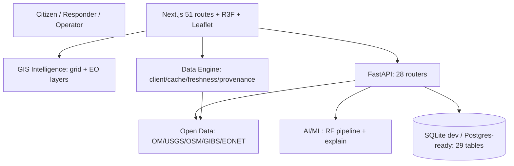

# DRISHTI-X — AI Disaster Intelligence Command Center

DRISHTI-X is a free-first, GIS-driven disaster intelligence platform combining Earth observation, weather, terrain, AI/ML risk analysis, incident intelligence, early warning, emergency response, and resilience workflows — served through a cinematic command-center UI with honest LIVE / DEMO / SIMULATION / OFFLINE provenance on every value.

> **Working prototype — not a certified emergency-warning system.** It does not replace official government warnings. Live, demo, and unavailable integrations are labeled as such throughout.

## Mission / Objective

See Early. Understand Better. Act Faster. Save Lives. DRISHTI-X connects the seams where disaster response fails fastest — rainfall apart from terrain, terrain apart from roads, roads apart from field reports, all apart from citizens at risk — into one intelligence loop: open data in → validation → features → AI/ML + transparent rules → GIS heatmap → warnings → authority + citizen interfaces → field verification → database → continuous learning.

## Core Capabilities

- Command Center (`/command`) with truthful system status (no fabricated ONLINE/scores since the post-launch patch)
- GIS Risk Map (`/risk-map`): Leaflet + live NASA GIBS layers, scale/coordinate/fullscreen controls, per-tile liveness
- Weather Intelligence (`/weather`): backend rainfall chain + Open-Meteo direct current/hourly/daily via data engine
- Satellite (`/satellite`): live GIBS viewer (4 layers, 14-day NRT window) + FirePanel + honest provider adapters
- Earthquakes (`/earthquakes`), Events (`/events`, NASA EONET), Model Health (`/model-health`)
- 3D Digital Twin (`/twin`): hazard layers, camera presets, SIMULATION-labeled
- Incidents with photo/GPS + verify workflow + offline queue; P1–P4 response triage; shelter/resource/road/sensor registries
- Offline PWA (IndexedDB queue, receipts), 9-language UI, RBAC + JWT auth

## Architecture Overview



Details: `docs/FINAL-ARCHITECTURE.md`.

## Technology Stack

| Layer | Technology (verified from lockfiles) |
|---|---|
| Frontend | Next.js 14.2.5, React 18, TypeScript 5.5, Tailwind 3.4, framer-motion, lucide-react |
| 3D / GIS | three 0.169, R3F 8.18, drei 9.122, Leaflet 1.9.4, MapLibre 6.10 |
| Backend | FastAPI 0.116.1, Uvicorn, Pydantic, SQLAlchemy, PyJWT, scikit-learn 1.9.1, pandas |
| Data engine | dependency-free TypeScript (`src/data/engine/`): client, cache, freshness, registry, adapters, health |

## Route / Module Overview

51 route directories under `src/app/` (see `docs/ROUTE-INVENTORY.md`): command center, risk map, satellite, earthquakes, weather, events, model-health, ml, prediction, twin, nesafe, incidents, response, alerts, resources, shelter, drones, sensors, roads, regions, citizen safety/family/learn/talk, offline, admin, auth-gated ops, and more.

## Data-Source Overview

Keyless-live: Open-Meteo, USGS, NASA GIBS, OSM/Nominatim/Overpass, SoilGrids, Esri/CARTO/OpenTopoMap. Honestly gated (`NOT_CONFIGURED`): FIRMS, Earthdata, Copernicus, ISRO, IMD, SMS/push/email. Full table: `docs/DATA-SOURCES.md`. Every value carries LIVE / FORECAST / DEMO / SIMULATION / OFFLINE / STALE / NOT_CONFIGURED / UNAVAILABLE.

## AI/ML Overview

RandomForest pipeline (`backend/ml/`): 22-feature schema → train → joblib artifacts + `metrics.json`. Shipped model `Landslide-RF-v1` is **SYNTHETIC-DEMO** (accuracy 0.8867, precision 0.9766, recall 0.8895, F1 0.931, ROC-AUC 0.9408, 2400/600 split, trained 2026-09-16) — metrics describe the demo artifact only. No LLM APIs. Details: `docs/AI-ML.md`, `docs/MODEL-INTELLIGENCE.md`.

## GIS / Geospatial Overview

Leaflet (risk grid, 8-layer operational overlay, per-tile liveness, scale/coords/fullscreen) + MapLibre 3D GIS (`/nesafe`) + OSM tiles, Nominatim search (throttled + cached), Overpass POIs, OSRM routing. PostGIS path documented.

## Satellite / EO Overview

NASA GIBS WMTS (4 curated layers, 14-day NRT window, measured tile liveness) in the `/satellite` viewer + Kerala before/after reference pair + honest adapters (Sentinel/FIRMS/Earthdata/ISRO NOT_CONFIGURED). No live-tasking claims.

## 3D Digital Twin Overview

Vanilla Three.js `TwinViewport` (procedural city, surge plane, pickable entities, emergency corridor) + R3F globe + MapLibre command view. Step 30 added layer toggles, camera presets, reduced-motion gating. Everything simulated is labeled SIMULATION. Details: `docs/3D-DIGITAL-TWIN.md`.

## Real-Time Data Engine

`src/data/engine/` (Step 22): typed client (timeout/retry/dedupe), TTL cache, per-source freshness, 7-source registry, adapters (USGS, Open-Meteo, FIRMS-gated, EONET, GIBS), validation, health, provenance. 18 + feature tests, all mocked. Docs: `docs/DATA-ENGINE.md`.

## Provenance / Status Model

LIVE (measured fresh) · NEAR_REAL_TIME · LATEST_AVAILABLE · FORECAST · HISTORICAL · DEMO · SIMULATION · OFFLINE · STALE · NOT_CONFIGURED · UNAVAILABLE · ERROR. Demo can never silently become live; states ride every API response into badge UI and are asserted in tests.

## Security

Gateway-key + PyJWT HS256 + `OPERATOR_KEYS`, least-privilege RBAC roles (citizen → sys_admin), rate limits, upload guards, security headers, env-only secrets, audit logging. No secrets in Git/bundles (verified by scan). Details: `docs/SECURITY.md`. Prototype-grade caveats documented there.

## Testing

- `npm run typecheck` — clean · `npm run lint` — clean
- `npm test` (vitest) — **131/131 PASS**
- `npm run build` — 50/50 static routes
- `python -m pytest -q` (backend) — **51/51 PASS**
- Production route QA + fake-data/secret scans. Details: `docs/TESTING.md`.

## Deployment

GitHub `main` → Vercel Git integration → production (never `vercel --prod`). Backend: Docker/Railway FastAPI (SQLite file; Postgres-ready via `DATABASE_URL` + pinned `psycopg2-binary`). Details: `docs/DEPLOYMENT.md`.

## Current Production State

- Frontend: https://drishti-ai-command-center.vercel.app/ — Ready (commit `b4275aa`)
- Backend: **OFFLINE** — Railway trial expired 2026-09-26; no paid action taken. Frontend degrades honestly (OFFLINE/DEMO/STALE).
- Model: SYNTHETIC-DEMO, backend-dependent panels show MODEL OFFLINE.
- Providers NOT_CONFIGURED: FIRMS, Earthdata, Copernicus, ISRO, IMD, SMS/push/email.

## Known Limitations

SQLite ephemeral on hosts without volumes; sparse demo geography outside AP/Telangana showcases; procedural terrain; synthetic ML data; no bulk satellite ingestion; unconfigured notification providers; no Background Sync; prototype-grade JWT; duplicate incidents possible. Full list: `docs/LIMITATIONS.md`.

## Future Scope

Verified historical dataset + retrain + calibration/drift baselines; SRTM DEM swap; PostGIS deploy; live sensor fleet; notification providers; duplicate detection; Background Sync; E2E browser tests; production observability. No Step 32 exists.

## Local Development

```bash
npm install
cp .env.example .env.local   # all keys optional
npm run dev                  # http://localhost:3000
```
```bash
cd backend
pip install -r requirements.txt
uvicorn app.main:app --port 8000  # docs: http://localhost:8000/docs
```

## Environment Configuration

All optional; see `.env.example` (48 vars) + `docs/ENVIRONMENT.md`. Frontend reads only `NEXT_PUBLIC_*` (publishable). Server secrets (`GATEWAY_KEY`, `JWT_SECRET`, provider keys) never leave the backend. No `.env` files committed.

## Production Links

- App: https://drishti-ai-command-center.vercel.app/
- Repository: https://github.com/hemanthhemanth1834-bit/drishti-ai-command-center
- Backend API (currently offline): https://drishti-ai-backend-production.up.railway.app

## License

Not yet specified — no LICENSE file. Educational/hackathon use; contact the author otherwise.
