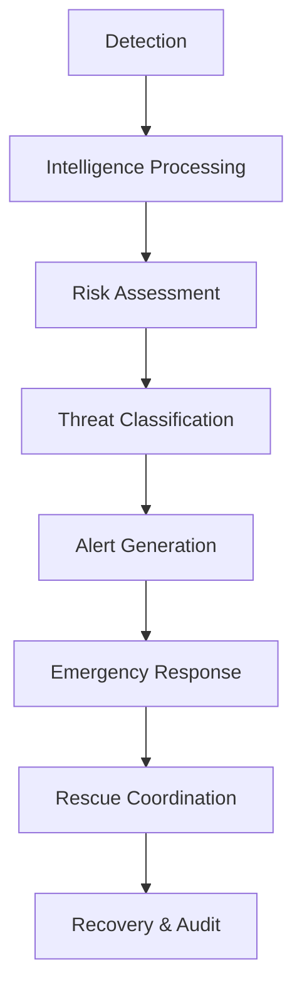
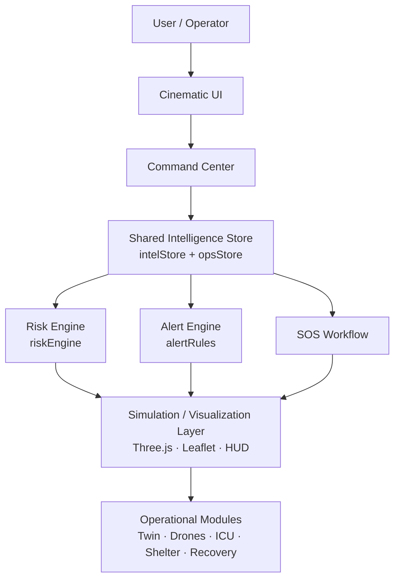

# DRISHTI-X

**Cinematic 3D Disaster Intelligence & Emergency Response Command Center**

DRISHTI-X is an interactive disaster-intelligence and emergency-response command platform. It demonstrates how multiple intelligence signals — risk analysis, alerts, SOS workflows, simulation, geospatial visualization, drone/SAR concepts, hospital and shelter awareness, citizen reporting, and recovery operations — can be unified inside one cinematic command environment instead of scattered across disconnected dashboards.


## 🚀 Live Project

**Live Application:** https://drishti-ai-command-center.vercel.app/

**GitHub Repository:** https://github.com/hemanthhemanth1834-bit/drishti-ai-command-center

The live deployment is the production demonstration environment (current release **V3.2**).

## 🎯 What is DRISHTI-X?

DRISHTI-X is a cinematic disaster-intelligence command center that combines:

* Real-time-style shared intelligence state
* Disaster risk visualization
* Emergency alerts
* SOS workflow
* Geospatial command visualization (3D globe + 2D maps)
* Drone/SAR concepts
* Digital Twin visualization
* Flood simulation
* AI decision support (Hydra-Net panel)
* Shelter intelligence
* Hospital intelligence
* Recovery workflows
* Citizen reporting
* Command operations
* Presentation/demo mode

The application is designed as a **unified operational interface** — risk, alerts, SOS, telemetry, and visualization all read from one shared intelligence store — rather than a collection of unrelated pages.

## ⚠️ The Problem

During emergencies, information fragments across sensors, field reports, alerts, response teams, maps, shelters, hospitals, and communication channels. Citizens get noise; operators get dashboards that disagree with each other.

DRISHTI-X demonstrates a unified interface where intelligence moves through:

```text
Detection → Analysis → Decision → Alert → Response → Rescue → Recovery
```

## 💡 The DRISHTI-X Approach



This is a **demonstration and coordination interface**, not a fully autonomous real-world emergency dispatch system. Simulated content is always labeled as such (see [Real Engine vs Demonstration State](#-real-engine-vs-demonstration-state)).

# 🧠 V3.2 — Current Release

V3.2 adds a **cinematic presentation mode**: a guided ~30-second demonstration (INIT → DETECTION → GEOINT → RISK → ALERT → RESPONSE → SOS → RECOVERY → MISSION COMPLETE) that drives the real application engine, so the AI core, globe, timeline, alerts, ticker, and SOS all react as one system during the story.

Release highlights:

* Cinematic presentation mode with declarative scenes (`DemoMode.tsx`)
* Shared intelligence state as the single source of truth
* AI Decision Timeline over the shared event stream
* Real application engine driving demo scenarios (existing flood/demo engine)
* Interactive command center with coordinated alert/ticker/globe/tone reactions
* Simulated SOS workflow with strict safety boundaries
* Reduced-motion support, keyboard controls (`P`, arrows, `Esc`), responsive mobile controls

## 🔄 DRISHTI-X Evolution

| Version | Focus |
| ------- | ----- |
| V2 | Cinematic command-center foundation — 3D AI core, SOS radar, risk visualizer, HUD system, holographic globe |
| V2.5 | Advanced cinematic interaction and visual polish — lighting, transitions, boot sequence, status ticker, responsive trims |
| V3 | Shared real-time intelligence architecture — one store driving command, risk, alerts, SOS, globe, and ticker |
| V3.1 | AI Decision Timeline — explainable event stream over shared intelligence |
| V3.2 | Cinematic Presentation / Demo Mode — guided story on the real engine |

# 📡 V3 Shared Intelligence Architecture

Implemented in `src/store/intelStore.ts`, the application uses a lightweight shared intelligence state architecture (React `useSyncExternalStore` modules — no state-management dependency).

Confirmed shared outputs:

* Risk snapshot (score, level, confidence, place, coordinates)
* SOS snapshot (phase, coordinates, timestamp)
* Latest alert
* Session event history (capped ring buffer, 30 events)

Event types:

* `SENSOR` · `RISK` · `ALERT` · `SOS` · `SYSTEM` · `NETWORK`

`useIntel()` derives intelligence such as:

* Scenario score (same formula as the command ticker and drill surrogate)
* Risk-check score
* Effective score (SOS forces maximum)
* AI tone (`ok` / `warn` / `critical`)
* Threat level
* Operational focus (SOS location wins over risk-check location, else neutral)

Severity model: `INFO` → `WATCH` → `WARN` → `CRITICAL`.

Nothing here implies a live external sensor network: telemetry comes from the local FastAPI backend over WebSocket when it is running, and from clearly labeled drill/simulation state otherwise.

# 🧠 AI Decision Timeline — V3.1

Component: `src/components/cinematic/AiDecisionTimeline.tsx`

A presentation layer over the shared intelligence event stream — not a second engine. Mappings:

```text
SENSOR  → SENSOR DATA RECEIVED
RISK    → RISK ANALYSIS COMPLETED
ALERT   → THREAT ALERT PROCESSED
SOS     → EMERGENCY RESPONSE ACTIVATED
SYSTEM  → SYSTEM STATE UPDATED
NETWORK → NETWORK STATE UPDATED
```

* Real timestamps, source/place/coordinates rendered only when present on the event
* Severity indicators with text labels (never color-only)
* AI state pill derived from real SOS phase and AI tone (`IDLE`, `MONITORING`, `ANALYZING`, `CRITICAL RESPONSE`)
* Accessible `role="log"`, newest-first, expandable rows
* Only newly arriving events animate (tracked against first-render ids); history stays stable
* Reduced-motion support; demo-sourced rows carry an explicit `DEMO` badge

# 🎬 V3.2 Cinematic Presentation Mode

Component: `src/components/cinematic/DemoMode.tsx` — an **orchestration layer**, not a separate fake application. It drives the existing flood/demo engine (`opsStore`: scenario + spillway scripts) and the existing intelligence publishers, so alerts, tones, globe, timeline, and ticker respond through the real pathways.

Presentation sequence:

1. INIT — system online
2. DETECTION — sensor sweep (live unit fix when linked, else labeled drill sweep)
3. GEOINT — demo-sector focus (Vijayawada drill sector)
4. RISK — drill surrogate re-scores the sector
5. ALERT — genuine evaluated alert shown in drill context
6. RESPONSE — drill tasking (e.g. NDRF Boat RB-07)
7. SOS SIMULATED — on-device beacon only
8. RECOVERY — stand-down, tone relaxes red → cyan
9. MISSION COMPLETE — checklist, replay, exit

Controls: Play, Pause, Previous, Next, Restart, Exit, scene indicators (`SCENE 04 / 09`), per-scene progress bar, keyboard shortcut `P` on `/command`, arrow-key stepping, `Esc` to exit. Reduced motion disables auto-advance (manual stepping). Exit — or navigating away — restores the exact pre-demo ops and SOS snapshots; demo SOS events resolve but remain in history.

## 🎭 Real Engine vs Demonstration State

| State | Meaning |
| ----- | ------- |
| LIVE | Data or functionality connected to a real external source (e.g. local telemetry WebSocket, OSM responses) |
| DEMO | Controlled presentation/demo state (drill scripts, presentation scenes) |
| SIMULATION | Scenario-generated operational data (surge math, ETAs, drill metrics) |
| LOCAL | Runs locally inside the application (prefs, reports, on-device GPS) |
| OFFLINE | Cached content available without connectivity |

Simulated values are never labeled live. The V3.2 presentation reuses the existing flood/demo engine, and demo timeline events use `source = "demo-mode"` with `DEMO` titles and badges.

# 🚨 SOS Safety Model

The SOS workflow — including the V3.2 simulated SOS scene — is **simulation/demo behavior**:

* No real emergency calls are placed
* No dispatch operation is triggered
* No external emergency notification is sent
* No real-world responder is contacted
* Demo exit restores the pre-demo operational/SOS state

Real SOS functionality on `/emergency` (numbers, on-device GPS, share-via-clipboard, nearest shelter/hospital) is untouched by Presentation Mode.

# 🌐 Cinematic 3D Command Environment

Vanilla Three.js (no wrapper libraries), procedural geometry only. Effects communicate system state rather than decorating it; the AI/risk tone is semantic — **cyan** normal, **amber** elevated, **red** emergency — with smooth lerped transitions, never snapping or strobing.

* **AI Core** (`AiCoreScene.tsx`): energy core with breathing pulse kernel, wireframe lattice, fresnel glow shell, 3 orbital rings, orbiting data nodes with neural links, particle shell, expanding scan waves, grid floor, 3-point cinematic lighting, tone-reactive color
* **Holographic globe** (`CommandBackground.tsx`): rotating earth, atmosphere rim shell, lat/long grid, data arcs with traveling packets, hazard pulses, orbital satellite traces, drone orbiters, India beacon with regional links, tone-tinted lighting, SOS/risk focus ring, adaptive particles, mouse parallax
* **HUD system** (`HudPanel.tsx`): dark glass, animated edge light, corner ticks, tone states, scan-line drift on interaction only
* **Risk visualization** (`RiskVisualizer.tsx`): animated score gauge, threat segments, confidence bar, heatmap grid — pure SVG/CSS for mobile speed
* **SOS radar** (`SosRadar.tsx`): expanding warning rings, location-lock brackets, sweep — slow professional pulse, reduced-motion aware
* **Status header**: system/network/satellite/drone/AI/data cells plus a ticker (link, uptime, UTC, AI load, sensors, nodes, alerts, risk, SOS)
* **Boot sequence**: skippable, session-scoped init overlay

# 🚁 Drone Swarm & Search and Rescue

Route: `/drones`. A cinematic SAR demonstration: procedural swarm with formation flight, navigation lights, telemetry rings, FLIR scan cones, motion trails, SAR search grid, radar sweep, and a staged detection beat (`SCAN → ANALYZING → TARGET DETECTED`, always labeled SIMULATION with id, coordinates, confidence, distance, ETA, thermal signature). A Leaflet tracker with live fleet list sits underneath. All detection output is simulated.

# 🗺️ Digital Twin

Route: `/twin`. A procedural response-city visualization: terrain, animated river with travelling shimmer, bridge, glowing roads, breathing emergency corridor, extruded buildings with window strips, holographic zone wall, moving response vehicles, pulsing hazard markers, telemetry-driven drone with spotlight cone, flood-surge plane, click-to-pick entities, satellite/grid modes, and a T-0h→T+24h flood driver. This is a **demonstrative visualization**, not a production-grade physical digital twin.

# 🌊 Flood Simulation

Routes: `/simulation`, `/command` (timeline strip). T-0h / T+1h / T+3h / T+6h / T+12h / T+24h progression with eased water expansion, affected-zone chips, BEFORE → SIMULATION → AFTER impact framing (population, roads, buildings, hospitals, shelters), spillway slider, and scenario injector. Spillway discharge in thousand cusecs against the Prakasam Barrage 45k threshold drives the shared alert rules, so the twin, ticker, AI tone, and command reactions stay synchronized. Scenario: **Vijayawada flood response (SIMULATION)** — NORMAL → rain → river rising → WATCH → WARNING → CRITICAL → EVACUATION → SAR → RESCUE → RECOVERY.

# 🤖 Hydra-Net AI Decision Support

Route: `/command`. A **rules-driven** decision-support panel (ANALYZING → INFERENCE COMPLETE, explicitly labeled rule output / SIMULATION): recommended intervention, reasoning summary, affected population, resource requirement, response ETA, risk state, and dispatch approval. It presents decision support — it does not implement autonomous decision-making or trained ML models.

# 🏥 Hospital Intelligence

Route: `/resources`. Medical-operations demonstration: live ECG/SpO₂/respiratory waveforms (demo), ICU/ventilator/O₂ capacity gauges, CRITICAL/WARNING/STABLE triage indicators, demo-labeled registry, and ambulance→ICU dispatch pairing. All patient and capacity figures are illustrative.

# 🏠 Shelter Intelligence

Route: `/shelter`. Holographic shelter nodes with animated capacity rings (capacity / occupied / available / ETA / risk / status), kiosk check-in flow, occupancy bars, demo-labeled registry, and family-reunification cross-match. Availability figures are illustrative.

# 🔄 Recovery & Audit

Route: `/recovery`. Animated EVENT → TIME → ACTION → RESPONDER → RESULT → STATUS incident timeline, relief-disbursement ledger with running totals, structural sensor diagnostics, and recovery snapshot. Provides audit-style visibility over the session's operational history.

# 👥 Citizen Reporting

Routes: `/report`, `/portal`. Simulated citizen intake across flood / trapped-person / blocked-road / fire / medical / missing-person categories with LOW → CRITICAL priority framing and an animated SUBMITTED → RESOLVED pipeline, plus a low-bandwidth public advisory lifeline with corridors and relief schedules. Reports stay on-device.

# 🛡️ Citizen Safety Platform

Big-button, plain-language routes answering *Am I safe? What happened? What should I do? Where should I go? How do I get help?*

* `/welcome` entry poster · `/safety` safety dashboard · `/risk` GPS-or-manual risk check · `/alerts` alert center · `/nearby` shelters/hospitals · `/evacuate` exposure-ranked safe routes · `/emergency` SOS mode · `/report` incident intake · `/family` check-ins · `/plan` emergency plan · `/kit` kit checklist · `/learn` trilingual disaster education · `/talk` voice assistant (Web Speech)

# 🖥️ Command Platform

Operator routes answering *What is happening? Where? How severe? Who is affected? What responds next?*

* `/command` master deck (globe/twin viewport, AI core + timeline, telemetry, presentation entry) · `/ops` KPIs + system health · `/demo` scenario presenter · `/drones` swarm SAR · `/twin` digital twin · `/location` GPS/OSM location intel · `/simulation` what-if copilot · `/resources` hospital ICU · `/shelter` shelter scanner · `/reunion` family reunification · `/recovery` audit ledger · `/portal` public advisory · `/platform` architecture map · `/sources` data-source transparency

# ⚙️ Core Capabilities

| Capability | Purpose |
| ---------- | ------- |
| Risk Intelligence | Analyze disaster risk state (on-device hazard cells) |
| SOS Response | Demonstrate emergency workflow (simulated, on-device) |
| Alert Intelligence | Surface threat information (rule engine over live + drill inputs) |
| AI Decision Timeline | Explain intelligence progression (shared event stream) |
| Geospatial View | Visualize operational context (3D globe, Leaflet/OSM) |
| Flood Simulation | Demonstrate scenario progression (T-0h→T+24h surrogate) |
| Drone/SAR | Demonstrate search-and-rescue operations (simulated) |
| Digital Twin | Visualize simulated environments (procedural city) |
| Hospital Intelligence | Demonstrate medical-resource awareness (illustrative) |
| Shelter Intelligence | Demonstrate evacuation support (illustrative) |
| Recovery | Support post-incident workflow (session ledger) |
| Citizen Portal | Demonstrate citizen interaction (local-first) |
| Presentation Mode | Deliver a guided ~30-second cinematic demo on the real engine |

# 📍 Vijayawada Disaster Scenario

The implemented demonstration scenario is the **Vijayawada flood response (SIMULATION)**: barrage discharge metering, upstream rain, bund patrols, ward alerts, evacuation buses, FLIR drone search over Ward 14, boat dispatch, hospital standby, and relief audit — driven by the shared scenario/spillway state so every module reacts together. It is a demonstration scenario, not official emergency information, and is not connected to official live feeds.

# 🏗️ System Architecture



Citizen inputs stay local (localStorage); domain logic (`riskEngine`, `alertRules`, `geocode`, `overpass`) sits behind provider interfaces (`src/data/providers.ts`) so official feeds can plug in later without touching pages.

# 🧩 Technology Stack

Verified against `package.json` and `backend/requirements.txt` — nothing listed here is invented:

**Frontend:** Next.js 14.2.5 · React 18 · TypeScript 5 · Tailwind CSS 3 · Three.js (vanilla, no wrappers) · Leaflet + OpenStreetMap · lucide-react
**Backend:** FastAPI · Uvicorn · Pydantic · python-dotenv · pytest + httpx
**Platform:** PWA + Service Worker · localStorage · Web Speech API · Web Notifications API · Vercel
**Deliberately avoided:** paid maps, paid AI APIs, paid 3D models, stock footage, premium fonts, commercial animation libraries, paid DB/auth. (Note: this project uses Next.js, not Vite.)

# 📂 Project Structure

```text
drishti-ai-command-center/
├── .github/workflows/   # CI: typecheck + build
├── backend/             # FastAPI (app/, routers/, services/, tests/)
├── src/
│   ├── app/             # /, /welcome, /command, /risk, /alerts, /emergency,
│   │                    # /drones, /twin, /simulation, /resources, /shelter,
│   │                    # /recovery, /report, ... (27 pages + root redirect)
│   ├── components/
│   │   ├── cinematic/   # AiCoreScene, AiDecisionTimeline, DemoMode,
│   │   │                # CommandBackground, StatusHeader, HudPanel,
│   │   │                # SosRadar, RiskVisualizer, RadarSweep,
│   │   │                # BootSequence, SoundToggle, CinematicShell
│   │   ├── three/       # DroneSwarmScene, FloodTimeline
│   │   ├── 3d/          # TwinViewport, DigitalTwinCanvas
│   │   ├── maps/        # Leaflet trackers + radar overlays
│   │   └── alerts/      # AlertBanner, GeofenceBreachModal
│   ├── data/            # providers.ts (demo/local provider interfaces)
│   ├── store/           # opsStore, appStore, intelStore
│   ├── hooks/           # useTelemetrySocket (reconnecting WS), useLocalList
│   ├── i18n/            # EN / TE / HI dictionary
│   └── utils/           # apiClient, riskEngine, alertRules, geocode, overpass
├── public/              # poster.jpg, icon.svg, manifest.json, sw.js
├── docs/screenshots/    # capture guide (captures added after live runs)
└── vercel.json + docker-compose.yml
```

# 🛣️ Application Routes

All routes below exist in `src/app` (27 pages; `/` redirects to `/welcome`):

| Route | Description |
| ----- | ----------- |
| `/welcome` | Entry poster and mode selection |
| `/command` | Master command deck: twin viewport, AI core, decision timeline, telemetry, presentation entry (`P`) |
| `/safety` | Citizen safety dashboard (five safety questions, hazard cards) |
| `/risk` | GPS-or-manual risk check with AI risk visualization |
| `/alerts` | Alert center: live mesh alerts + official-style drill feed |
| `/emergency` | SOS mode: emergency numbers, on-device location, share, nearest shelter/hospital |
| `/demo` | Scenario presenter with phase stepping and narrative |
| `/drones` | Drone swarm SAR twin + Leaflet fleet tracker |
| `/twin` | Procedural 3D response-city digital twin |
| `/simulation` | T-0h→T+24h flood what-if copilot |
| `/resources` | Hospital/ICU command (waveforms, gauges, dispatch pairing) |
| `/shelter` | Shelter intelligence (capacity rings, check-in, reunification link) |
| `/recovery` | Incident timeline + relief ledger + diagnostics |
| `/report` | Citizen incident intake pipeline |
| `/portal` | Low-bandwidth public advisory lifeline |
| `/ops` | System KPIs + real health probes |
| `/location` | GPS/OSM location intelligence with map layers |
| `/nearby` | Nearby shelters, hospitals, relief points |
| `/evacuate` | Exposure-ranked safe-route evacuation |
| `/family` | Family check-in and safety status |
| `/plan` | Household emergency plan builder |
| `/kit` | Emergency kit checklist |
| `/learn` | Trilingual disaster education library |
| `/talk` | Voice assistant (Web Speech) |
| `/reunion` | Missing-person / reunification board |
| `/platform` | Interactive architecture and provider map |
| `/sources` | Data-source transparency ledger |

# ♿ Accessibility & Resilience

As implemented (no WCAG conformance claimed):

* `prefers-reduced-motion` respected globally (camera, particles, transitions park) plus in-app reduce-motion toggle
* Keyboard navigation (`P`/arrows/`Esc` in Presentation Mode with field guards), `:focus-visible` rings, skip-to-content link, dialog semantics and focus management, `role="log"` timeline
* Severity/state always paired with text labels — never color-only
* Responsive layouts with compact mobile controls; reduced 3D cost on weak devices (adaptive particles, pixel-ratio caps, offscreen render parking)
* Graceful WebGL fallback to a 2D experience; PWA offline shell with cached safety content and reconnect banner

# 🔐 Security & Privacy

* Secrets live in git-ignored `.env` files and hosting dashboards only — none are committed (verified: working tree shows no env files)
* Personal data (reports, family, checklists, prefs) stays in browser localStorage
* Shared coordinates are rounded to ~100 m before display/sharing
* Demo SOS never contacts emergency services; nothing auto-dispatches
* No government integration is claimed — future feeds map onto existing provider interfaces

# 🧪 Engineering Verification

Freshly run in this workspace on the V3.2 tree:

| Check | Status |
| ----- | ------ |
| TypeScript (`npm run typecheck`) | ✅ PASS (`tsc --noEmit` clean) |
| Lint (integrated in `next build`) | ✅ PASS |
| Production build (`npm run build`) | ✅ PASS — 31/31 routes prerendered |
| Backend tests (`pytest tests/ -q`) | ✅ PASS — 9 passed |
| Security (no secrets in repo) | ✅ PASS |

# 🚀 Local Development

```bash
git clone https://github.com/hemanthhemanth1834-bit/drishti-ai-command-center.git
cd drishti-ai-command-center
npm install
npm run dev        # http://localhost:3000
```

Production commands (from `package.json`):

```bash
npm run typecheck  # tsc --noEmit
npm run build      # next build (31 routes)
npm run start      # next start -p 3000
```

Backend (two-terminal daily run):

```bash
cd backend
pip install -r requirements.txt
uvicorn app.main:app --host 0.0.0.0 --port 8000 --reload
```

# ☁️ Deployment

```text
GitHub (main) → Build → Vercel → Production
https://drishti-ai-command-center.vercel.app/
```

Note: repository-to-Vercel automatic deployment has proven unreliable in this project, so production currently ships through a verified manual workflow (`vercel --prod --yes` from a clean tree, then live-bundle fingerprint check). The live site serving V3.2 was verified by matching build markers in the production bundle.

# 🎥 Hackathon / Portfolio Demo

A 30–90 second flow ( reviewers watch the system, not slides ):

1. Open `/welcome`, enter the Command Center
2. Press `P` — Presentation Mode opens
3. Detection → Geoint → Risk → Alert → Response → Simulated SOS → Recovery → Mission Complete
4. Point at the AI Decision Timeline filling with real events
5. Explain the shared intelligence layer (one store, every panel reacts)
6. Optionally: `/drones` target detection, `/twin` digital twin, `/simulation` flood progression, `/recovery` audit

Watch for: the core, globe, timeline, ticker, and banners changing **together** at each scene transition.

# 📸 Showcase

`public/poster.jpg` (hero artwork) and `public/icon.svg` ship with the repo. Route captures belong in `docs/screenshots/` (cover: Welcome, Command Center, Risk, Alerts, Emergency, Drone/SAR, Digital Twin, Simulation, AI Decision Timeline, Presentation Mode) — that directory currently holds only its capture guide, so **no screenshot paths are listed here until real captures from the running app are added**. Capture standard: 1280×800 PNG, each under ~500 KB, never mockups.

# 🧭 Roadmap

Future ideas — **not currently live** unless the repository proves otherwise:

* Official weather feeds (e.g. IMD-style data)
* Government disaster/CAP alert APIs
* IoT / river-sensor networks
* Real satellite imagery tiles
* Live drone telemetry links
* Emergency-service integrations
* Advanced AI models beyond the rules engine
* Real-time multi-user operations

# ⚠️ Limitations

* Many operational signals are simulated or drill-driven and labeled as such
* No external government/emergency integration is connected or assumed
* SOS is simulated and on-device; it does not summon help
* Drone data, detection, and FLIR output are simulated
* The Digital Twin is demonstrative, not a surveyed physical twin
* Disaster scenarios are not official emergency information
* Heavy 3D scenes depend on browser/device GPU capability
* Production deploys currently rely on a manual workflow (see Deployment)

# 🌟 Why DRISHTI-X?

* One unified disaster-response workflow instead of fragmented dashboards
* A real shared intelligence architecture — every view reads the same truth
* A cinematic 3D interface where visuals encode system state
* A presentation mode running on the real application engine, not a slideshow
* An explainable decision timeline over a capped, labeled event stream
* Simulation-driven behavior that is always badged DEMO/SIMULATION
* Safety-first demo boundaries (restores state, never calls for help)
* Responsive, reduced-motion-aware, weak-device-tolerant interaction
* A hard, honest line between real, simulated, and future state

# 👨‍💻 Author

**MUCHAKARLA HEMANTH KUMAR**

B.Tech — CSE (AI/ML)
SRK Institute of Technology
2024–2028

GitHub: https://github.com/hemanthhemanth1834-bit

LinkedIn: https://www.linkedin.com/in/hemanth-kumar-muchakarla-7974002a7/
