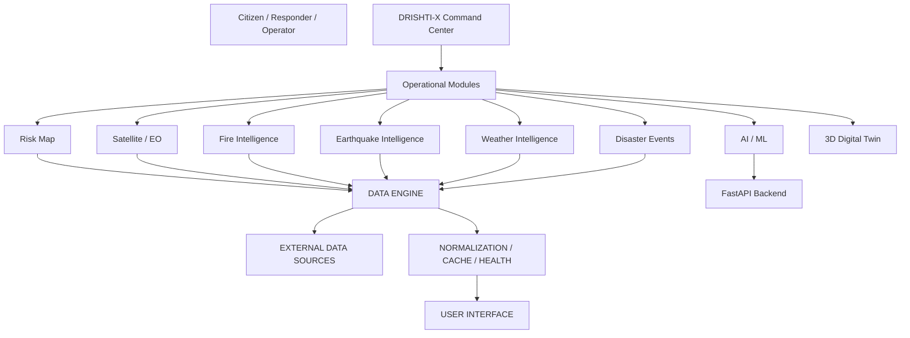
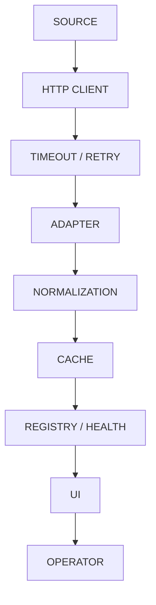
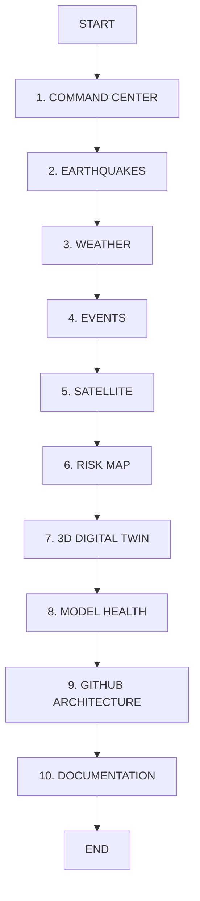

<div align="center">

# DRISHTI-X
## AI Disaster Intelligence Command Center

**See Early · Understand Better · Act Faster · Save Lives**

DRISHTI-X is a disaster-intelligence platform combining real-time public data, GIS, satellite Earth observation, AI/ML architecture, and a 3D digital twin into an operator-oriented command center — with honest LIVE / DEMO / SIMULATION / OFFLINE provenance on every value.

[](https://drishti-ai-command-center.vercel.app/)
[](https://github.com/hemanthhemanth1834-bit/drishti-ai-command-center)
[](https://github.com/hemanthhemanth1834-bit/drishti-ai-command-center/tree/main/docs)


[🌐 Live Demo](https://drishti-ai-command-center.vercel.app/) · [💻 GitHub](https://github.com/hemanthhemanth1834-bit/drishti-ai-command-center) · [📚 Documentation](https://github.com/hemanthhemanth1834-bit/drishti-ai-command-center/tree/main/docs) · [🏗 Architecture](https://github.com/hemanthhemanth1834-bit/drishti-ai-command-center/blob/main/docs/FINAL-ARCHITECTURE.md) · [🚀 Deployment](https://github.com/hemanthhemanth1834-bit/drishti-ai-command-center/blob/main/docs/DEPLOYMENT.md)

> **Working prototype — not a certified emergency-warning system.** It does not replace official government warnings. **No `LICENSE` file is currently included in the repository.**


> **Command artwork:** the cinematic poster rendered on the Command Center hero. Original project asset.

</div>

---

## What is DRISHTI-X?

### In one sentence
DRISHTI-X is a free-first, GIS-driven disaster intelligence platform where Earth observation, weather, terrain, AI/ML risk analysis, incident reports, and emergency response read and write one shared intelligence loop.

### In simple terms
Disaster information is scattered: rainfall lives apart from terrain maps, terrain apart from roads, roads apart from field reports, and all of it apart from the citizens at risk. DRISHTI-X puts them on one screen with honest labels, so anyone — citizen, responder, operator, researcher — can see what is known, what is simulated, and what is unavailable.

### Technical definition
Next.js 14 + FastAPI platform: 51 routes, 28 backend routers, 29 database tables, a typed TypeScript data engine (client/cache/freshness/provenance), scikit-learn RandomForest pipeline, Leaflet/MapLibre GIS, Three.js/R3F 3D, keyless public feeds (Open-Meteo, USGS, GIBS, OSM, EONET), credential-gated adapters kept honestly NOT_CONFIGURED.

### What problem it addresses
Fragmented disaster data across weather, earthquakes, events, satellite, GIS, AI/ML, and operations tooling — each with different formats, freshness, and reliability — combined into one interface without fabricating certainty.

### What makes the architecture different
Provenance honesty as architecture: an 11-state model (LIVE → OFFLINE) rides every value into badge UI and is asserted in tests; a post-launch patch deleted every fabricated operational number (98.4% confidence, 2.0 Hz, 26+3n drone count, LEO-lock) — verified zero repo-wide.

## The Problem

Weather, earthquake, event, satellite, GIS, AI/ML, and operations data each live in separate systems with separate formats and freshness. Operators cross-reference them by hand; citizens get none of it. DRISHTI-X merges them into one command surface while preserving each source's identity — it does not replace government emergency systems and never presents itself as an official warning channel.

## Project Objectives

- Multi-source intelligence (7-source registry: GIBS, FIRMS, EONET, USGS, Open-Meteo, Copernicus, OSM)
- Geographic visualization (Leaflet + MapLibre, 51-route GIS app)
- Event awareness (USGS + EONET, real feeds)
- Satellite observation (GIBS daily NRT viewer + reference pairs)
- Operational dashboards (command center + 14-module status grid)
- Model integration (RF pipeline + honest health surface)
- 3D visualization (twin, globe, command views with SIMULATION containment)
- Source provenance (every value labeled)
- Resilient data handling (cache-first, offline-labeled, deduped, throttled)

## Who Can Explore DRISHTI-X?

Students (live APIs + readable engine code), researchers (EONET/USGS/event geometry handling), GIS learners (Leaflet layers, OSM policies in practice), AI/ML learners (RF pipeline + SYNTHETIC-DEMO ethics), disaster-management technology evaluators (honest-state audit trail), software engineering evaluators (131 + 51 tests, gated deploys). No official operational deployment is claimed.

## Complete System Overview



Backend-backed modules currently read OFFLINE (Railway trial expired); keyless direct feeds remain LIVE. Not every module depends on the same backend — the module grid proves it per-endpoint.

## Complete Architecture

Frontend (Next.js 14.2.5, React 18, TS 5.5, Tailwind) → Data layer (`src/data/engine/`: typed client with 12s timeout, ≤2 transient-only retries, in-flight dedup) → Adapters (USGS/Open-Meteo/FIRMS-gated/EONET/GIBS) → External providers (keyless first) → Cache (source TTLs) → UI (routes/components/maps/3D). Backend where present: FastAPI 0.116.1 + Python ML (scikit-learn 1.9.1, pandas) + SQLite file (Postgres-ready via dormant `psycopg2-binary`). Auth: gateway key + PyJWT + OPERATOR_KEYS, 16-role RBAC. Full version: [docs/FINAL-ARCHITECTURE.md](https://github.com/hemanthhemanth1834-bit/drishti-ai-command-center/blob/main/docs/FINAL-ARCHITECTURE.md).

## Complete Data Flow



SOURCE (e.g. USGS GeoJSON) → typed client (timeout, retry, dedupe) → adapter (validate, skip malformed, count) → normalized records → TTL cache → freshness/health evaluation → UI with provenance badges → operator decision support. Offline serves labeled stale cache or honest empty states — never synthetic fills.

## Data Engine

Registry of 7 sources (GIBS, FIRMS-gated, EONET, USGS, Open-Meteo, Copernicus-gated, OSM) with access type, env vars, rate notes, attribution, freshness thresholds, adapter names, enabled flags. Client: GET, 12s timeout, AbortController, bounded exponential backoff (transient only), in-flight dedup, 11 normalized error kinds, secret-free diagnostics. Cache: memory TTL (USGS 5m, Open-Meteo 10m, EONET 30m, FIRMS 1h). Freshness FRESH/AGING/STALE/UNKNOWN per-source. Offline → OFFLINE + labeled STALE or honest empty. Example: USGS response → `adaptUsgsEarthquakes` → normalized event → cache/health → Earthquake UI. Details: [docs/DATA-ENGINE.md](https://github.com/hemanthhemanth1834-bit/drishti-ai-command-center/blob/main/docs/DATA-ENGINE.md).

## Live / Simulation / Not_configured / Offline

| State | Meaning | Example |
|---|---|---|
| LIVE | Real source currently available | USGS / Open-Meteo / EONET (verified 2026-09-26) |
| AVAILABLE | Function available, not necessarily live | OSM pages, local flows |
| SIMULATION | Deliberately simulated | 3D hazard/corridor, drones, reunion |
| NOT_CONFIGURED | Integration exists but unavailable | FIRMS (no key), Sentinel (no public path) |
| OFFLINE | Backend/service unreachable | ML backend (Railway trial expired) |
| SYNTHETIC-DEMO | Artifact/model data is synthetic | Landslide-RF-v1 metrics |

## Command Center — Detailed

Route: [`/command`](https://drishti-ai-command-center.vercel.app/command) — status header (WebSocket-derived ONLINE/OFFLINE, NOT AVAILABLE confidence, SIM FLEET, measured-or-N/A Hz, GIBS NRT satellite), feed strip (per-feed pills), SOS/risk banners, hero, real-data KPI row, flood timeline, twin viewport, rule-output AI panel, telemetry log, **module status grid** (14 modules, per-endpoint probing — one healthy endpoint never marks others LIVE), live map, imagery wall, globe, gallery.

### LIVE EXAMPLE
1. Open `/command` — SYSTEM reads OFFLINE while backend is down (never forced ONLINE)
2. Inspect module grid — backend modules OFFLINE, sim pages SIMULATION, satellite LATEST_AVAILABLE
3. Select Earthquakes / Weather / Events / Satellite — each opens live
4. Return to Command Center — same pills, same states
5. Open Twin, then Model Health — SIMULATION, then OFFLINE honesty
6. WHAT YOU SEE: status + evidence per module. DATA: mixed probes. SOURCE: per-pill provenance. STATE: mixed honest.

## Risk Map

Route: [`/risk-map`](https://drishti-ai-command-center.vercel.app/risk-map) — Leaflet grid + 8-layer overlay, legend, inspect dialog, region presets, **scale control, cursor coordinates, fullscreen** (Step 21). Grid/incidents OFFLINE while backend down; GIBS measured per-tile.

### LIVE EXAMPLE
Open risk-map → hover for live coordinates → toggle EARTHQUAKE (USGS markers link to event pages) → click any point for the satellite panel → try fullscreen. Visualization shows measured layer health; empty overlays mean no data.

## Satellite / Earth Observation

Route: [`/satellite`](https://drishti-ai-command-center.vercel.app/satellite) — GIBS viewer (4 layers, date/location/opacity, 14-day NRT window, measured tile liveness), Kerala before/after slider, FirePanel, honest adapters, reference renders, registry sources, stored observations.

### LIVE EXAMPLE
Open satellite → select MODIS 7-2-1 → change nominal date (acquisition vs retrieved stay separate) → read the 8-field provenance → note Copernicus NOT_CONFIGURED (live-probed, no public imagery path — never implied live).

## Fire Intelligence

No standalone `/fire` route by design — FirePanel on `/satellite` + map FIRE layer. `adaptFirmsFires` + `firms-fires` kind gated on server key: currently NOT_CONFIGURED, 0 detections, reason shown, burn-scar fallback pointer. Never synthetic hotspots.

## Earthquake Intelligence

Route: [`/earthquakes`](https://drishti-ai-command-center.vercel.app/earthquakes) — USGS list (newest first), magnitude-sized + depth-colored markers (numeric values everywhere, never color alone), 11-field detail + VIEW ON USGS, timeline, provenance, refresh. Zero records → "0 EVENTS", no placeholders.

### LIVE EXAMPLE
Open earthquakes → newest event → magnitude/depth/time/place → detail → follow VIEW ON USGS. Example of the type shown: M3.11 near Laupahoehoe, Hawaii (verified live during development; feed content varies).

## Weather Intelligence

Route: [`/weather`](https://drishti-ai-command-center.vercel.app/weather) — backend chain (OFFLINE → labeled) + Open-Meteo direct: OBSERVED current grid, 24h timeline, 7-day cards, wind panel, telemetry, provenance, refresh, forecast disclaimer, no-alerts note. Never disaster prediction.

### LIVE EXAMPLE
Open weather → Hyderabad preset → current vs hourly vs 7-day → read retrieved time + CC-BY line → try REFRESH offline for STALE labeling.

## NASA EONET Events

Route: [`/events`](https://drishti-ai-command-center.vercel.app/events) — 100-record open feed, category + open/closed filters, list/map/timeline/detail, VIEW SOURCE. Polygon geometries stay list-only (no fabricated points).

### LIVE EXAMPLE
Open events → Wildfires filter → open/closed → event detail → source link → polygon honesty check.

## AI / ML

Routes [`/ml`](https://drishti-ai-command-center.vercel.app/ml) · [`/prediction`](https://drishti-ai-command-center.vercel.app/prediction) · [`/model-health`](https://drishti-ai-command-center.vercel.app/model-health). Landslide RandomForest (scikit-learn, 22 features), artifact metrics, `POST /api/v1/ml/predict` contract, contributions + explain endpoint. **Backend OFFLINE → MODEL OFFLINE UI; SYNTHETIC-DEMO banner when reachable. MODEL IMPLEMENTATION EXISTS ≠ LIVE INFERENCE AVAILABLE.**

## Model Health

Artifact metrics table (accuracy 0.8867, precision 0.9766, recall 0.8895, F1 0.931, ROC-AUC 0.9408, 2400/600, confusion [[73,11],[57,459]] — pass-through, never derived), identity panel (contract fields), calibration NOT AVAILABLE (no source exists), drift from payload or NOT AVAILABLE, inference availability + playground links, source-timestamp timeline.

## 3D Digital Twin

Route: [`/twin`](https://drishti-ai-command-center.vercel.app/twin) — Three.js terrain/city/surge/entities/corridor/vehicles, flood/fire toggles, OVERVIEW/INCIDENT/GROUND cameras, surge timeline, actuator log, HUD. **All SIMULATION**; corridor is not an official route.

### LIVE EXAMPLE
Open Twin → Overview → toggle FLOOD → toggle FIRE → INCIDENT camera → inspect corridor (simulated) → scrub surge → GROUND → free orbit. Each action demonstrates scenario state, never live geography.

## GIS / Regional Intelligence

Country → State → District → City → Locality (`/regions`, 20 states incl. AP 26/26 + Telangana 33/33 verified districts), Nominatim (throttled+cached), Overpass POIs, OSRM routing. Example: `/regions` → Andhra Pradesh → Krishna → Vijayawada (verified coordinates). Backend OFFLINE → labeled demo view.

## Emergency Response

SOS beacon, evacuation routes (OSRM/straight-line DEMO estimate, never approved), shelter scanner (DEMO rows, "call ahead"), offline reporting with receipts, DETECT→ASSESS→RESPOND strip. No dispatch backend — triage aid only.

## Multi-Source Intelligence

Quake + weather + events + satellite + GIS + AI/ML + 3D are separate capabilities sharing one provenance language — demonstrated live by the command module grid's per-endpoint states.

## Real Project Example

Command Center → Earthquakes (real USGS event) → Weather (Hyderabad current) → Events (EONET filter) → Satellite (GIBS layer + FirePanel emptiness) → Risk Map (click-to-inspect) → Twin (FLOOD toggle, SIMULATION) → Model Health (OFFLINE honesty) → Source Verification (badges + docs). Each step: route, action, observation, source, state, interpretation, limitation — all above.

## Free Data Sources

| Capability | Source | DRISHTI-X Use | Current State | Alternative |
|---|---|---|---|---|
| Satellite imagery | NASA GIBS | 4-layer viewer | LATEST_AVAILABLE | [Worldview](https://worldview.earthdata.nasa.gov/) (external, complementary) |
| Earthquakes | USGS | List/map/detail | LIVE | FDSN-compatible (unverified, not integrated) |
| Weather | Open-Meteo | Current/hourly/daily | LIVE | NOAA (documented only) |
| Natural Events | NASA EONET | Browser + map | LIVE | USGS overlap reused |
| Fire | NASA FIRMS | Gated adapter | NOT_CONFIGURED | MODIS 7-2-1 context |
| Maps | OSM | Tiles/search/POIs | AVAILABLE | Esri/CARTO/OpenTopoMap |
| Location embed | OSM radar | Google Maps Embed (optional toggle) | OSM default; Google NOT_CONFIGURED | Key + billing required; official iframe only, never scraped |
| Sentinel | Copernicus | None yet | NOT_CONFIGURED | GIBS (different data, no equivalence claimed) |

INTEGRATED INTO DRISHTI-X vs EXTERNAL ALTERNATIVE/REFERENCE is labeled per row — Worldview/FDSN/NOAA are references, not integrations.

**Google Maps integration (optional, env-gated):** `/location` offers an official Maps Embed toggle that renders only when `NEXT_PUBLIC_GOOGLE_MAPS_KEY` is configured (key + billing-enabled Cloud project, referrer-restricted). Without a key the toggle is disabled, Google reports NOT_CONFIGURED, and the OSM radar remains the full experience. No scraping, no undocumented endpoints, no vendored Google imagery; Places/Street View are not integrated.

## Visual Examples

`public/poster.jpg` (hero artwork, original) · `public/img/photos/*.jpg` (6 verified NASA/FEMA/USN, public domain, ILLUSTRATIVE-badged in-app) · `public/img/*.svg` (26 original illustrations). Full table: [`public/img/SOURCES.md`](https://github.com/hemanthhemanth1834-bit/drishti-ai-command-center/blob/main/public/img/SOURCES.md). No screenshots presented as live output exist; use production links instead.

## Source Provenance

| Visual/Data | Source | Integrated? | State |
|---|---|---|---|
| Quake markers | USGS | Yes | LIVE |
| Weather cards | Open-Meteo | Yes | LIVE |
| EONET cards | EONET | Yes | LIVE |
| GIBS tiles | NASA GIBS | Yes | LATEST_AVAILABLE |
| Hero/model photos | NASA/FEMA/USN | Yes (vendored) | HISTORICAL/ILLUSTRATIVE |
| Fire detections | FIRMS | No (no key) | NOT_CONFIGURED |
| Sentinel products | Copernicus | No (no public path) | NOT_CONFIGURED |
| ML metrics | Artifacts | Yes | SYNTHETIC-DEMO/OFFLINE |
| Twin scene | Scene data | Yes | SIMULATION |

## Complete Route Guide

51 route directories — full table: [docs/ROUTE-INVENTORY.md](https://github.com/hemanthhemanth1834-bit/drishti-ai-command-center/blob/main/docs/ROUTE-INVENTORY.md). Key links in Quick Links below. Fire lives in `/satellite` + map layer (no `/fire` by design).

## Repository Structure

```text
src/app/         # 51 routes (page.tsx per route)
src/components/  # home/ command/ map/ 3d/ fire/ earthquake/ weather/ events/ satellite/ model/ twin/ ...
src/data/        # engine/ (client/cache/registry/adapters) + operational/regions/providers
src/platform/    # api client, provenance, maps, RiskGridMap, stores helpers
src/hooks/       # telemetry socket, dialog a11y, platform hooks
src/store/       # ops/intel/auth/app stores
src/utils/       # geocode, alerts, audio
src/config/      # navigation, regions, disasters, image sources
src/i18n/        # 9 languages
src/lib/         # liveServices (keyless feeds)
src/nesafe/      # NE-India center data/scenes
public/          # img/ verified photos + SVGs, poster.jpg
docs/            # 29 topic docs
backend/         # FastAPI (28 routers) + ml/ + tests/
```

## Technology Stack

| Area | Stack |
|---|---|
| Frontend | Next.js 14.2.5, React 18, TS 5.5, Tailwind 3.4, framer-motion, lucide-react |
| Maps/GIS | Leaflet 1.9.4, MapLibre 6.10, OSM/Nominatim/Overpass/OSRM |
| 3D | three 0.169, R3F 8.18, drei 9.122 |
| Data | Engine (dependency-free TS) + SQLite/Postgres-ready backend |
| Backend | FastAPI 0.116.1, SQLAlchemy, PyJWT, scikit-learn 1.9.1, pandas |
| AI/ML | RandomForest pipeline + deterministic fallback + explain endpoint |
| Testing | Vitest 1.6 (131), pytest 8.3 (51) |
| Deployment | Vercel Git integration; Docker; Railway-compatible |
| Documentation | 29 docs files, all source-verified |

## Security

Env-only secrets; frontend reads only `NEXT_PUBLIC_*`; gateway + JWT + 16-role RBAC; rate limits; upload guards; security headers; audit logging; scans clean; prototype-grade caveats documented. Details: [docs/SECURITY.md](https://github.com/hemanthhemanth1834-bit/drishti-ai-command-center/blob/main/docs/SECURITY.md). Never expose secrets.

## Testing

Vitest **131/131** · Pytest **51/51** · Lint clean · Typecheck clean · Build 50/50 static · route QA + secret/fake-data scans. Details: [docs/TESTING.md](https://github.com/hemanthhemanth1834-bit/drishti-ai-command-center/blob/main/docs/TESTING.md).

## Deployment

Developer → commit → GitHub `main` → Vercel Git integration → production. Never `vercel --prod`. Live: https://drishti-ai-command-center.vercel.app/ · Details: [docs/DEPLOYMENT.md](https://github.com/hemanthhemanth1834-bit/drishti-ai-command-center/blob/main/docs/DEPLOYMENT.md).

## Limitations

Backend OFFLINE (Railway trial expired); FIRMS/Earthdata/Copernicus/ISRO/IMD/SMS unconfigured; synthetic ML data; simulated twin/drones; sparse demo geography; no Background Sync; prototype JWT. Full list: [docs/LIMITATIONS.md](https://github.com/hemanthhemanth1834-bit/drishti-ai-command-center/blob/main/docs/LIMITATIONS.md).

## How to Explore DRISHTI-X



| Step | Live link | Do | Look for | Source | State |
|---|---|---|---|---|---|
| 1 | [/command](https://drishti-ai-command-center.vercel.app/command) | Read status + module grid | Honest pills, no forced ONLINE | Probes | Mixed |
| 2 | [/earthquakes](https://drishti-ai-command-center.vercel.app/earthquakes) | Newest event → detail → USGS link | M/depth/time | USGS | LIVE |
| 3 | [/weather](https://drishti-ai-command-center.vercel.app/weather) | Current vs hourly vs 7-day | Retrieved time, CC-BY | Open-Meteo | LIVE |
| 4 | [/events](https://drishti-ai-command-center.vercel.app/events) | Filter → polygon check | Source links | EONET | LIVE |
| 5 | [/satellite](https://drishti-ai-command-center.vercel.app/satellite) | Layer + date + FirePanel | Acquisition vs retrieved | GIBS | LATEST_AVAILABLE |
| 6 | [/risk-map](https://drishti-ai-command-center.vercel.app/risk-map) | Layers + click point | Measured statuses | GIBS/grid | Mixed |
| 7 | [/twin](https://drishti-ai-command-center.vercel.app/twin) | Layers + cameras + surge | SIM labels | Scene | SIMULATION |
| 8 | [/model-health](https://drishti-ai-command-center.vercel.app/model-health) | Banner + metrics | OFFLINE honesty | Artifacts | OFFLINE |
| 9 | [engine code](https://github.com/hemanthhemanth1834-bit/drishti-ai-command-center/tree/main/src/data/engine) | Registry + one adapter | 25 green tests | Code | AVAILABLE |
| 10 | [docs](https://github.com/hemanthhemanth1834-bit/drishti-ai-command-center/tree/main/docs) | Provenance + limits | 29 files | Docs | STATIC |

## 10-Minute Evaluator Tour

- **00:00** Command Center — system + module honesty
- **01:00** Module grid — per-endpoint states
- **02:00** Earthquakes — newest event → detail → USGS link
- **03:00** Weather — current vs hourly vs 7-day
- **04:00** Events — filter → polygon honesty
- **05:00** Satellite — layer + date + FirePanel emptiness
- **06:00** Risk Map — layers + click-to-inspect
- **07:00** 3D Twin — layers + cameras + surge
- **08:00** Model Health — OFFLINE + SYNTHETIC-DEMO semantics
- **09:00** GitHub architecture + docs
- **10:00** Done — review TESTING + LIMITATIONS

## FAQ

**What is DRISHTI-X?** Free-first disaster-intelligence command center (above).
**Is the data real?** Keyless feeds (USGS/Open-Meteo/EONET/GIBS/OSM) are live; backend-dependent panels are OFFLINE-labeled; sim content is SIMULATION-labeled.
**Which modules are live?** Earthquakes, weather, events, satellite imagery, maps/geocoding.
**Which are simulated?** 3D twin/hazards/corridors, drones, reunion/recovery flows, shelter rows.
**Does it use AI/ML?** Yes — scikit-learn RF pipeline + explainability; artifact is SYNTHETIC-DEMO.
**Is the ML model currently live?** No — backend OFFLINE; UI shows MODEL OFFLINE, never simulated health.
**What satellite source?** NASA GIBS daily NRT (measured per-tile).
**Does it use NASA data?** Yes — GIBS, EONET, Earth Observatory reference imagery (public domain).
**Does it use USGS?** Yes — M2.5+/7d feed via data engine.
**Does it require API keys?** No — runs fully keyless in labeled DEMO/OFFLINE modes.
**What happens when a source is unavailable?** Labeled STALE cache or honest empty/OFFLINE/NOT_CONFIGURED states — never synthetic fills.
**Is the 3D Twin real or simulated?** Simulated scenario content, always labeled.
**Where is the source code?** GitHub link above. **Production?** Vercel link above. **How do I test?** `npm run lint && npm run typecheck && npm test`, `cd backend && python -m pytest -q`.

## Final Project Status

DRISHTI-X · Production READY · Steps 1–31 COMPLETE · Post-launch correction COMPLETE · Homepage FROZEN · Documentation COMPLETE · Tests 131 + 51 green · No Step 32.

## Final Links

Production: https://drishti-ai-command-center.vercel.app/ · GitHub: https://github.com/hemanthhemanth1834-bit/drishti-ai-command-center · Routes: `/command` `/risk-map` `/satellite` `/earthquakes` `/weather` `/events` `/model-health` `/ml` `/prediction` `/twin` (all verified 200) · Docs: 29 files in [`docs/`](https://github.com/hemanthhemanth1834-bit/drishti-ai-command-center/tree/main/docs).

## What This Project Demonstrates

Full-stack engineering (Next.js + FastAPI + SQLite/Postgres) · data integration (7-source engine, adapters, validation) · GIS (Leaflet layers, OSM policies, measured liveness) · Earth observation (GIBS viewer, reference pairs) · AI/ML integration (RF pipeline, explainability, honest demo labeling) · 3D visualization (twin, globe, fallbacks) · API architecture (28 routers, typed client, offline queue) · caching (TTL, dedupe, throttling) · testing (182 green tests, honesty assertions) · deployment (gated GitHub→Vercel) · technical documentation (29 verified docs) — all with provenance honesty as the load-bearing feature.
