# DRISHTI-X — AI Disaster Intelligence Command Center

> **SEE EARLY · UNDERSTAND BETTER · ACT FASTER · SAVE LIVES**

[](https://drishti-ai-command-center.vercel.app/)
[](https://github.com/hemanthhemanth1834-bit/drishti-ai-command-center)
[](https://nextjs.org/)
[](https://www.typescriptlang.org/)
[](https://threejs.org/)
[](https://fastapi.tiangolo.com/)
[](#-license)

**DRISHTI-X is a disaster-intelligence command prototype: Next.js operator + citizen interfaces, FastAPI telemetry, Leaflet geospatial, Three.js 3D, and deterministic risk/alert logic over simulated data.**

Live: **https://drishti-ai-command-center.vercel.app/** · Status: **working prototype, not a production emergency system.**

> **Truth contract:** no trained ML model, no live satellite tasking, no real dispatch backend in this repo. Telemetry/hazards/scenarios are **simulated**; open geospatial services are **external**; roadmap items are **planned**. Labels `🟢 Implemented · 🟡 Simulated · 🔵 External · ⚪ Planned` are used throughout.

---

## 🚀 Live Demo

**Production:** https://drishti-ai-command-center.vercel.app/ — start at `/welcome`, then `/command`. Runs keyless.

### ⚡ Quick start (under 1 minute, experienced devs)

```bash
git clone https://github.com/hemanthhemanth1834-bit/drishti-ai-command-center.git
cd drishti-ai-command-center
npm install
cp .env.local.example .env.local
npm run dev
# http://localhost:3000
```

Backend (live telemetry, optional): `cd backend && pip install -r requirements.txt && uvicorn app.main:app --host 0.0.0.0 --port 8000`.

<details>
<summary><strong>How to read this README (5 levels)</strong></summary>

- **L1 General user:** Executive Overview + Live Demo + Platform Preview.
- **L2 Hackathon judge:** Problem, Solution, Target Users, Capabilities, Why DRISHTI-X, Limitations, Roadmap.
- **L3 Engineer:** Modules, Installation, Env, Deployment, Testing, Project Structure, Tech Matrix.
- **L4 Senior engineer:** Architecture diagrams, State, APIs, Telemetry, Maps, 3D, Risk/Alert/Geofence engines, Data Models, Failure behavior.
- **L5 Architect:** Boundaries, Trade-offs, Scalability/Future architecture, Observability, Security.

</details>

---

## 🎯 Executive Overview

DRISHTI-X (“AI Disaster Intelligence Command Center”) is one shared operational picture: maps, terrain, telemetry, alerts, scenarios, and citizen tools reading the same client stores and backend scenario state. The command-center concept is the integration itself — not a single model.

| Surface | Audience | Goal | Key routes |
|---|---|---|---|
| Citizen | Public, families, reporters | Am I safe? Where do I go? Who do I call? | `/welcome /safety /risk /location /alerts /nearby /evacuate /emergency /family /report /plan /kit /learn /talk /portal` |
| Operator | Commanders, drill coordinators, evaluators | What is happening? What if discharge rises? Where are drones? | `/command /twin /drones /ops /simulation /resources /shelter /reunion /recovery /demo /platform /sources` |

Root `/` redirects to `/welcome`. `Navbar.tsx` encodes `PUBLIC_ITEMS` (13) vs `COMMAND_ITEMS` (14).

---

## 🧩 Problem

- Fragmented maps, terrain, telemetry, alerts, and field reports.
- Delayed awareness as conditions change faster than manual updates.
- 2D lists cannot convey elevation, water spread, and hazard overlap.
- Citizens need simple numbers, share-links, and navigation under stress.
- Drone position, battery, link, and search pattern must be seen together.
- Shelter distance, path exposure, and transport mode interact during evacuation.
- Hospitals/shelters/police/fire data is scattered across sources.
- Operators need one posture, one timeline, one scenario control.

No invented statistics are used; the above is the design problem the prototype addresses.

---

## 💡 Solution

Conceptual flow (each layer maps to implemented code, labeled where simulated):

```text
Earth observation imagery [🔵 External open tiles + 🟡 gallery examples]
  → Geospatial intelligence [🟢 Leaflet/OSM/Overpass/Nominatim]
  → Risk / alert processing [🟢 deterministic rules over 🟡 demo zones]
  → Command center [🟢 Next.js HUD + shared stores]
  → 3D digital twin [🟡 procedural terrain + surge plane]
  → Drone telemetry [🟡 simulated packets over 🟢 real WS plumbing]
  → Operator intelligence [🟢 scenarios, spillway, timeline, replay]
  → Citizen safety [🟢 risk/alerts/nearby/evacuation/SOS helpers]
  → Emergency response [🟡 frontend prototype + map links, no dispatch]
```

---

## 👥 Target Users

- **Citizens/families:** risk checks, hazard maps, alerts, nearby help, evacuation, SOS, reporting, education, voice assistant.
- **Operators/evaluators:** telemetry wall, digital twin, swarm view, what-if spillway, drill KPIs, audit ledger, demo presenter.
- **Contributors:** modular routes/stores/utils/backend with labeled demo data (`source: 'DEMO'/'SIMULATION'`, `STAMP='DEMO feed · updated 10 min ago'`).

---

## ✨ Platform Capabilities

| Capability | Status | Notes |
|---|---|---|
| Command HUD + timeline + triage | 🟢 Implemented | Real UI/state; values simulated |
| 3D core / twin / globe / swarm | 🟡 Simulated | Procedural Three.js driven by posture |
| Leaflet maps + OSM + Overpass + Nominatim | 🟢 Implemented + 🔵 External | Keyless; Google optional |
| Risk / alert / geofence engines | 🟢 Implemented | Deterministic rules, not ML |
| SOS / evacuation helpers | 🟢 Implemented (prototype) | No dispatch; map-link handoff |
| FastAPI REST + WS telemetry | 🟢 Implemented | Simulated generator, real protocol |
| Trilingual EN/TE/HI, audio synth, quality modes | 🟢 Implemented | No audio assets |
| Sentinel / WebRTC / push / multi-agency / chatbot / mobile / NavIC | ⚪ Planned | Roadmap only |

---

## 🧠 How the System Works

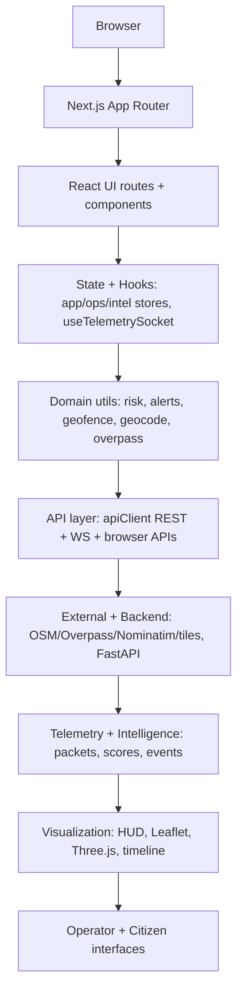

---

## 🏗️ System Architecture

### High-level

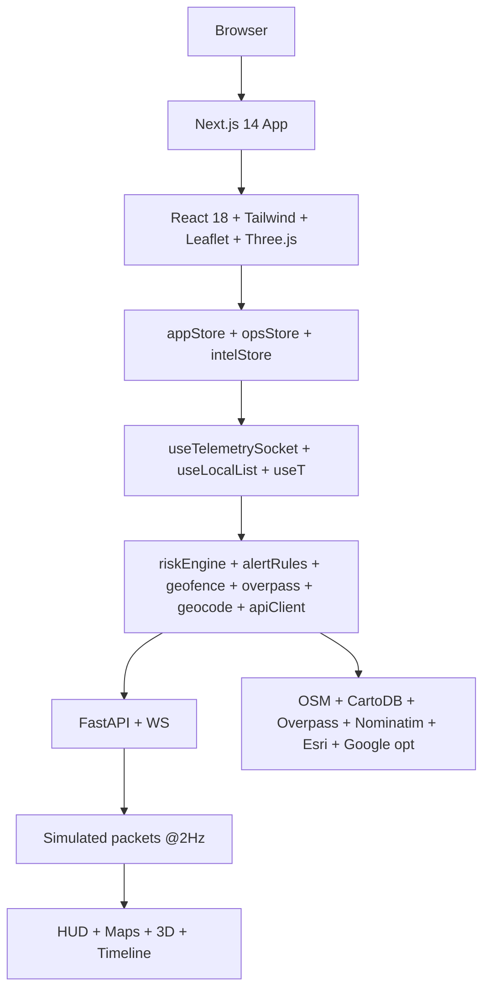

### Frontend

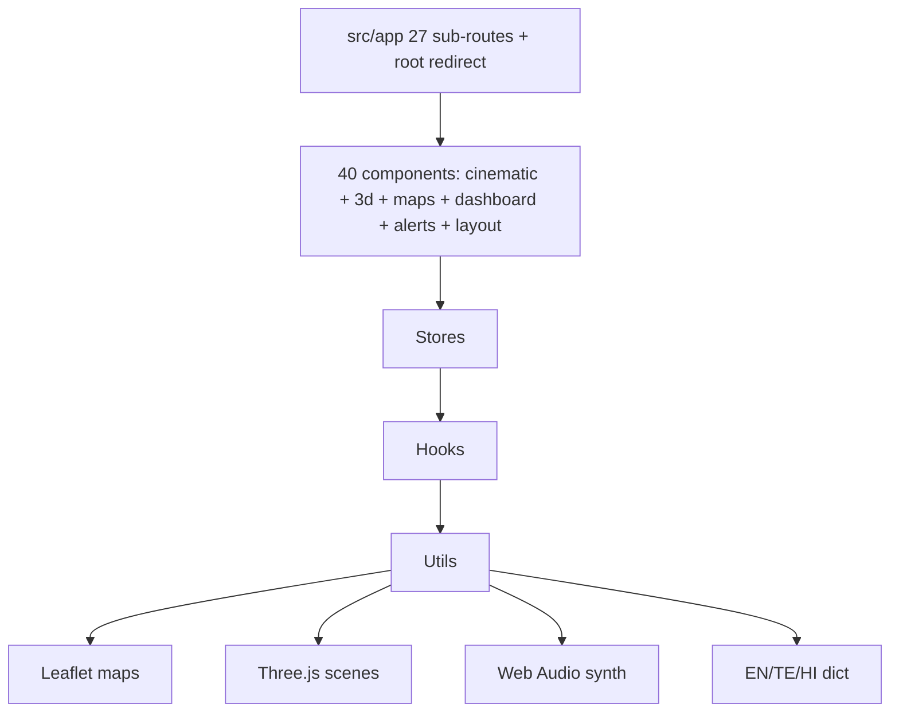

### Backend

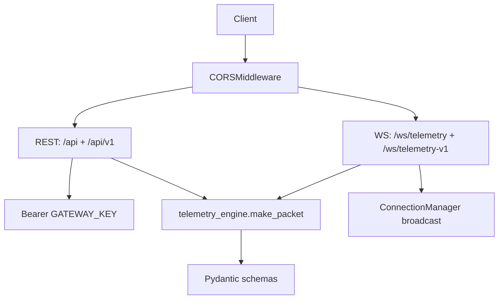

---

## 🔄 Data Flow Architecture

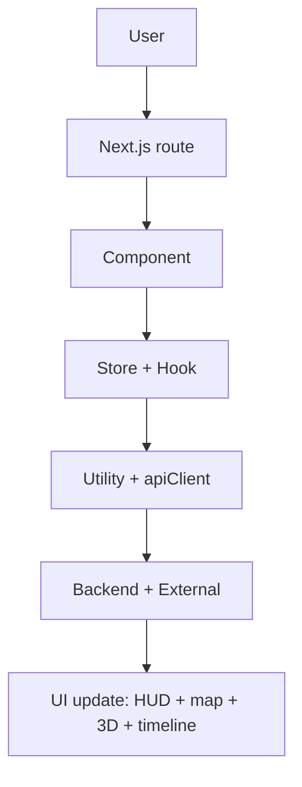

### Telemetry flow (🟡 values, 🟢 plumbing)

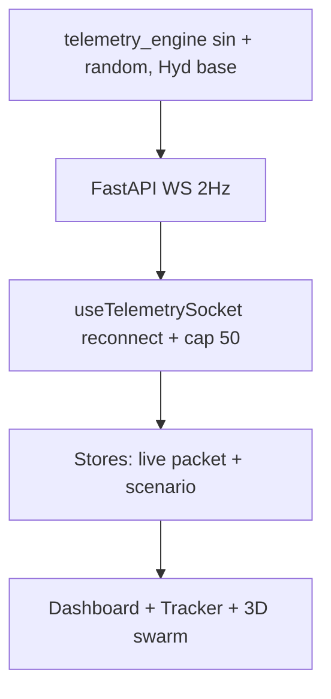

### Alert flow

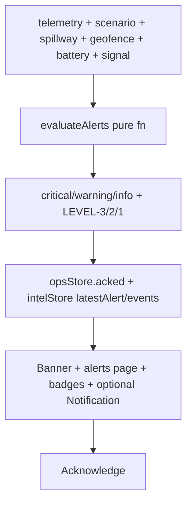

### Citizen safety / Emergency / Evacuation

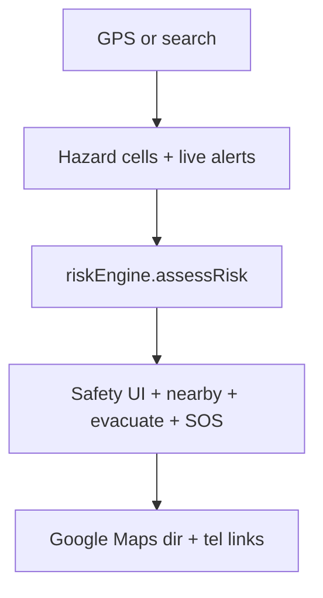

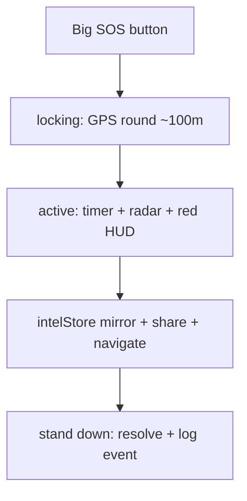

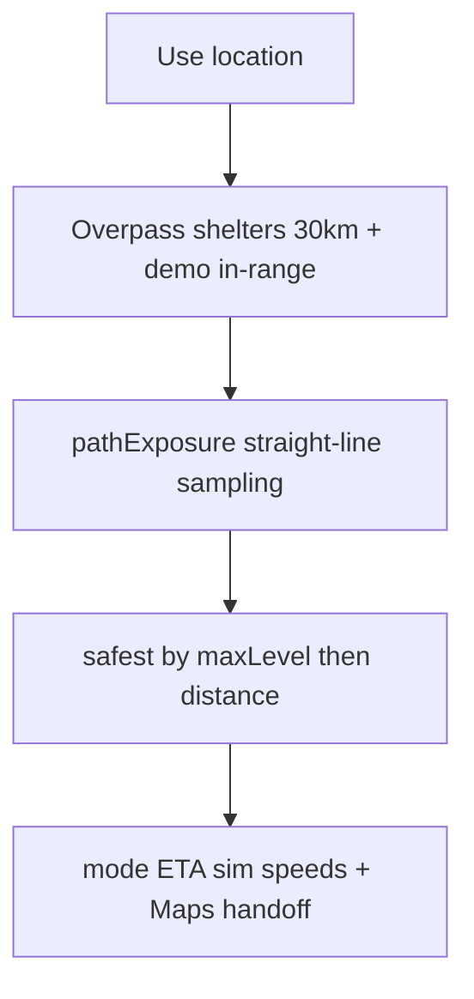

### 3D rendering flow

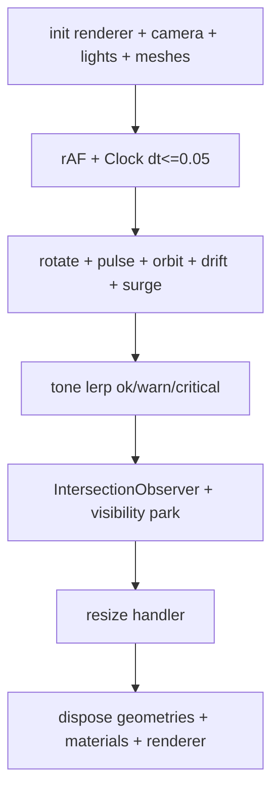

### External API flow

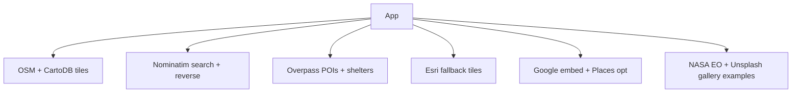

---

## 🔀 System Boundaries

| Layer | Lives here | Examples |
|---|---|---|
| **Client** | Browser | All UI/rendering, 3 stores, hooks, risk/alert/geofence math, Leaflet + Three.js, geolocation/speech/notify/SW, Web Audio, localStorage |
| **Server** | FastAPI process | REST snapshots, scenario global, WS loops, Bearer checks, CORS, static sensor stubs |
| **External** | Internet services | OSM/CartoDB tiles, Nominatim, Overpass, Esri, Google (opt), gallery imagery |

Browser computes posture; backend only streams packets and holds scenario. No server-side DB, queue, or ML inference exists.

---

## 🗺️ Module Architecture

> Status key: 🟢 Implemented · 🟡 Simulated values · 🔵 External dependency · ⚪ Planned. All 27 sub-routes verified via `src/app/*/page.tsx` glob.

<details open>
<summary><strong>Core 11 routes</strong></summary>

| Route | User | UI + Components | State/Hooks/APIs/Data | Interactions / Failure / Status |
|---|---|---|---|---|
| `/welcome` | both | Hero core+twin, counters, gallery, 15 cards, scenario picker; `Navbar`, `AiCoreScene`, `DigitalTwin`, `GeospatialIntelGallery` | `useTelemetrySocket`, `useApp`, `useOps`, `useIntel`; const ROW1/ROW2/SCENARIOS | Pick scenario → global; 3D fails → CSS fallback; 🟢 + 🟡 gallery |
| `/command` | operator | HUD, ticker, triage, twin, tracker, timeline; `CinematicShell`, `HudPanel`, `AiDecisionTimeline`, `AlertBanner`, `GeofenceBreachModal` | `useTelemetrySocket`, `useOps/ackAlert`, `useIntel`, `evaluateAlerts`, `checkGeofenceBreach`, `setScenario` | Ack/triage local; WS down → stale badge; 🟢 + 🟡 values |
| `/safety` | citizen | AM I SAFE / WHAT DO / WHERE GO; `RiskChecker`, `TrustBadge` | `useTelemetrySocket`, `useT`; `DEMO_HAZARDS`, `RISK_META` | Check risk → shared snapshot; demo-only disclaimer; 🟢 over 🟡 cells |
| `/location` | both | Search, detail, layers; dynamic `DroneLeafletTracker` | `geocode`, `googlePlaces`, `DEMO_*`; Nominatim + Google embed | Search → markers; quota/key fail → fallback embed; 🟢+🔵 |
| `/alerts` | both | Stream + severity + notify opt-in | `evaluateAlerts`, `useOps`, `useIntel`; `DEMO_ALERTS` + live | Ack + notify; rules-only; 🟢 |
| `/emergency` | citizen | SOS targets, numbers, share, radar, timer | `setSosPhase/pushEvent/resolveEvent`; `EMERGENCY_NUMBERS`, GPS | SOS → global mirror; denied GPS → error; 🟢 prototype |
| `/evacuate` | citizen | Shelters ≤30 km, exposure rank, 4 modes | `queryNearbyShelters`, `pathExposure`, `haversineKm` | Locate → rank → Maps nav; OSM fail → demo; 🟢 + 🟡 exposure |
| `/twin` | operator | Twin + surge + air-drop; `TwinViewport`, `FloodTimeline` | local `surgeM/terrain`; live alt/batt/signal | Scrub surge → water plane; procedural DEM; 🟡 |
| `/drones` | operator | Radar + swarm + tracker (fleet ≤8, `?lat&lon&name`) | `packets/live`; const PAYLOADS | Focus link → highlight; single-stream fan-out; 🟡 |
| `/ops` | operator | KPIs, spillway, health, demo console | `PEOPLE[scenario]`, `demoDroneProvider`, `drishti-reports`, `SystemHealth` | Drill KPIs are math; 🟢 + 🟡 |
| `/simulation` | operator | Spillway 5–80k, `30+spillwayK·1.1`, timeline | `setOps`, `setScenario`, `incidentLevel` | Slider → alerts+surge; illustrative; 🟡 |

</details>

<details>
<summary><strong>Extended routes (16)</strong></summary>

| Route | Purpose | Key data | Status |
|---|---|---|---|
| `/risk` | GPS/manual risk + visualizer | `assessRisk`, `toneForScore`, shared risk/sos | 🟢 over 🟡 |
| `/nearby` | Hospitals/police/fire/clinic/pharmacy | `queryNearbyHelp` + demo fallback | 🟢+🔵 |
| `/report` | Incident pipeline + photo &lt;1.5 MB | `localStorage:drishti-reports`, `cleanText` | 🟢 local |
| `/family` | Profiles + I'M SAFE | `localStorage:drishti-family`, manual | 🟢, no tracking |
| `/learn` | BEFORE/DURING/AFTER EN/TE/HI | `data/learn.ts` | 🟢 static |
| `/plan`, `/kit` | 10-item checklists | `drishti-plan`, `drishti-kit` | 🟢 |
| `/shelter` | Kiosk check-in, 3 nodes | `SEED EV-1042/43/77` | 🟡 seeds |
| `/resources` | ICU registry (4 demo) | `ICU_REGISTRY`, `/api/v1/sensors` | 🟡 + 🟢 sensors |
| `/recovery` | Audit ledger + mockHash chain | `SEED RL-001/002` | 🟡 |
| `/reunion` | Match queue heuristic | name/camp/age score; face pending | 🟡 |
| `/talk` | Voice assistant + risk/POI | Web Speech, `HOME 17.385,78.4867` | 🟢 browser-gated |
| `/demo` | 8-step story presenter | `DEMO_PHASES`, `DemoConsole`, `MissionReplay` | 🟢 + 🟡 |
| `/platform` | 8 pillars, hardware, agencies | const PILLARS/HARDWARE | 🟢 descriptive |
| `/portal` | Low-bandwidth advisory (server comp.) | corridors/trucks demo | 🟢 |
| `/sources` | Free-now vs future (server) | LIVE_FREE:10, FUTURE:8 | 🟢 |

</details>

---

## 🧱 Component Architecture

Grouped from 40 verified `src/components/**/*.tsx`:

| Domain | Components | Responsibility |
|---|---|---|
| cinematic | `AiCoreScene`, `CommandBackground`, `BootSequence`, `CinematicShell`, `StatusHeader`, `HudPanel`, `AnimatedCounter`, `RadarSweep`, `SosRadar`, `RiskVisualizer`, `AiDecisionTimeline`, `GeospatialIntelGallery`, `DemoMode`, `SoundToggle` | Posture visuals, HUD chrome, timeline, gallery, boot/sound |
| 3D | `DigitalTwin`, `3d/DigitalTwinCanvas`, `3d/TwinViewport`, `three/DroneSwarmScene`, `three/FloodTimeline` | Terrain, water, drone group, swarm, flood scrub |
| maps | `RadarMap`, `maps/DroneLeafletTracker` | Leaflet map, circles, SAR grid, target |
| dashboard | `dashboard/HeaderBar`, `dashboard/LiveTelemetryTable`, `TelemetryFeed`, `SystemHealth`, `DemoConsole`, `MissionReplay` | Tables, health, replay |
| alerts | `alerts/AlertBanner`, `alerts/GeofenceBreachModal` | Banner, breach modal + 20 s RTH copy |
| layout | `layout/Navbar`, `A11yBar`, `MobileQuickBar`, `EmergencyFab`, `DemoBar`, `OfflineBanner`, `SwRegister` | Nav, a11y, mobile, offline, SW |
| safety/ops | `RiskChecker`, `TrustBadge`, `Checklist`, `ArchitectureDiagram` | Risk form, trust labels, lists, diagram |

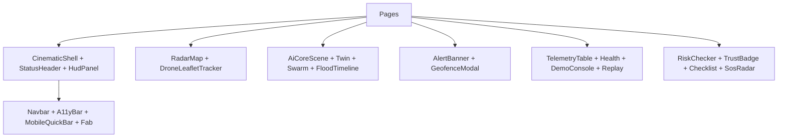

Important behaviors: dynamic `ssr:false` for 3D/Leaflet; `aria-hidden` on canvases with CSS fallbacks; `TrustBadge` labels `SIMULATION/DEMO/LIVE` at display sites; `SystemHealth` polls `/api/health`; `OfflineBanner` listens online/offline; `SwRegister` registers `sw.js`.

---

## 🌐 3D Visualization Architecture

Vanilla `three@0.169` (no R3F). Per scene: renderer (`antialias:!weak`, `powerPreference:low-power`, `pixelRatio≤weak?1:1.75`) → `PerspectiveCamera(50–55°)` → ambient + directional + cyan points → procedural meshes → `rAF+Clock(dt≤0.05)` → `IntersectionObserver` + `visibilitychange` park → resize → dispose. `prefers-reduced-motion` returns early (CSS fallback stays). WebGL constructor `try/catch` → fallback.

| System | Implementation | Data class |
|---|---|---|
| AI Neural Core | Icosahedron emissive + lattice + pulse + fresnel shell, 3 torus rings, 4/8/12 octa nodes + links, 70/240/450 particles, 2 scan waves, grid floor, drag-velocity + parallax, tone lerp | 🟡 PROCEDURAL + CONCEPTUAL posture viz |
| Digital Elevation Twin | Plane DEM (hill sin·cos, river −exp, ridge sin), contour wireframe, surge plane `y=−0.45+surgeM·0.15`, drone Group (chassis/dome/arms/nacelles/blades/cone searchlight/beacon), rotors 15/32 | 🟡 PROCEDURAL terrain + SIMULATED surge/drone |
| Holographic Earth | Schematic globe (not geographic projection) + arcs + pulses + dust + haze; props `intensity`, `tone`, `focusKind` | 🟡 CONCEPTUAL schematic |
| Drone viz | Swarm scene + tracker markers from WS packets (fleet ≤8) | 🟡 SIMULATED positions |
| Flood viz | Water plane + `FloodTimeline` scrub; depth copy `spillwayK·0.041m`, inundation `30+spillwayK·1.1` | 🟡 SIMULATED display math |
| Searchlight/volumetric | Open cone additive + point-light pulse + beacon blink | 🟡 PROCEDURAL effect |

---

## 🛰️ Geospatial Intelligence

- **Leaflet 1.9.4** (`RadarMap.tsx`): `setView([17.385,78.4867],12)`, OSM tiles + CartoDB dark, `L.marker`, `L.layerGroup` rebuilds, `L.circle` hazard rings (pulse if high/critical), SAR dashed grid 5×5 step 0.02, target marker; icon fix to unpkg 1.9.4.
- **Geocoding (`geocode.ts`):** Nominatim search/reverse, `haversineKm(R=6371)`, `bearingDeg atan2`, `compass16`, `toDMS`, `getLivePosition` high-accuracy one-shot with permission messages.
- **Discovery (`overpass.ts`):** QL for help (6 km) + shelters (30 km), `GET overpass-api.de`, 15 s abort, throws → demo fallback, cap 20.
- **Geofence:** separate engine below; breach feeds alerts + modal.

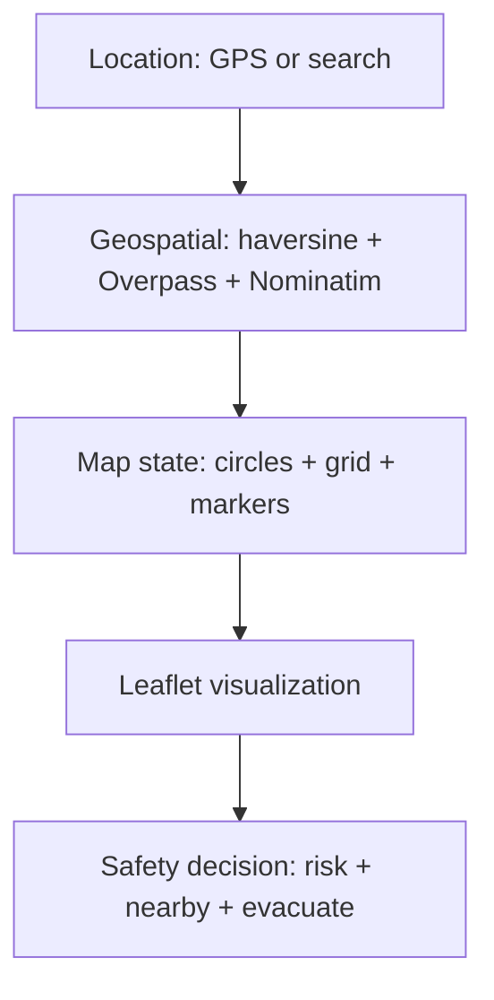

---

## 🛸 Drone & Telemetry System

Simulated generator, real protocol. Base `17.3850,78.4867`:

```python
lat = base + 0.02*sin(tick/12) + rand(±0.001)
lon = base + 0.02*cos(tick/15) + rand(±0.001)
alt_m = 120 + 10*sin(tick/8) + alt_noise
speed_ms = max(0, 18 + 4*sin(tick/10) + rand(±1))
battery_pct = max(0, 100 - tick*batt_drain)
```

| Scenario | alt_noise | drain | signal | mode |
|---|---|---|---|---|
| nominal | ±15 | 0.02 | 75–99 | AUTO-MESH |
| storm | ±120 | 0.08 | 35–65 | AUTO-MESH |
| swarm-surge | ±30 | 0.05 | 70–98 | AUTO-MESH |
| gps-denied | ±50 | 0.04 | 5–25 | DEAD-RECKONING |

Packet: `id,tick,ts,scenario,drone_id DRX-01..12,lat,lon,alt_m,speed_ms,battery_pct,signal_pct,temp_c,mode`. `TELEMETRY_HZ=2` default.

`useTelemetrySocket` (68 lines): `WebSocket(url ?? getWsUrl())`, `onopen→connected`, `onclose→backoff min(1s·2^retry,10s)`, `onerror→close`, `onmessage→JSON.parse` (ignore malformed), `packets≤50` newest-first + `live`. Consumers: HUDs, tracker, swarm, twin badges.

---

## 🗃️ State Management

| Store | Responsibility | State | Actions | Consumers |
|---|---|---|---|---|
| `appStore` (107) | Prefs + quality | `mode`, `lang`, `a11y{large,contrast,reduce}`, `qualityMode`, `soundEnabled` | `setApp/setA11y/setQualityMode/setSoundEnabled`, `useApp` | nav, a11y, 3D, i18n |
| `opsStore` (176) | Drill + triage | `scenario`, `spillwayK`, `acked[]`, `demo{id,phase}` | `setOps/ackAlert/startDemo/demoStep/demoGoto/stopDemo`, `useOps` | command/ops/sim/demo/alerts |
| `intelStore` (266) | Shared truth | `risk`, `sos{phase,lat,lon}`, `latestAlert`, `events≤30` | `setRiskResult/clearRisk/setSosPhase/setLatestAlert/pushEvent/resolveEvent`, `useIntel` | timeline, core, globe, risk, SOS |

`appStore` persists `drishti-app-v2` (lazy hydrate, private-mode safe); `opsStore` in-memory reset `nominal/45`; `intelStore` dedupes/sorts/caps events, derives `effectiveScore = SOS?100:max(scenario,risk)`, `tone = SOS?critical:maxTone(...)`. `useIntel` subscribes to ops+intel together.

---

## 🧠 Intelligence & Risk Engine

> **No ML/AI inference exists.** Everything below is rules, math, simulation, or visualization over open data.

| Component | Type | Input → Processing → Output | Used by |
|---|---|---|---|
| Risk scoring | 4 Deterministic | `(lat,lon)` → haversine vs demo cells → `RiskReport` | safety/risk/location/evacuate/talk |
| Alert rules | 3 Rule-based | telemetry+scenario+spillway+geofence+battery+signal → 6 rules → alerts + LEVEL | command/alerts/ops/sim |
| Scenario score | 4 Deterministic | `(scenario,spillwayK)` → `min(100,30+spillwayK·1.1+storm?18:0)` → 0–100 | ticker, core, globe |
| Tone/threat | 3 Rule-based | score → `>70 crit/>40 warn`, `≥80/60/30` levels | badges, 3D colors |
| Event log | 6 Visualization | actions → dedupe/sort/cap30 → timeline | review |
| Reunion rank | 4 Heuristic | name/camp/age overlap → score | reunion queue |
| 3D core/globe | 6 Visualization | tone → color/animation | posture display |
| Telemetry | 5 Simulation | tick+scenario → sin+random packet | dashboards/maps/3D |
| OSM/Overpass | 7 External data | coords → tiles/POIs | maps/nearby/evacuate |

### Risk formulas (only implemented variables)

```text
distKm(p, zone) = haversineKm(p.lat, p.lon, zone.lat, zone.lon)   # R=6371
candidate if distKm ≤ zone.radiusKm + 15
rank: critical 3 > high 2 > moderate 1 > low 0; tie → smaller distKm
level = inside-top?.level ?? nearest?.level ?? 'low'
confidence = zone.confidence ?? 95
RISK_SCORE = { low:12, moderate:42, high:72, critical:94 }
scenarioScore = min(100, round(30 + spillwayK*1.1 + (scenario=='storm' ? 18 : 0)))
tone = score>70 ? critical : score>40 ? warn : ok
effectiveScore = sos.phase=='active' ? 100 : max(scenarioScore, riskScore)
pathExposure: samples = clamp(ceil(pathKm/2), 8, 60) straight-line; maxLevel = max zone containing any sample
```

Edge cases: no nearby → `low` + “demo coverage” factor; GPS denied → manual search path; OSM down → demo facilities; straight path ignores roads/water.

---

## 🚨 Alert Architecture

Rules (`alertRules.ts`, `DISCHARGE_LIMIT_K=45`): barrage-discharge critical (`depth=spillwayK·0.041m` copy), geofence-breach critical, storm-cell critical, gps-denied warning, low-battery `<20` warning, weak-link `<30` warning. Sorted critical→info; `incidentLevel` → LEVEL-3/2/1. Lifecycle: signals → `evaluateAlerts` per render → banner/page/badges → `acked[]` + `latestAlert/events` → optional Notification. Geofence breach also opens modal with 20 s RTH copy (acknowledge stands it down locally).

---

## 📍 Geofence Engine

`geofenceDetection.ts` (32 lines): ray-casting `yi>lat !== yj>lat && lon < (xj−xi)(lat−yi)/(yj−yi)+xi`, toggle inside. `HYDERABAD_GEOFENCE` rect `17.3757,78.4669 ±0.05°`. `checkGeofenceBreach = !inside`. Consumers: command/alerts via live packet coords. Triggers critical alert + modal. Math is planar degrees (fine for small drill box, not survey-grade).

---

## 🆘 Emergency & Safety System

SOS `idle→locking→active`: GPS rounded ~100 m → timer + `SosRadar` + red HUD → `tel:` (112/101/108/100/1078) + share/clipboard + Maps `dir` → stand-down resolves events and logs `sos-stood-down`. `intelStore` mirror lets command/globe/core react. Prototype: no dispatch, no background beacon, share requires user gesture + network.

Citizen 9: MY SAFETY (score+checklist), LIVE LOCATION (GPS layers), ALERT CENTER (rules+ack), EMERGENCY (above), EVACUATION (≤30 km + exposure), NEARBY HELP (Overpass + fallback), FAMILY (local profiles), REPORTING (local pipeline + photo), EDUCATION (static trilingual).

---

## 🚗 Evacuation System

`evacuate/page.tsx`: GPS → `queryNearbyShelters(30 km)` + in-range demo → `distKm≤30` sort top 10 → `pathExposure` per dest → safest = min maxLevel then distance → mode ETAs via 32/24/30/5 km/h (labeled simulated) → Maps `dir` handoff. No road routing, closures, capacity, or water logic.

---

## 🔌 API Architecture

| API | Method | Purpose | In → Out | Auth | Failure |
|---|---|---|---|---|---|
| `/api/health` | GET | Liveness + scenario | — → `{ok,service,scenario}` | open | backend down → health UI error |
| `/api/telemetry` | GET | Snapshot | — → packet(`tick=0`) | Bearer | 401; malformed ignored |
| `/api/scenario` | POST | Inject scenario | `{scenario}` → `{ok,scenario}` | Bearer, validated 4 | 400 invalid; 401 |
| `/ws/telemetry` | WS | Stream | tick++ → packet @2 Hz | none | reconnect backoff |
| `/api/v1/health` | GET | V1 liveness | — → `{ok,service,api:v1}` | open | — |
| `/api/v1/telemetry` | GET | V1 snapshot | — → packet | Bearer | 401 |
| `/api/v1/drones` | GET | Fleet stub | — → `{drones×3}` | Bearer | 401 |
| `/api/v1/sensors` | GET | Demo sensors | — → THM-01 + AIR-02 | open | static |
| `/api/v1/scenario` | POST | Echo (no mutate) | `{scenario}` → echo | Bearer | 401 |
| `/ws/telemetry-v1` | WS | Broadcast | tick++ via Manager | none | prune dead |
| Nominatim | GET | Geocode | query → `Place[]` | none/rate-limit | `[]` + message |
| Overpass | GET | POIs/shelters | QL → `OsmPlace[≤20]` | none | throw → demo |
| Google Places/Embed/Dir | GET/POST/link | Rich place + nav | key or keyless embed | opt key | `GOOGLE_KEY_MISSING` → fallback |
| Browser GPS/Speech/Notify/SW | APIs | Position/voice/alerts/offline | permission | — | guided errors |

---

## ⚙️ Backend Architecture

FastAPI `0.116.1`, Python 3.11, `app.main:app` v0.1.0. `config.py`: `GATEWAY_KEY`, `CORS_ORIGINS` (+`*` in code), `TELEMETRY_HZ=2`. `telemetry.py` re-exports engine. `services/telemetry_engine.py` (43 lines) + `connection_manager.py` (connect/disconnect/broadcast prune). `models/telemetry.py`: `TelemetryPacket/SensorReading/Alert/ScenarioRequest`. `routers/api_v1.py` + `ws_telemetry.py` mounted in `main.py`; global `_current_scenario` mutated only by `/api/scenario`.

```bash
cd backend
pip install -r requirements.txt
uvicorn app.main:app --host 0.0.0.0 --port 8000
```

Docker: `python:3.11-slim`, `EXPOSE 8000`, `CMD uvicorn app.main:app --host 0.0.0.0 --port ${PORT:-8000}`. Compose: backend (8000, env_file + `CORS_ORIGINS/TELEMETRY_HZ=2`) + frontend `node:20-slim` dev mount (3000, dev key).

---

## 🌍 External Services

- **OpenStreetMap:** base tiles; no key; blank-map fallback.
- **CartoDB:** dark variant; no key; OSM fallback.
- **Overpass:** `queryNearbyHelp/Shelters` QL; no key; 15 s timeout → demo + notice.
- **Nominatim:** search/reverse; no key, rate-limited; manual-coords fallback.
- **Esri World Imagery:** satellite fallback for twin; no key.
- **OpenWeatherMap:** documented optional weather alerts (`OWM_KEY`); degrades gracefully; no hard call path required.
- **NASA EO:** open educational flood imagery in gallery only.
- **Unsplash:** 4 `INTEL_EXAMPLES` (satellite/drone/vision/terrain) with gradient fallbacks.
- **Google:** keyless embed fallback everywhere; `GOOGLE_MAPS_KEY` unlocks `embed/v1/place` + `fetchGooglePlace` (searchText + FieldMask) + rich `dir` links.

---

## 📊 Data Models

```ts
TelemetryPacket { id, tick, ts, scenario, drone_id, lat, lon, alt_m, speed_ms, battery_pct, signal_pct, temp_c, mode }
HazardZone { id, type, label, lat, lon, radiusKm, level, note, factors[], confidence, source: DEMO|SIMULATION, updated }
Facility { id, kind: shelter|hospital|police|fire|relief|dam|bridge, name, lat, lon, status, detail, source: DEMO }
Alert { id, level: critical|warning|info, title, detail } + AlertInput { scenario, spillwayK, batteryPct?, signalPct?, geofenceBreach, droneId? }
DrishtiEvent { id, type: SENSOR|RISK|ALERT|SOS|SYSTEM|NETWORK, severity, title, detail?, lat?, lon?, place?, source, ts, status }
RiskSnapshot { score, level, confidence, placeName, lat, lon, assessedAt, source:'risk-check' }
SosSnapshot { phase: idle|locking|active, lat?, lon?, startedAt? }
StoredIncident { id, + localStorage drishti-reports pipeline } ; FamilyMember { localStorage drishti-family, manual sharing }
EvacDest { id, name, lat, lon, live, status, distKm } + PathExposure { maxLevel, crossed, pathKm }
OpsState { scenario, spillwayK, acked[], demo{id,phase}|null } ; AppState { mode, lang, a11y, qualityMode, soundEnabled }
```

Only above entities exist; no user accounts, DB rows, or ML feature stores.

---

## 🧯 Failure & Fallback Architecture

| Failure | Behavior |
|---|---|
| Backend down | `connected:false` badges, last packet shown, `SystemHealth` error, scenario local-only |
| WS drop | Exponential backoff `≤10 s`, auto-resume, malformed frames ignored |
| GPS denied | Message + manual search path; SOS/evacuate blocked with guidance |
| No WebGL / reduced motion | Canvas skipped, CSS/gradient fallback remains |
| Low device | Auto `low`, pixelRatio≤1, fewer nodes/particles, gated pointer |
| OSM/tiles down | Overlays remain; fallback tile layer |
| Overpass/Nominatim fail | Demo facilities + notices; `[]` for short queries |
| Google key missing | Keyless embed; `GOOGLE_KEY_MISSING` friendly copy |
| Weather key missing | Alerts degrade; core works |
| Storage full/private | `try/catch`, in-memory continue |

---

## ⚡ Performance Engineering

| Problem → Technique → Benefit |
|---|
| Three/Leaflet bloat initial JS → dynamic `ssr:false` + `await import(leaflet)` → split chunks, faster FCP |
| Off-screen WebGL burn → `IntersectionObserver` park → near-zero idle GPU |
| Hidden-tab burn → `visibilitychange` pause → battery saved |
| Weak GPUs jank → adaptive `high/medium/low` + `pixelRatio` caps → stable frames |
| Motion-sensitive / no GPU → reduced-motion + WebGL `try/catch` fallbacks → usable everywhere |
| Gallery cost → `loading="lazy"` + gradients → deferred bytes |
| Unbounded growth → packets≤50, events≤30, lists≤200/200 kB → bounded memory |
| Paid walls → keyless-first + optional keys → evaluable offline from backend |

---

## 🔐 Security & Privacy

- `NEXT_PUBLIC_*` ships to browser: publishable only; backend `GATEWAY_KEY/CORS/TELEMETRY_HZ` server-side.
- REST Bearer-checked; WS open (local-trust) — proxy/auth before any shared hosting.
- `CORS_ORIGINS + "*"` in code is dev-grade; tighten for shared deploys.
- GPS rounded ~100 m for display/share; family/reports in unencrypted `localStorage`.
- No RBAC, rate limits, audit log, or encrypted dispatch — prototype boundaries, not production posture.

---

## ♿ Accessibility

Implemented: skip link, semantic `main/h1`, `sr-only`, `A11yBar` (`a11y-large/contrast/still` on `html`, persisted), OS reduced-motion default, `readAloud` (1200 chars), big SOS targets, status text alongside color, keyboard-reachable nav/buttons. Gaps: canvases `aria-hidden` without text equivalents; Leaflet keyboard limited; no formal WCAG audit; voice/notification browser-gated.

---

## 📱 Responsive Design

Tailwind `sm/md`: `grid-cols-1 sm:2`, `max-w-3xl` citizen pages, `pb-14 md:pb-0` for `MobileQuickBar`. HUD stacks; tables scroll; maps touch-drag; `EmergencyFab` persistent; Navbar overflows compactly. 3D auto-low on mobile/low cores/memory. Pattern-verified, not device-lab certified.

---

## 🎨 UX Architecture

Mission-control hierarchy: posture (`LEVEL` + tone color) → map/twin/telemetry → timeline → actions. Operator flow inspects then injects scenario; citizen flow checks then navigates/calls. Cyan primary, rose/amber status on `#020b14` navy; mono telemetry; `TrustBadge` marks `LIVE/DEMO/SIMULATION` at every ambiguous surface; confirm-free ack, gesture-gated SOS/share/notify.

---

## 🎮 Scenario Simulation

| Scenario | Initial → Changed | Affects | UX |
|---|---|---|---|
| Nominal | Baseline | calm ticker, AUTO-MESH, LEVEL-1 | surveillance |
| Monsoon Surge (`storm`) | +18 score, alt±120, drain 4×, sig 35–65, critical storm + barrage at >45k, surge rises | alerts, twin, core red | flood drill |
| Swarm SAR (`swarm-surge`) | alt±30, sig 70–98, fleet emphasis | drones, radar | search drill |
| GPS-Denied | DEAD-RECKONING, sig 5–25, warning | maps, alerts | degraded drill |

`DEMO_SCRIPTS` maps 7 phases → scenario+spillway; `POST /api/scenario` syncs backend global where reachable.

---

## 🔀 Complete User Journeys

```mermaid
flowchart TD
  C0[Open /welcome] --> C1[/safety check]
  C1 --> C2[Enable location]
  C2 --> C3[/location hazards]
  C3 --> C4[/nearby help]
  C4 --> C5[/alerts subscribe]
  C5 --> C6[/evacuate shelter]
  C6 --> C7{SOS needed?}
  C7 -- Yes --> C8[/emergency SOS]
  C7 -- No --> C9[/learn + /family safe]
```

```mermaid
flowchart TD
  E0[/emergency open] --> E1[Locate ~100m]
  E1 --> E2[locking]
  E2 --> E3[active timer + radar]
  E3 --> E4[Call 112 + share + navigate]
  E4 --> E5[Stand down + log]
```

```mermaid
flowchart TD
  O0[/command] --> O1[Telemetry + map]
  O1 --> O2[/twin surge]
  O2 --> O3[/drones swarm]
  O3 --> O4[/simulation spillway]
  O4 --> O5[LEVEL + timeline]
  O5 --> O6[/ops ack + health]
```

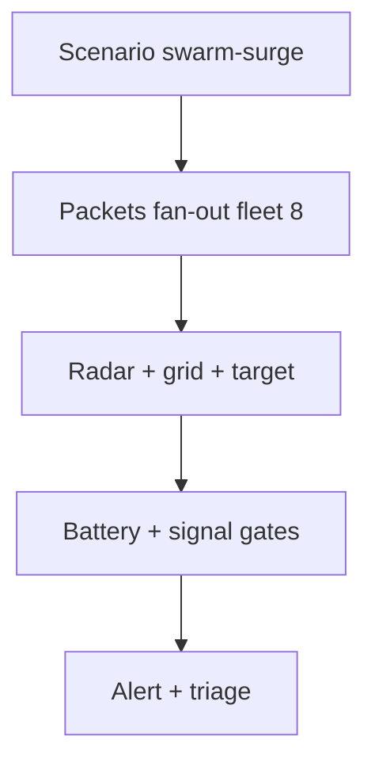

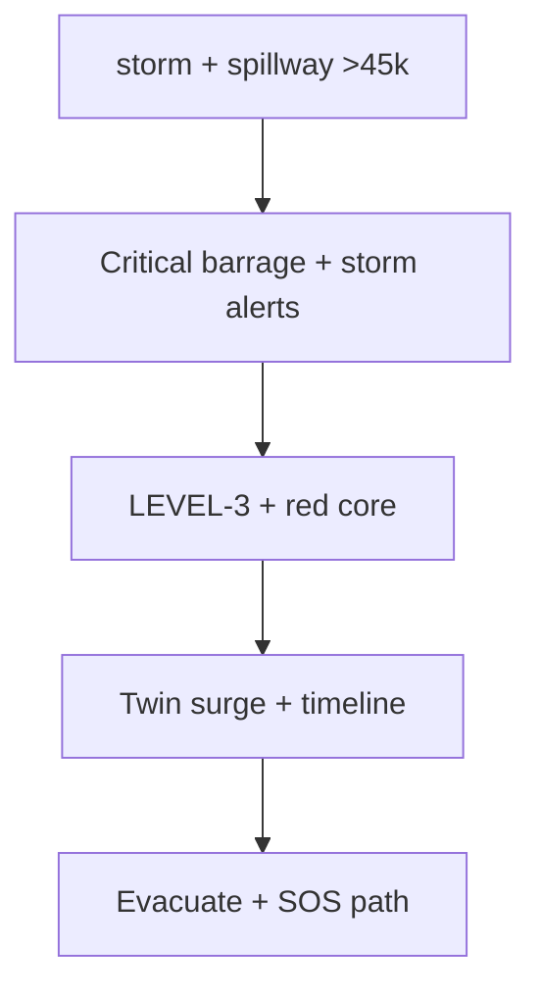

---

## 🛠️ Installation

Prereqs: Node 18+ (CI 20), npm 9+, Python 3.11 (backend), WebGL browser.

```bash
git clone https://github.com/hemanthhemanth1834-bit/drishti-ai-command-center.git
cd drishti-ai-command-center
npm install
cp .env.local.example .env.local
npm run dev
# http://localhost:3000
```

```bash
npm run build
npm run start
npm run lint
npm run typecheck
```

```bash
cd backend
pip install -r requirements.txt
uvicorn app.main:app --host 0.0.0.0 --port 8000
```

```bash
docker build -t drishti-backend ./backend
docker compose up --build
```

---

## 🔑 Environment Configuration

| Variable | Required | Scope | Purpose | Default |
|---|---|---|---|---|
| `NEXT_PUBLIC_WS_URL` | Optional | browser | WS URL | `ws://localhost:8000/ws/telemetry` |
| `NEXT_PUBLIC_API_BASE` | Optional | browser | REST base | `http://localhost:8000` |
| `NEXT_PUBLIC_GATEWAY_KEY` | Match backend | browser | REST Bearer | `drishti-mesh-dev-key-2025` |
| `NEXT_PUBLIC_GOOGLE_MAPS_KEY` | Optional | browser | Rich Places/embeds | empty → keyless |
| `NEXT_PUBLIC_OWM_KEY` | Optional | browser | Documented weather | empty → degrade |
| `GATEWAY_KEY` | Match frontend | server | REST Bearer | `drishti-mesh-dev-key-2025` |
| `CORS_ORIGINS` | Optional | server | Origins (+`*` in code) | `http://localhost:3000` |
| `TELEMETRY_HZ` | Optional | server | Packets/sec | `2` |

> ⚠️ Never commit real keys. `.env*.local` + backend `.env` are gitignored.

---

## 🚀 Deployment

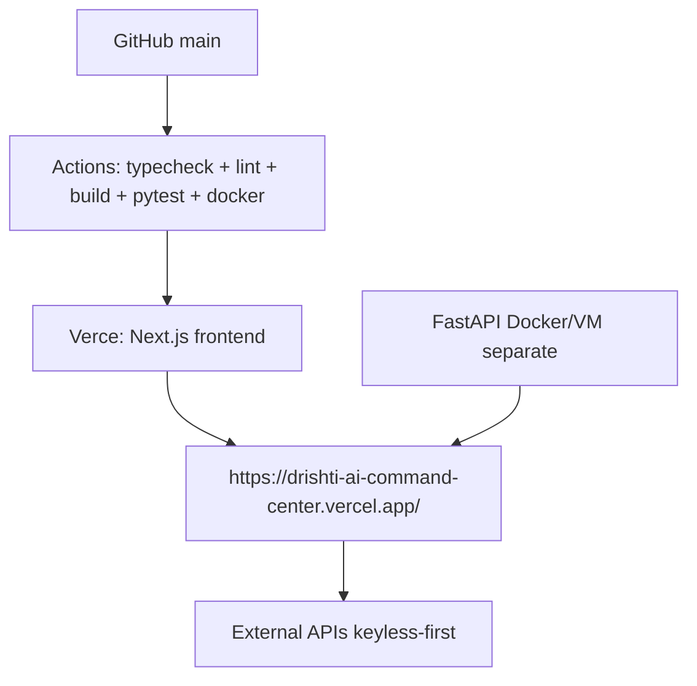

`vercel.json` services: frontend root `.`, backend entry `app.main:app`, `/api/backend/*` rewrite. Manual: `npm run build && vercel --prod`; set `NEXT_PUBLIC_*` in Vercel env. Backend needs separate host with `wss` + tightened CORS; WS needs sticky/proxy support. Do not claim backend is on the Vercel URL.

---

## 🧪 Testing

9 backend contract tests (`backend/tests/test_api.py`, `TestClient`, `GATEWAY_KEY=test-key-123`): open health ×2, 401 guards, authed shape (fields + lat/lon/battery ranges), drones list, scenario round-trip (`storm→200`, `nope→400`, reset), WS frame (`drone_id+tick`), open sensors, v1 scenario guard. Run `python -m pytest -q`. Frontend: no suite; CI enforces `tsc --noEmit` + `next lint` + `next build`. No coverage percentages claimed.

---

## 👁️ Observability

Exists: `/api/health` + `/api/v1/health` + `/api/v1/sensors`, `SystemHealth` panel, `OfflineBanner`, `BootSequence` steps, `DemoConsole`/`MissionReplay` drill trace, `AiDecisionTimeline` event log, `try/catch` + malformed-frame guards, Next error/loading boundaries. Missing: structured logs, metrics/tracing, alerting, persisted audit — see Scalability.

---

## 🧯 Troubleshooting

| Symptom | Fix |
|---|---|
| Install fail | Node 20, clean cache, reinstall |
| Build fail | `typecheck` + `lint` first |
| `connected:false` | Start backend, check WS URL + `/api/health` |
| 401 | Match gateway keys |
| GPS error | Allow permission, localhost/HTTPS |
| Overpass empty | Retry; demo fallback expected |
| Google details missing | Set Maps key + redeploy |
| 3D fallback | Enable HW accel; test without reduced-motion |
| Mobile jank | Eco/low mode |

---

## ⚠️ Limitations

Prototype/demo boundaries: simulated telemetry/hazards/facilities/ICU/seeds/gallery; no ML, metrics, satellite tasking, or dispatch. Straight-line evacuation; OSM rate limits; GPS/WebGL permission/hardware gated; localStorage-only; dev-grade CORS/auth; WS open. Maturity explicit in matrix below.

---

## 📈 Scalability & Future Architecture

> Recommendations, not existing features.

- Distributed telemetry: gateway → queue (e.g., NATS/Kafka) → stream processors → WS fan-out + history DB.
- Persistent PostGIS + event store; idempotent ingestion; backfill/replay.
- WebRTC SFU for drone video alongside telemetry tracks.
- Multi-agency rooms: presence + CRDT/shared WS state + RBAC + audit.
- Real inference service: versioned models behind feature-flagged API, calibrated scores, eval harness.
- Satellite pipeline: STAC catalog + tile server + change detection jobs.
- Mobile: Expo client reusing REST/WS + push.
- Backend horizontal scale: stateless packet builders + Redis pub/sub + sticky WS or gateway broadcast.

---

## 🧭 Architectural Decisions & Trade-offs

| Decision | Why (evident) / Interpretation |
|---|---|
| Next.js App Router | Routes map 1:1 to ops/citizen modules; SSR shell + client islands; Vercel-native |
| Vanilla Three.js | Full control of particles/loops/dispose; no R3F dep; cost = imperative code |
| Leaflet + OSM | Keyless, light, sufficient for circles/markers; cost = no vector 3D globe |
| WS push @2 Hz | Liveness for HUD/maps/3D; cost = open local WS, reconnect logic owned by client |
| FastAPI | Typed Python service, TestClient tests, Docker-ready; cost = separate host from Vercel |
| Browser-side viz | Zero backend render cost, instant tone updates; cost = GPU-gated, needs quality modes |
| Adaptive quality | One codebase across desktop/mobile; cost = tuning matrix |
| Procedural audio | Zero assets, gesture-safe; cost = limited fidelity |
| Open geo services | Evaluable with no keys; cost = quotas/fallback complexity |

---

## 🗺️ Roadmap

**Current (verified):** 27 sub-routes, HUD+timeline, 3D trio+swarm, Leaflet+Overpass+Nominatim, rules engines, SOS/evacuate prototypes, trilingual, audio, quality modes, FastAPI+WS, CI, Docker/compose.

**Planned (not started):** Copernicus Sentinel, WebRTC drone video, PWA push, multi-agency collaboration, citizen AI chatbot (local LLM), React Native/Expo app, NavIC/Bharat GNSS.

---

## 📁 Complete Project Structure

```text
src/
├── app/ # 27 page.tsx (welcome/command/safety/location/alerts/emergency/evacuate/twin/drones/ops/simulation/risk/nearby/report/family/learn/plan/kit/shelter/resources/recovery/reunion/talk/demo/platform/portal/sources) + page redirect + layout + globals + error/loading
├── components/ # 40 tsx: cinematic(14) + 3d/three + maps + dashboard + alerts + layout + safety/ops primitives
├── hooks/ # useTelemetrySocket(68) + useLocalList(44)
├── store/ # appStore(107) + opsStore(176) + intelStore(266)
├── utils/ # apiClient(36) + alertRules(105) + riskEngine(103) + geofenceDetection(32) + overpass(105) + geocode(146) + googlePlaces(120) + audioSynth(157)
├── i18n/dict.ts(88) # EN/TE/HI + useT
└── data/ # providers.ts(183: 11 hazards/11 facilities/4 alerts + numbers) + learn.ts
backend/ # app/main(81)+config+telemetry + services(engine43/manager) + models(39) + routers(api_v1 52/ws) + requirements + Dockerfile(py3.11) + tests(71: 9 tests) + .env.example
public/ # poster.jpg + icon.svg + manifest.json + sw.js
docs/screenshots/README.md # capture guide, no PNGs
next.config.js # strict + env passthrough
tailwind.config.js # content src/**/*.tsx
docker-compose.yml # backend 8000 + frontend node:20 dev
vercel.json # frontend svc + backend entry + rewrites
.github/workflows/ # deploy.yml + pr-check.yml
```

---

## 🧮 Technology Matrix

| Layer | Technology | Version | Responsibility |
|---|---|---|---|
| Frontend | Next.js / React / TS | 14.2.5 / 18.3.1 / 5.5.0 | Routing, UI, types |
| 3D | three + @types/three | 0.169.0 | Core, twin, globe, swarm |
| Maps | leaflet + @types/leaflet | 1.9.4 / 1.9.12 | Tiles, circles, grid, markers |
| State | React external stores | built-in | app/ops/intel shared truth |
| Styling | Tailwind + PostCSS + autoprefixer | 3.4.19 / 8.5.28 / 10.5.6 | Utility UI |
| Icons | lucide-react | 1.45.0 | Glyphs |
| Audio | Web Audio | native | Procedural cues |
| Backend | FastAPI / Uvicorn / Pydantic | 0.116.1 / 0.35.0 / 2.11.7 | REST/WS/models |
| Realtime | WebSocket | native | 2 Hz packets |
| Tests | pytest + httpx + TestClient | 8.3.4 / 0.28.1 | 9 contract tests |
| Deploy | Vercel + Docker + compose | services/dockerfile | Frontend hosting + API container |
| External | OSM/CartoDB/Overpass/Nominatim/Esri/Google/NASA/Unsplash | services | Tiles, POIs, geocode, gallery |

---

## 🏷️ Feature Maturity Matrix

| Capability | Status | Implementation |
|---|---|---|
| Routing + HUD + timeline + triage | 🟢 Implemented | 27 routes, 40 components, 3 stores |
| Maps + search + POIs + shelters | 🟢 Implemented | Leaflet + Nominatim + Overpass; Google opt |
| Risk/alert/geofence math | 🟢 Implemented | Deterministic fns, 6 alert rules, ray-casting |
| REST/WS + reconnect + health | 🟢 Implemented | FastAPI + hook + SystemHealth |
| SOS/evacuate/report/family/learn/voice | 🟢 Implemented | Prototypes, local-first |
| Drone positions/battery/signal | 🟡 Simulated | sin+random Hyd generator @2 Hz |
| Hazards/facilities/ICU/seeds/gallery | 🟡 Simulated | Labeled DEMO/SIMULATION |
| 3D core/twin/globe/swarm/flood | 🟡 Simulated | Procedural viz of posture |
| Tiles/POIs/geocode/imagery | 🔵 External | Keyless-first, quota-gated |
| Sentinel/WebRTC/push/multi-agency/chatbot/mobile/NavIC | ⚪ Planned | Roadmap only |

---

## 🖼️ Platform Preview


Verified assets: `public/poster.jpg` (hero + OG image), `public/icon.svg` (favicon), `public/manifest.json` + `sw.js` (PWA shell). `docs/screenshots/` holds only a capture guide — add real 1280×800 route PNGs before referencing more images.

---

## 🤝 Contributing

```bash
git clone https://github.com/<you>/drishti-ai-command-center.git
cd drishti-ai-command-center
git checkout -b feat/<short-name>
npm install
npm run typecheck
npm run lint
npm run build
cd backend && python -m pytest -q
```

Scoped PRs to `main`; screenshots for UI; label simulated vs real; update maturity matrix when behavior changes.

---

## 📄 License

This project is open-source for educational and hackathon purposes.

---

---

## 🌋 DRISHTI-X Full Intelligence Platform (free-first upgrade)

Additive upgrade — all routes above preserved. New hub: `/intelligence`.

| Area | Status | Notes |
|---|---|---|
| ML pipeline (`backend/ml`) | 🟢 Implemented | RandomForest, 22 features, stratified split, metrics from real runs only |
| ML API (`/api/v1/ml/*`, `/api/v1/model-health`) | 🟢 Implemented | predict/batch/model/health/features/explain; DEMO-labeled fallback when untrained |
| NER risk grid (`/api/v1/grid`, `/risk-map`) | 🟢 Implemented | Leaflet heat + legend + layers, OSM attribution |
| Weather (`/api/v1/weather`, `/api/v1/rainfall`, `/weather`) | 🟢 + 🔵 | Open-Meteo free/live; IMD opt-in stub (never synthesized) |
| Soil hierarchy | 🟢 Implemented | ISRO → SoilGrids → Open-Meteo → DEMO, chain recorded |
| Sensors (`/api/v1/sensors/*`, `/sensors`) | 🟢 Implemented | ESP32/LoRa/MQTT/HTTP ingest, anomaly + battery gates |
| Satellite (`/api/v1/satellite/*`, `/satellite`) | 🟢 + 🔵 | Copernicus/NASA/ISRO adapters with honest status; GIBS keyless |
| Terrain (`/api/v1/terrain/*`, `/terrain`) | 🟢 Implemented | slope/aspect/curvature + twin params; SRTM-ready |
| History (`/api/v1/history/*`, `/history`) | 🟢 Implemented | CSV import + validation; seeds are DEMO |
| Early warning (`/api/v1/warnings/*`) | 🟢 Implemented | WATCH/ALERT/WARNING/CRITICAL, decision-support wording |
| Roads (`/api/v1/roads/*`, `/roads`) | 🟢 Implemented | 5 statuses, blockage, impact (villages + units) |
| Incidents (`/api/v1/incidents/*`, `/incidents`) | 🟢 Implemented | photo/video + GPS, validated uploads, human verify |
| Vision (`/api/v1/vision/*`) | 🟡 Simulated | pluggable interface, DEMO heuristic labeled |
| Response (`/api/v1/response/*`, `/response`) | 🟢 Implemented | P1..P4 with WHY |
| Notifications (`/api/v1/notifications/*`, `/notifications`) | 🟢 Implemented | web/push/sms/email; NOT_CONFIGURED honesty; VAPID-ready SW push |
| Alerts (`/api/v1/alerts/*`) + 9-lang templates | 🟢 Implemented | EN/HI/ASM/BN/Bodo/Manipuri/Khasi/Mizo/Nepali reviewed shorts |
| Offline PWA (`/api/v1/sync/*`, `/offline`) | 🟢 Implemented | IndexedDB queue + receipts + auto-sync; SW push handler |
| DB (PostgreSQL-ready, SQLite fallback) | 🟢 Implemented | 17 tables, seed-on-empty (DEMO only), PostGIS path documented |
| Docker Compose | 🟢 Implemented | default keyless; `--profile full` adds PostGIS + Valkey + MinIO + Mailpit |
| Security | 🟢 Implemented | JWT-ready, RBAC 5 roles, rate limits, upload guards, audit log |
| Model monitoring (`/model-health`) | 🟢 Implemented | real metrics or NOT AVAILABLE — never invented |

Demo model card (SYNTHETIC-DEMO, seed 42, 3000 rows): acc 0.887 · precision 0.977 · recall 0.890 · F1 0.931 · ROC-AUC 0.941. Regenerate: `cd backend && python -m ml.train`.
New tests: `backend/tests/test_platform.py` (26 tests). Full suite: 35 passed.

## 👨‍💻 Author

**Muchakarla Hemanth Kumar**
AI Engineer · Full-Stack Developer

📧 hemanthhemanth1834@gmail.com
🔗 [GitHub](https://github.com/hemanthhemanth1834-bit)

---

## ⭐ Why DRISHTI-X

AI disaster management needs more than models: geospatial intelligence, drone search and rescue context, digital twin and flood simulation, real-time telemetry, Three.js visualization, Next.js + FastAPI delivery, and citizen safety plus command center workflows in one evaluable system. DRISHTI-X is that integration prototype — honest about simulated boundaries, explicit about architecture, and structured for Sentinel, video, push, multi-agency, inference, and mobile next.

*DRISHTI-X — For a Safer, Stronger, Resilient India 🇮🇳*
