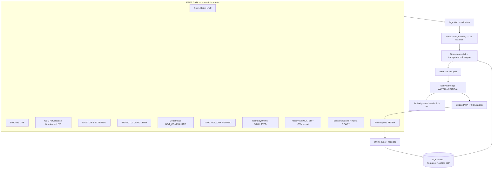

# DRISHTI-X — AI Disaster Intelligence Command Center

> **Working prototype** · free-first, open-data-oriented disaster-intelligence platform.
> **Not a certified emergency-warning system** — it does not replace official government warnings or professional disaster-response procedures.

[](https://drishti-ai-command-center.vercel.app/)
[](https://github.com/hemanthhemanth1834-bit/drishti-ai-command-center)
[](https://drishti-ai-command-center.vercel.app/intelligence)
[](https://drishti-ai-command-center.vercel.app/data-sources)
[](https://drishti-ai-command-center.vercel.app/model-health)
[](https://drishti-ai-command-center.vercel.app/risk-map)

**Live:** https://drishti-ai-command-center.vercel.app/ — start at `/welcome`, operators at `/command`, platform hub at `/intelligence`. Runs keyless; live-data features degrade to labeled DEMO when the backend is unreachable.

**Status key used everywhere:** `READY` · `PARTIALLY READY` · `CONFIGURATION REQUIRED` · `SIMULATED` · `NOT AVAILABLE` · `PLANNED`
**Provenance labels in the UI:** `LIVE` · `FORECAST` · `DEMO` · `SIMULATION` · `EXTERNAL` · `OFFLINE` · `STALE` · `NOT_CONFIGURED`

---

## 1. Project overview

Landslide and flood response fails fastest at the seams: rainfall data lives apart from terrain maps, terrain apart from road status, roads apart from field reports, and all of it apart from the citizens at risk. DRISHTI-X closes those seams with one working prototype where **GIS + AI/ML + weather + terrain + sensors + citizen reports** read and write the same intelligence loop:

- **Problem:** fragmented hazard maps, delayed awareness, 2D lists that can't show elevation/water spread, scattered shelter/hospital data, no shared operator–citizen picture.
- **Approach:** free/open data (Open-Meteo, SoilGrids, OpenStreetMap) → validation → feature engineering → open-source ML + transparent risk engine → GIS heatmap → early-warning workflow → authority dashboard + citizen PWA → field verification → database → continuous learning.
- **Users:** citizens/families (safety checks, alerts, evacuation, SOS, reporting), field officers (offline reporting, verification), district/state officers (alerts, roads, response priority), developers/evaluators (APIs, model lab, demo scenarios).
- **Scope:** a functional prototype with real open-data integrations where free access exists, honest stubs where credentials are required, and clearly labeled simulation everywhere else.

---

## 2. Key capabilities

### AI/ML intelligence — PARTIALLY READY
- 22-feature risk schema (`rainfall_1h/6h/24h/72h`, intensity, anomaly, antecedent, soil, temperature, elevation, slope, aspect, curvature, roughness, drainage, land cover, satellite/vegetation change, history frequency, distance-to-prior, hill-cutting, road proximity) with validation (`backend/ml/schemas.py`).
- RandomForest training/inference (`backend/ml/train.py`, `backend/ml/inference.py`), model versioning (`version.json`), held-out metrics (accuracy/precision/recall/F1/ROC-AUC/confusion matrix), feature importance, per-prediction explanations (`GET /api/v1/ml/explain/{id}`).
- Real CSV training path (`--csv`, schema-validated); labeled DEMO heuristic fallback when untrained.
- **The demonstration model (`Landslide-RF-v1`) is trained on synthetic data — acc 0.887 · F1 0.931 · ROC-AUC 0.941 — and these metrics must NOT be interpreted as validated real-world landslide prediction performance.**

### GIS intelligence — READY (open data) + SIMULATED (risk values)
- Leaflet + OpenStreetMap tiles (attributed), NER risk grid (`/api/v1/grid/risk-cells`, `/risk-map`) with GREEN/YELLOW/ORANGE/RED legend, layer toggles (cells, sensors, roads), popups (probability, slope, rain, history, nearby assets).
- Overpass POIs (hospitals/shelters), Nominatim search, hazard rings, evacuation helpers; MapLibre 3D GIS in the NE-SAFE center (`/nesafe`).

### Weather & rainfall — READY (free, no key)
- Open-Meteo primary: current, 1/6/24/72 h, 7-day sums, anomaly vs climatology, thresholds (`RAIN_WARN_24H`/`RAIN_CRIT_24H`); observed vs forecast separated in every response.
- IMD: opt-in provider stub — reports `NOT_CONFIGURED` without credentials; **no IMD data is ever synthesized.**

### Soil intelligence — PARTIALLY READY
- Hierarchy with recorded fallback chain: ISRO/Bhuvan (not configured) → SoilGrids/ISRIC (live, no key) → Open-Meteo soil → DEMO. Plus ESP32/LoRa/MQTT/HTTP-ready sensor ingest (`POST /api/v1/sensors/ingest`) with anomaly/battery gates.

### Satellite intelligence — SIMULATED + EXTERNAL
| Adapter | State |
|---|---|
| Demo observation/change detection | SIMULATED (labeled, stored, comparable) |
| NASA GIBS tiles | EXTERNAL (keyless WMTS, reachable) |
| Copernicus Sentinel-1/-2, NASA bulk, ISRO/Bhoonidhi | CONFIGURATION REQUIRED (free accounts/logins; never faked) |
Gallery/placeholder imagery is never presented as a live observation; every record carries source/timestamp/type/resolution/status.

### Terrain intelligence — SIMULATED (procedural DEM)
Elevation/slope/aspect/curvature/roughness/drainage/hill-cutting with Himalayan-scale relief; feeds ML + twin params (`/api/v1/terrain/twin-params`). **Not survey data** — SRTM/Copernicus DEM is the documented swap-in.

### Historical disasters — SIMULATED + real import path
SQLite/Postgres table + validated CSV import (`/history`, max 2000 rows), trends (yearly/severity/rainfall correlation), hotspots. Seeds are synthetic; casualties accept official figures or `unknown` only.

### Citizen / field reporting — READY (prototype)
GPS + photo/video upload (type/size-validated, ≤15 MB, 4 files) → pluggable vision hint (demo, labeled) → DB as UNVERIFIED → human verify → risk map + authority queue. Offline queue with per-item server receipts + auto-sync (`/offline`).

### Emergency response — READY (triage aid)
Transparent P1–P4 scoring (probability, population, road cutoff, infrastructure, shelter gap, unit distance, rain, severity) with WHY breakdown; commander decides. Warnings: WATCH/ALERT/WARNING/CRITICAL with decision-support wording, affected villages/roads/infrastructure, forecast windows (never fixed times).

### Notifications — PARTIALLY READY
In-app + web queue **live**; Web Push (VAPID, SW handler installed), email (SMTP/Mailpit), SMS: **CONFIGURATION REQUIRED** — the API returns `Provider not configured`, never a fake receipt. Reviewed 9-language alert templates (EN/HI/ASM/BN/Bodo/Manipuri/Khasi/Mizo/Nepali).

### Offline mode — PARTIALLY READY
PWA shell caching, IndexedDB queue + cache with localStorage fallback, receipts, reconnect auto-sync. **Limitation:** Background Sync API not implemented (manual + `online`-event sync).

### 3D digital twin — SIMULATED (existing, preserved)
Vanilla Three.js twin + R3F terrain center (`/nesafe`): elevation, risk blobs, sensor masts, rain particles, orbit controls, 2D fallbacks, reduced-motion support. **Simulation is labeled and never shown as live reality.**

---

## 3. System architecture



---

## 4. Technology stack (only what is in the repo)

| Layer | Technology | Version | Role |
|---|---|---|---|
| Frontend | Next.js / React / TypeScript | 14.2.5 / 18.3.1 / 5.5 | App Router, 47 routes |
| 3D | three / @react-three/fiber / @react-three/drei | 0.169 / 8.18 / 9.122 | twin, terrain center, globe |
| Maps | leaflet / maplibre-gl | 1.9.4 / 6.10 | risk heatmap, 3D GIS |
| UI | Tailwind 3.4, framer-motion 13.3, lucide-react | — | cinematic HUD, glassmorphism |
| Backend | FastAPI / Uvicorn / Pydantic | 0.116.1 / 0.35.0 / 2.11.7 | REST + WebSocket |
| AI/ML | scikit-learn / pandas / numpy | 1.9.1 / 3.0.5 / 2.5.1 | RandomForest pipeline |
| Data | SQLAlchemy 2.0.54, SQLite fallback | — | 17 tables; Postgres/PostGIS-ready |
| Infra | Docker + Compose, Valkey, MinIO, Mailpit | full profile | self-hosted, all free |
| Open data | Open-Meteo, SoilGrids, OSM/Overpass/Nominatim, GIBS | services | keyless live layers |

---

## 5. Application routes (all 47 verified in `src/app` + production build)

**Intelligence platform (new, all deployed, backend-backed with DEMO fallback):**

| Route | Purpose | Backend API |
|---|---|---|
| `/intelligence` | hub: status + pipeline + module cards | ml/health, weather, notify, sync |
| `/regions` | dynamic region command: Country → State → District → City | `/api/regions/*`, rainfall, risk, resources |
| `/prediction` | citizen/officer predictor + WHY | `ml/predict`, `ml/explain` |
| `/risk-map` | NER heatmap + legend + layers | `grid/risk-cells`, sensors, roads |
| `/weather` | rainfall 1/6/24/72h, anomaly, thresholds | `rainfall/*`, `weather/*` |
| `/sensors` | network table, anomaly/battery gates | `sensors/network` |
| `/satellite` | adapters, observations, change | `satellite/*` |
| `/terrain` | slope/aspect/roughness + twin link | `terrain/*` |
| `/history` | trends, records, CSV import | `history/*` |
| `/ml` | model card + validation metrics | `ml/model`, `ml/health` |
| `/model-health` | metrics/drift or NOT AVAILABLE | `model-health` |
| `/incidents` | report + queue + verify flow | `incidents/*` |
| `/roads` | statuses, blockage, impact | `roads/*` |
| `/response` | P1–P4 queue + WHY | `response/*` |
| `/notifications` | channels, templates, push test | `notifications/*`, `sync/subscriptions` |
| `/offline` | queue, cache, receipts, sync | `sync/*` |
| `/data-sources` | attribution + license catalog | provider statuses |
| `/admin` | roles, thresholds, models, audit | `admin/*`, `warnings/config` |

**Existing DRISHTI-X + NE-SAFE (preserved):** `/` → `/welcome`, `/command`, `/nesafe` (3D landslide center), `/twin`, `/drones`, `/simulation`, `/location`, `/safety`, `/risk`, `/alerts`, `/nearby`, `/evacuate`, `/emergency`, `/report`, `/family`, `/plan`, `/kit`, `/learn`, `/talk`, `/ops`, `/demo`, `/sources`, `/platform`, `/portal`, `/resources`, `/shelter`, `/reunion`, `/recovery`.

### Universal, multi-region, Telugu-first platform

- **Geography:** DB-driven Country → State → District → City → Locality (`/regions`, `/api/regions/*`). Showcase: **Andhra Pradesh (26 districts) + Telangana (33 districts)** with verified city coordinates; 20 Indian states seeded; US/GB/AU/JP stub rows for global extensibility. No code changes needed for new regions. Boundary overlays stay schematic until open boundary datasets are wired.
- **Sectors:** 7 sectors × 15 disaster types (EN + TE), 9 agency records — config + DB, filterable.
- **Telugu-first:** full EN/TE platform strings (`src/platform/i18n.ts`), TE nav, TE emergency phrases, TE alert templates; app language switch already in Navbar.
- **AI:** `/api/v1/ai/*` — Ollama-optional summarization/classification; LLM explains text only, never computes risk. Output classes OBSERVED/ANALYZED/ESTIMATED/PREDICTED/SIMULATED.
- **Observability:** `/api/v1/ops/health` (errors, latency p50/p95, inference time, provider failures, sync, DB) + Admin panel; in-memory, no commercial monitoring.
- **Maps:** OSRM routing + Nominatim geocoding adapters (cached, throttled, labeled CACHED/LIVE/DEMO).
- **Shelters/resources:** live registry with occupancy workflow + nearest-open-shelter.
- **Reports:** UNVERIFIED → UNDER_REVIEW → VERIFIED/REJECTED workflow (backwards-compatible `verified` flag kept).
- **Alerts:** INFO/ADVISORY/WATCH/ALERT/WARNING/EMERGENCY/CRITICAL (superset; old levels unchanged).
- Docs: `FREE-STACK.md`, `THIRD-PARTY-LICENSES.md`, `data/README.md`, `docs/` (architecture, GIS, AI, data-sources, API, database, deployment, security, demo-mode, local-development).

---

## 6. Data sources

| Source | Purpose | Status | Auth | Fallback |
|---|---|---|---|---|
| Open-Meteo | weather/rainfall/soil proxy | LIVE | none | DemoWeather |
| SoilGrids/ISRIC | soil texture | LIVE | none | Open-Meteo → DEMO |
| OpenStreetMap | tiles, geocoding | LIVE | none | CartoDB/Esri |
| Overpass / Nominatim | POIs, search | LIVE (quota) | none | seeded DEMO |
| NASA GIBS | satellite context tiles | EXTERNAL | none | demo obs |
| NASA GPM/Earthdata | precipitation bulk | CONFIGURATION REQUIRED | free login | Open-Meteo |
| Copernicus | Sentinel-1/-2 | CONFIGURATION REQUIRED | free account | demo obs |
| ISRO/Bhuvan/Bhoonidhi | soil/satellite (India) | CONFIGURATION REQUIRED | varies | SoilGrids/DEMO |
| IMD | official weather | CONFIGURATION REQUIRED | key | Open-Meteo |
| DEM/SRTM | elevation (production) | PLANNED | — | procedural DEM (demo) |
| Historical datasets | training/history | SIMULATED + CSV import | — | demo seeds |

Full catalog with licenses: `/data-sources` in the app.

---

## 7. Free-first strategy

FREE-FIRST · OPEN-SOURCE-FIRST · SELF-HOSTABLE · API-KEY-OPTIONAL · DEMO-READY · OFFLINE-CAPABLE. Every external source sits behind an adapter (`WeatherProvider`, soil/precipitation/satellite/storage/notification providers) with a free default: Open-Meteo for weather, SoilGrids for soil, OSM for maps, scikit-learn for ML, SQLite→Postgres for data, MinIO/Valkey/Mailpit self-hosted. No provider is claimed connected unless the code proves it (§6).

---

## 8. Demo mode & data integrity

Live/open integrations and simulated components coexist; **provenance labels decide what anything is**: `LIVE`/`FORECAST`/`EXTERNAL` (real), `DEMO`/`SIMULATION` (synthetic), `OFFLINE`/`STALE`/`NOT_CONFIGURED`/`NOT_AVAILABLE` (state). Demo data can never silently become live: `data_status`/`simulated` ride every API response into badge UI, and the suite asserts the flags. **Prototype — not a replacement for official warnings.**

---

## 9. ML limitations

- Trained on synthetic data (87% positive skew → optimistic metrics); needs verified historical data for operational training.
- Geographic generalization unvalidated; calibration unevaluated; drift PSI needs stored baselines (currently NOT AVAILABLE).
- Human/government validation required before any operational use.

---

## 10. Installation (verified commands)

Prereqs: Node 18+ (CI: 20), npm 9+, Python 3.11+.

```bash
git clone https://github.com/hemanthhemanth1834-bit/drishti-ai-command-center.git
cd drishti-ai-command-center
npm install
cp .env.example .env.local   # all keys optional
npm run dev                  # http://localhost:3000
```

```bash
cd backend
pip install -r requirements.txt
python -m ml.train --samples 3000        # or --csv data/verified.csv
uvicorn app.main:app --host 0.0.0.0 --port 8000   # docs: http://localhost:8000/docs
```

```bash
docker compose up --build                                   # keyless demo stack
docker compose --profile full up --build                    # + PostGIS/Valkey/MinIO/Mailpit
```

---

## 11. Environment variables (`.env.example`, all optional unless noted)

| Variable | Needed for | Required? |
|---|---|---|
| `NEXT_PUBLIC_API_BASE/WS_URL/GATEWAY_KEY` | frontend→backend link | recommended (demo without) |
| `DATABASE_URL` | Postgres (default SQLite file) | production |
| `JWT_SECRET` | JWT roles (else gateway key → operator) | production |
| `IMD_API_KEY`, `COPERNICUS_USER`, `EARTHDATA_TOKEN` | official/satellite feeds | only for those feeds |
| `SMS_PROVIDER_KEY`, `PUSH_PROVIDER_KEY`, `WEB_PUSH_*`, `SMTP_*` | notifications | only for those channels |
| `STORAGE_*`, `RAIN_*`, `WARN_PROB_*`, `MAX_UPLOAD_MB`, `ML_MODEL_DIR` | storage/thresholds/uploads/model | optional tuning |
| `AI_PROVIDER`, `OLLAMA_BASE_URL`, `OLLAMA_MODEL` | local LLM (optional, nothing auto-downloaded) | optional |

Never commit real values (gitignored: `.env*`, `backend/.env`, `*.db`, `ml/artifacts/`).

---

## 12. Docker

Default: FastAPI + Next.js dev, SQLite, no keys. Full profile (`--profile full`): `postgis/postgis:16-3.4`, `valkey/valkey:8`, MinIO console :9001, Mailpit UI :8025 / SMTP :1025. Point `DATABASE_URL` at PostGIS and `SMTP_HOST=mailpit` to use them.

---

## 13. API documentation

Groups (all under `/api/v1/`): `ml` (predict/batch/model/health/features/explain), `model-health`, `weather`, `rainfall`, `sensors` (+legacy `GET /sensors` extended, preserved), `satellite`, `terrain`, `history`, `warnings`, `roads`, `response`, `notifications`, `incidents`, `vision`, `grid`, `risk`, `alerts`, `sync`, `admin`, `nesafe`, plus `/api/regions/*` (countries/states/districts/cities/disasters/sectors/agencies/geocode/route), `/api/v1/ai/*` (status/summarize/classify), `/api/v1/resources/*` (units/shelters/occupancy/nearest-shelter). Interactive docs: **http://localhost:8000/docs** (backend running). Mutations need `Authorization: Bearer <GATEWAY_KEY>` (or JWT when configured); honest `401/403/429` otherwise.

---

## 14. Testing & verification (latest verified runs)

```bash
cd backend && python -m pytest -q     # 49 passed (9 legacy + 26 platform + 14 universal)
npm test                              # 7 passed (vitest: templates, geo config, region store)
npm run typecheck                      # clean
npm run lint                           # clean
npm run build                          # 47/47 routes static
```

These verify contracts, validation, honesty flags, and builds — **not** real-world prediction skill.

---

## 15. Project status

| Capability | Status |
|---|---|
| ML pipeline + inference | PARTIALLY READY (synthetic data) |
| Weather/rainfall (Open-Meteo) | READY |
| Soil (SoilGrids chain) | PARTIALLY READY |
| GIS + risk grid | READY (values SIMULATED) |
| Satellite | SIMULATED + EXTERNAL tiles |
| Terrain | SIMULATED |
| Historical data | SIMULATED + import READY |
| Warnings/alerts/response | READY (triage aid) |
| Notifications | PARTIALLY READY (in-app live; SMS/push/email need keys) |
| Offline PWA | PARTIALLY READY (no Background Sync) |
| Database | READY (SQLite) / Postgres path PLANNED-to-deploy |
| Auth/RBAC | READY (prototype-grade; JWT hardening planned) |
| Citizen reporting | READY (prototype) |

---

## 16. Roadmap (by dependency)

1. Vercel redeploy on each release; 2. verified historical dataset + retrain; 3. denser demo geography; 4. SRTM DEM swap; 5. real satellite ingestion/change detection; 6. IMD integration; 7. Postgres/PostGIS deploy; 8. JWT hardening (library) + tests; 9. VAPID push E2E; 10. SMS/email providers; 11. offline test suite + Background Sync; 12. duplicate detection; 13. calibration + drift baselines; 14. live sensor fleet; 15. production observability.

---

## 17. Security

RBAC (citizen → sys_admin), Bearer/JWT-ready auth, per-identity rate limits, upload type/size guards + scanner hook, audit log (admin-role reader), env-only secrets. Dev defaults (`drishti-mesh-dev-key-2025`, open CORS) are local-only — rotate before any shared deploy. See `SECURITY.md`.

---

## 18. Platform preview


Live tour: `/welcome` → `/command` → `/intelligence` → `/risk-map` → `/prediction` → `/nesafe`. More captures: [`docs/screenshots/`](docs/screenshots/) (real captures only — see its README for the capture guide).

---

## Contributing / License / Author

- Contributing: [`CONTRIBUTING.md`](CONTRIBUTING.md) · Security policy: [`SECURITY.md`](SECURITY.md)
- License: educational/hackathon use (no formal license file — contact the author for other uses).
- **Muchakarla Hemanth Kumar** — AI Engineer · Full-Stack Developer · hemanthhemanth1834@gmail.com · [GitHub](https://github.com/hemanthhemanth1834-bit)

*DRISHTI-X — for a safer, stronger, resilient India 🇮🇳 (prototype; trust official warnings for real emergencies).*
