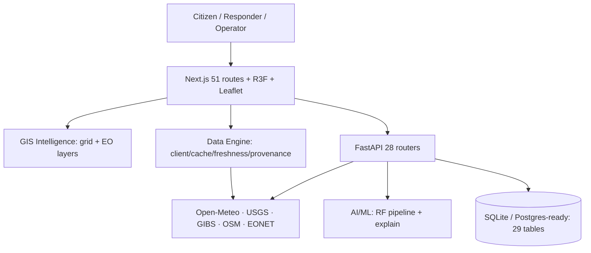
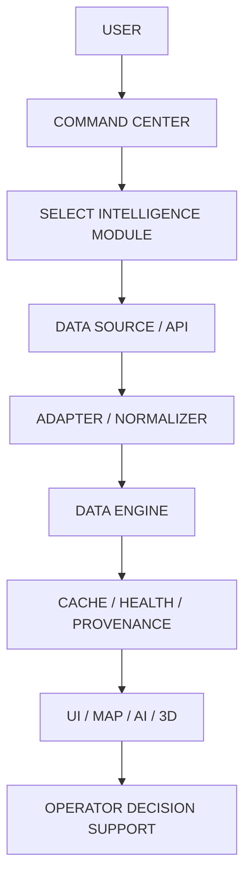
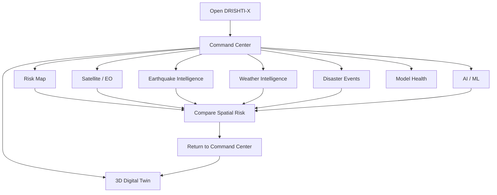

<div align="center">

# DRISHTI-X
## AI Disaster Intelligence Command Center

**See Early · Understand Better · Act Faster · Save Lives**

A free-first, GIS-driven disaster intelligence platform combining Earth observation, weather, terrain, AI/ML risk analysis, incident intelligence, early warning, emergency response, and resilience workflows — with honest LIVE / DEMO / SIMULATION / OFFLINE provenance on every value.

[](https://drishti-ai-command-center.vercel.app/)
[](https://github.com/hemanthhemanth1834-bit/drishti-ai-command-center)
[](https://github.com/hemanthhemanth1834-bit/drishti-ai-command-center/tree/main/docs)


[🌐 Live Demo](https://drishti-ai-command-center.vercel.app/) · [💻 GitHub](https://github.com/hemanthhemanth1834-bit/drishti-ai-command-center) · [📚 Documentation](https://github.com/hemanthhemanth1834-bit/drishti-ai-command-center/tree/main/docs) · [🏗 Architecture](https://github.com/hemanthhemanth1834-bit/drishti-ai-command-center/blob/main/docs/FINAL-ARCHITECTURE.md) · [🚀 Deployment](https://github.com/hemanthhemanth1834-bit/drishti-ai-command-center/blob/main/docs/DEPLOYMENT.md)

> **Working prototype — not a certified emergency-warning system.** It does not replace official government warnings. Live, demo, and unavailable integrations are labeled as such throughout. No `LICENSE` file is currently included in the repository.


> **Command artwork:** the cinematic poster rendered on the Command Center hero. Original project asset.

</div>

---

## What is DRISHTI-X?

DRISHTI-X is an AI Disaster Intelligence Command Center: a Next.js + FastAPI platform where **GIS + AI/ML + weather + terrain + sensors + citizen reports** read and write the same intelligence loop. It exists because disaster response fails fastest at the seams — rainfall data lives apart from terrain maps, terrain apart from road status, roads apart from field reports, and all of it apart from the citizens at risk. DRISHTI-X connects them.

Designed for citizens, field responders, operators, emergency-management teams, authorities, and researchers. What makes it different: **provenance honesty as architecture** — every value carries LIVE / DEMO / SIMULATION / OFFLINE / NOT_CONFIGURED status, demo can never silently become live (asserted in tests), and a post-launch truthfulness patch removed every fabricated operational number from the Command Center.

An operator can move from the [Command Center](https://drishti-ai-command-center.vercel.app/command) to the [Risk Map](https://drishti-ai-command-center.vercel.app/risk-map), inspect a geographic area, cross-reference [USGS earthquake events](https://drishti-ai-command-center.vercel.app/earthquakes), check [Open-Meteo weather](https://drishti-ai-command-center.vercel.app/weather), inspect [NASA GIBS imagery](https://drishti-ai-command-center.vercel.app/satellite), review [model health](https://drishti-ai-command-center.vercel.app/model-health), and open the [3D Digital Twin](https://drishti-ai-command-center.vercel.app/twin) — all routes verified live below.

## Quick Project Overview

| Area | DRISHTI-X Implementation |
|---|---|
| Frontend | Next.js 14.2.5 · React 18 · TypeScript 5.5 · Tailwind 3.4 |
| Backend | FastAPI 0.116.1 · 28 routers · SQLite dev / Postgres-ready (29 tables) |
| Database | SQLite file fallback; `DATABASE_URL` switch; seeds guarantee registry data |
| AI/ML | scikit-learn RandomForest `Landslide-RF-v1` (**SYNTHETIC-DEMO**, never field accuracy) |
| GIS | Leaflet 1.9.4 + MapLibre 6.10 + OSM/Nominatim/Overpass/OSRM |
| Satellite | NASA GIBS WMTS (4 layers, 14-day NRT, measured liveness) |
| Weather | Open-Meteo keyless (current/hourly/daily via data engine) |
| Earthquakes | USGS M2.5+/7d via data engine |
| Disaster Events | NASA EONET (100 records, polygons list-only) |
| 3D | Three.js 0.169 + R3F 8.18 (twin, globe, command views) |
| Deployment | GitHub `main` → Vercel Git integration (never `vercel --prod`) |
| Testing | Vitest 131/131 · Pytest 51/51 · typecheck/lint/build clean |

## System Architecture



Full version: [docs/FINAL-ARCHITECTURE.md](https://github.com/hemanthhemanth1834-bit/drishti-ai-command-center/blob/main/docs/FINAL-ARCHITECTURE.md).

## How the Project Works



1. **User** opens the Command Center and picks a module (risk, satellite, quakes, weather…).
2. **Module** requests through the **Data Engine** (`fetchDataset`), never raw `fetch()` in components.
3. **Adapter** normalizes the source payload (USGS GeoJSON, Open-Meteo, EONET, FIRMS-gated) into validated records; malformed rows are skipped and counted.
4. **Cache + freshness + health** decide HIT/STALE, FRESH/AGING/STALE, AVAILABLE/DEGRADED.
5. **UI** renders records with provenance badges; offline serves labeled stale cache or honest empty states.

## 🧭 How to Explore DRISHTI-X



1. Start at [`/command`](https://drishti-ai-command-center.vercel.app/command) — status header, KPI row, module grid.
2. Open [`/risk-map`](https://drishti-ai-command-center.vercel.app/risk-map) — layers, legend, inspect any point.
3. Open [`/satellite`](https://drishti-ai-command-center.vercel.app/satellite) — GIBS viewer, date/layer controls, fire panel.
4. Open [`/earthquakes`](https://drishti-ai-command-center.vercel.app/earthquakes) — USGS list, map, detail, timeline.
5. Open [`/weather`](https://drishti-ai-command-center.vercel.app/weather) — current vs forecast, hourly, 7-day.
6. Open [`/events`](https://drishti-ai-command-center.vercel.app/events) — EONET records, filters, map.
7. Open [`/model-health`](https://drishti-ai-command-center.vercel.app/model-health) — metrics, SYNTHETIC-DEMO banner.
8. Open [`/twin`](https://drishti-ai-command-center.vercel.app/twin) — 3D layers, cameras, timeline.

## 🚨 Intelligence Modules

| Module | Purpose · Data · State · Link |
|---|---|
| Command Center | Operational overview + per-module live status · backend + direct feeds · [open](https://drishti-ai-command-center.vercel.app/command) |
| Risk Map | GIS grid + 8-layer overlay, scale/coords/fullscreen · GIBS/OSM/grid API · [open](https://drishti-ai-command-center.vercel.app/risk-map) |
| Satellite / EO | GIBS viewer (4 layers, 14-day NRT), before/after slider · NASA · LATEST_AVAILABLE · [open](https://drishti-ai-command-center.vercel.app/satellite) |
| Fire Intelligence | FIRMS adapter, zero synthetic fires · NOT_CONFIGURED (no key) · on `/satellite` |
| Earthquake Intelligence | USGS list/map/detail/timeline · LIVE · [open](https://drishti-ai-command-center.vercel.app/earthquakes) |
| Weather Intelligence | OM current/hourly/daily, observed vs forecast · LIVE · [open](https://drishti-ai-command-center.vercel.app/weather) |
| Disaster Events | EONET records, filters, map · LIVE · [open](https://drishti-ai-command-center.vercel.app/events) |
| AI/ML | RF pipeline, playground, explanations · SYNTHETIC-DEMO · [open](https://drishti-ai-command-center.vercel.app/ml) |
| Model Health | Metrics, identity, drift honesty, timeline · OFFLINE-aware · [open](https://drishti-ai-command-center.vercel.app/model-health) |
| 3D Digital Twin | Layers, cameras, timeline, SIMULATION-labeled · [open](https://drishti-ai-command-center.vercel.app/twin) |

## 🔎 Real DRISHTI-X Examples

### Earthquake investigation
Open Command Center → Earthquake Intelligence → inspect USGS-derived events → select one → review magnitude/depth/time/location → follow provenance → [open the event on USGS](https://earthquake.usgs.gov/) via VIEW SOURCE.

### Weather intelligence
Open [`/weather`](https://drishti-ai-command-center.vercel.app/weather) → pick a verified showcase city → read OBSERVED current vs FORECAST hourly/7-day → check provenance (retrieved time, CC-BY attribution).

### Disaster event investigation
Open [`/events`](https://drishti-ai-command-center.vercel.app/events) → filter by EONET category → open detail → verify source link → view on map (point events only).

### Satellite imagery inspection
Open [`/satellite`](https://drishti-ai-command-center.vercel.app/satellite) → pick GIBS layer + nominal date → read acquisition vs retrieved times → try the Kerala before/after slider.

### Risk-map exploration
Open [`/risk-map`](https://drishti-ai-command-center.vercel.app/risk-map) → toggle layers → click any point for satellite intelligence → read per-tile measured status.

### 3D simulation exploration
Open [`/twin`](https://drishti-ai-command-center.vercel.app/twin) → toggle flood/fire/corridor layers → try camera presets → scrub the surge timeline (all SIMULATION).

### AI/model-health inspection
Open [`/model-health`](https://drishti-ai-command-center.vercel.app/model-health) → read the SYNTHETIC-DEMO banner → inspect artifact metrics → confirm calibration NOT AVAILABLE.

## Live Data vs Simulation

| Capability | State | Meaning |
|---|---|---|
| USGS earthquakes | LIVE | Measured feed, 5-min cache |
| NASA GIBS | LATEST_AVAILABLE | Daily NRT, per-tile measurement |
| Open-Meteo | LIVE | Keyless current + forecast |
| NASA EONET | LIVE | 100-record open feed |
| Backend APIs | OFFLINE | Railway trial expired; labeled fallbacks active |
| AI backend/model | OFFLINE / SYNTHETIC-DEMO | No simulated health; demo artifact labeled |
| NASA FIRMS | NOT_CONFIGURED | No key; zero synthetic fires |
| Copernicus/Sentinel | NOT_CONFIGURED | Live-probed: no public imagery path |
| 3D hazards/corridors | SIMULATION | Fixed scenario content |

## AI/ML

`Landslide-RF-v1` (scikit-learn RandomForest, 22 features) trained 2026-09-16 on synthetic data:

| Metric | Value |
|---|---:|
| Accuracy | 0.8867 |
| Precision | 0.9766 |
| Recall | 0.8895 |
| F1 | 0.931 |
| ROC-AUC | 0.9408 |
| Train / test | 2400 / 600 |
| Confusion matrix | [[73, 11], [57, 459]] |

Metrics describe the **demo artifact only**. Inference (`POST /api/v1/ml/predict`) returns probability + contributions; confidence shown only when returned. No LLM APIs. Details: [docs/AI-ML.md](https://github.com/hemanthhemanth1834-bit/drishti-ai-command-center/blob/main/docs/AI-ML.md).

## Data Engine

Typed client (12s timeout, bounded retry, in-flight dedup) → adapters (USGS/Open-Meteo/FIRMS-gated/EONET/GIBS) → validation → TTL cache → per-source freshness → provenance → health. Example: USGS GeoJSON → `adaptUsgsEarthquakes` → normalized event → 5-min cache → earthquake UI. Details: [docs/DATA-ENGINE.md](https://github.com/hemanthhemanth1834-bit/drishti-ai-command-center/blob/main/docs/DATA-ENGINE.md).

## GIS

Leaflet risk grid + 8-layer operational overlay (incidents/risk/weather/rainfall/satellite/terrain/responders/resources/drones/infra/citizen/evacuation/regions), scale control, cursor coordinates, fullscreen, click-to-inspect satellite panel, region presets; MapLibre 3D GIS on `/nesafe`; Nominatim search (1 req/s, cached), Overpass POIs, OSRM routing.

## Satellite / Earth Observation

GIBS WMTS viewer (VIIRS True Color, MODIS Terra True Color, MODIS 7-2-1, MODIS Aqua; 14-day window ending yesterday UTC); Kerala 2018 before/after reference pair; FirePanel (NOT_CONFIGURED, zero fires); honest adapters (Sentinel/FIRMS/Earthdata/ISRO gated). Sentinel stays NOT_CONFIGURED per live probe — never implied operational.

## 3D Digital Twin

Vanilla Three.js `TwinViewport` (procedural city, surge plane, pickable entities, amber corridor — all SIMULATION) + R3F globe + MapLibre command view. Operator flow: pick hazard layer → pick camera (Overview/Incident/Ground) → inspect scenario → scrub surge timeline → return to Command Center. Reduced-motion freezes decoration; WebGL failures fall back to 2D. Details: [docs/3D-DIGITAL-TWIN.md](https://github.com/hemanthhemanth1834-bit/drishti-ai-command-center/blob/main/docs/3D-DIGITAL-TWIN.md).

## Command Center

Status header (WebSocket-derived ONLINE/OFFLINE, measured-or-N/A stream rate, SIM FLEET without live count, no fabricated confidence) · feed strip · real-data KPI row · module grid with per-endpoint probing · twin viewport · rule-output AI panel · telemetry log · live map · imagery wall · globe · gallery. Full spec: [docs/COMMAND-CENTER.md](https://github.com/hemanthhemanth1834-bit/drishti-ai-command-center/blob/main/docs/COMMAND-CENTER.md).

## Route Map

51 route directories — complete inventory: [docs/ROUTE-INVENTORY.md](https://github.com/hemanthhemanth1834-bit/drishti-ai-command-center/blob/main/docs/ROUTE-INVENTORY.md). Key links in Quick Links below; fire intelligence lives in `/satellite` + the map layer (no duplicate `/fire` route by design).

## Tech Stack

| Area | Stack |
|---|---|
| Frontend | Next.js 14.2.5, React 18, TS 5.5, Tailwind 3.4, framer-motion, lucide-react |
| Backend | FastAPI 0.116.1, Uvicorn, Pydantic, SQLAlchemy, PyJWT |
| AI/ML | scikit-learn 1.9.1, pandas, joblib |
| GIS | Leaflet 1.9.4, MapLibre 6.10, OSM ecosystem |
| 3D | three 0.169, R3F 8.18, drei 9.122 |
| Data | SQLite fallback; Postgres-ready (`psycopg2-binary` pinned, dormant) |
| Testing | Vitest 1.6, pytest 8.3 |
| Deployment | Vercel Git integration; Docker; Railway-compatible |

## Repository Structure

```text
src/
├── app/          # 51 routes (page.tsx per route)
├── components/   # home/ command/ map/ 3d/ fire/ earthquake/ weather/ events/ satellite/ model/ twin/ ...
├── data/         # engine/ (client/cache/registry/adapters) + operational/regions/providers
├── platform/     # api client, provenance, maps, stores helpers
├── hooks/        # telemetry socket, dialog a11y, platform hooks
├── store/        # ops/intel/auth/app stores
├── utils/        # geocode, alerts, audio
├── config/       # navigation, regions, disasters, image sources
├── i18n/         # 9 languages
├── lib/          # liveServices (keyless feeds)
└── nesafe/       # NE-India center data/scenes
public/           # img/ (SVG set + verified NASA/FEMA/USN photos), poster.jpg
docs/             # 28 topic docs (see Documentation)
backend/          # FastAPI app (28 routers) + ml/ (schemas/train/inference) + tests/
```

## Installation

```bash
git clone https://github.com/hemanthhemanth1834-bit/drishti-ai-command-center.git
cd drishti-ai-command-center
npm install
cp .env.example .env.local   # all keys optional
npm run dev                  # http://localhost:3000
npm run lint && npm run typecheck && npm test && npm run build
```

```bash
cd backend
pip install -r requirements.txt
uvicorn app.main:app --port 8000
python -m pytest -q
```

## Environment

All optional; frontend reads only `NEXT_PUBLIC_*`. Details: [docs/ENVIRONMENT.md](https://github.com/hemanthhemanth1834-bit/drishti-ai-command-center/blob/main/docs/ENVIRONMENT.md). Never commit secrets.

## Testing

Vitest **131/131** · Pytest **51/51** · Lint clean · Typecheck clean · Build 50/50 static · production route QA + secret/fake-data scans. Details: [docs/TESTING.md](https://github.com/hemanthhemanth1834-bit/drishti-ai-command-center/blob/main/docs/TESTING.md).

## Deployment

Developer → commit → GitHub `main` → Vercel Git integration → production. Never `vercel --prod`. Live: https://drishti-ai-command-center.vercel.app/ · Details: [docs/DEPLOYMENT.md](https://github.com/hemanthhemanth1834-bit/drishti-ai-command-center/blob/main/docs/DEPLOYMENT.md).

## 📚 Documentation

[FINAL-ARCHITECTURE](https://github.com/hemanthhemanth1834-bit/drishti-ai-command-center/blob/main/docs/FINAL-ARCHITECTURE.md) · [DATA-SOURCES](https://github.com/hemanthhemanth1834-bit/drishti-ai-command-center/blob/main/docs/DATA-SOURCES.md) · [AI-ML](https://github.com/hemanthhemanth1834-bit/drishti-ai-command-center/blob/main/docs/AI-ML.md) · [GIS-SATELLITE](https://github.com/hemanthhemanth1834-bit/drishti-ai-command-center/blob/main/docs/GIS-SATELLITE.md) · [3D-DIGITAL-TWIN](https://github.com/hemanthhemanth1834-bit/drishti-ai-command-center/blob/main/docs/3D-DIGITAL-TWIN.md) · [COMMAND-CENTER](https://github.com/hemanthhemanth1834-bit/drishti-ai-command-center/blob/main/docs/COMMAND-CENTER.md) · [SECURITY](https://github.com/hemanthhemanth1834-bit/drishti-ai-command-center/blob/main/docs/SECURITY.md) · [TESTING](https://github.com/hemanthhemanth1834-bit/drishti-ai-command-center/blob/main/docs/TESTING.md) · [DEPLOYMENT](https://github.com/hemanthhemanth1834-bit/drishti-ai-command-center/blob/main/docs/DEPLOYMENT.md) · [LIMITATIONS](https://github.com/hemanthhemanth1834-bit/drishti-ai-command-center/blob/main/docs/LIMITATIONS.md) · [PROJECT-STATUS](https://github.com/hemanthhemanth1834-bit/drishti-ai-command-center/blob/main/docs/PROJECT-STATUS.md) · [ROUTE-INVENTORY](https://github.com/hemanthhemanth1834-bit/drishti-ai-command-center/blob/main/docs/ROUTE-INVENTORY.md) · [ENVIRONMENT](https://github.com/hemanthhemanth1834-bit/drishti-ai-command-center/blob/main/docs/ENVIRONMENT.md) · [FINAL-DELIVERY-SUMMARY](https://github.com/hemanthhemanth1834-bit/drishti-ai-command-center/blob/main/docs/FINAL-DELIVERY-SUMMARY.md)

## Limitations

Backend OFFLINE (Railway trial expired); FIRMS/Earthdata/Copernicus/ISRO/IMD/SMS unconfigured; synthetic ML data; simulated twin/drones; sparse demo geography; no Background Sync; prototype JWT. Full honesty list: [docs/LIMITATIONS.md](https://github.com/hemanthhemanth1834-bit/drishti-ai-command-center/blob/main/docs/LIMITATIONS.md).

## Future Scope

Backend restoration · verified provider credentials · retrain + calibration/drift baselines · SRTM DEM · PostGIS deploy · live sensors · notification providers · Background Sync · E2E tests · observability. Labeled FUTURE — not implemented.

## Project Status

DRISHTI-X · Production READY · Roadmap Steps 1–31 COMPLETE · Post-launch status correction COMPLETE · Homepage FROZEN · Documentation COMPLETE · No Step 32.

## Quick Links

| Resource | Link |
|---|---|
| Live Demo | https://drishti-ai-command-center.vercel.app/ |
| GitHub | https://github.com/hemanthhemanth1834-bit/drishti-ai-command-center |
| Command Center | https://drishti-ai-command-center.vercel.app/command |
| Risk Map | https://drishti-ai-command-center.vercel.app/risk-map |
| Satellite | https://drishti-ai-command-center.vercel.app/satellite |
| Earthquakes | https://drishti-ai-command-center.vercel.app/earthquakes |
| Weather | https://drishti-ai-command-center.vercel.app/weather |
| Events | https://drishti-ai-command-center.vercel.app/events |
| Model Health | https://drishti-ai-command-center.vercel.app/model-health |
| Digital Twin | https://drishti-ai-command-center.vercel.app/twin |

## 🗺️ Recommended Exploration Path


1. Open the [live demo](https://drishti-ai-command-center.vercel.app/) and launch the [Command Center](https://drishti-ai-command-center.vercel.app/command).
2. Check module statuses, then open [Risk Map](https://drishti-ai-command-center.vercel.app/risk-map) and click any point.
3. Inspect [NASA imagery](https://drishti-ai-command-center.vercel.app/satellite) and the Kerala before/after slider.
4. Investigate a real [USGS earthquake](https://drishti-ai-command-center.vercel.app/earthquakes) end-to-end.
5. Compare [forecast vs observed weather](https://drishti-ai-command-center.vercel.app/weather).
6. Filter [EONET events](https://drishti-ai-command-center.vercel.app/events) and open source links.
7. Read [model health](https://drishti-ai-command-center.vercel.app/model-health) with its SYNTHETIC-DEMO banner.
8. Finish in the [3D twin](https://drishti-ai-command-center.vercel.app/twin) (SIMULATION-labeled).

## Real Project Imagery

| Image | What it shows |
|---|---|
| `public/poster.jpg` | Command-center hero artwork (above) — original project asset |
| `public/img/photos/hero-nilam.jpg` | Cyclone over the Bay of Bengal (NASA MODIS, public domain) |
| `public/img/photos/mission-himalaya.jpg` | India + Himalayas from ISS (NASA, public domain) |
| `public/img/photos/kerala-before.jpg` + `kerala-after.jpg` | Kerala floods Feb→Aug 2018 (NASA EO, public domain) |
| `public/img/photos/command-eoc.jpg` | Real emergency operations center (FEMA, public domain, illustrative) |
| `public/img/photos/emergency-rescue.jpg` | Helicopter flood rescue (U.S. Navy, public domain, illustrative) |
| `public/img/*.svg` | Original in-repo illustration set (26 files) |

Full provenance: [`public/img/SOURCES.md`](https://github.com/hemanthhemanth1834-bit/drishti-ai-command-center/blob/main/public/img/SOURCES.md).
