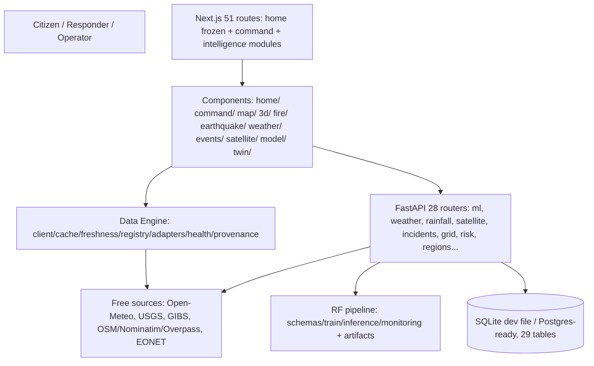

# DRISHTI-X final architecture

## Modules

- **Command Center** (`/command`): status header (truthful since patch), feed strip, KPI row, module status grid (per-endpoint probing), twin viewport, AI panels, telemetry, live map, imagery, globe, gallery. Docs: `COMMAND-CENTER.md`.
- **Risk Map** (`/risk-map`): `RiskGridMap` + 8-layer `DisasterMap`, scale/coords/fullscreen, tile-liveness, inspect dialog.
- **Satellite / EO** (`/satellite`): GIBS viewer (Step 23), `FirePanel` (Step 24, NOT_CONFIGURED), adapters list, reference renders, registry sources.
- **Fire Intelligence**: `adaptFirmsFires` + `firms-fires` kind (disabled without key) + FirePanel.
- **Earthquake Intelligence** (`/earthquakes`): engine `usgs-earthquakes-7d` + list/map/detail/timeline/provenance.
- **Weather Intelligence** (`/weather`): backend chain panels + engine `openmeteo-current` (current/hourly/daily).
- **Disaster Events** (`/events`): engine `eonet-events` + list/map/detail/timeline/filters.
- **AI/ML** (`/model-health`, `/ml`, `/prediction`): SYNTHETIC-DEMO RF artifact, honest states. Docs: `AI-ML.md`, `MODEL-INTELLIGENCE.md`.
- **Model Health**: metrics table, identity, calibration/drift honesty, inference availability, timeline.
- **3D Digital Twin** (`/twin`, `/nesafe`): Three.js/R3F/MapLibre, layers, presets, SIMULATION labels. Docs: `3D-DIGITAL-TWIN.md`.
- **Data Engine** (`src/data/engine/`): canonical normalized layer for Steps 22+. Docs: `DATA-ENGINE.md`.
- **Provenance/status system** (`src/platform/provenance.tsx` + engine types): 11-state model on every value.

## Backend integrations

28 FastAPI routers (admin, ai, alerts, api_v1, auth, grid, history, incidents, ml, model_health, nesafe, notifications, ops, rainfall, regions, resources, response, risk, roads, satellite, sectors, sensors, sync, terrain, vision, warnings, weather, ws_telemetry) + WebSocket telemetry + SQLite (29 tables) + seed demo/geo. **Currently OFFLINE** (Railway trial expired); frontend degrades honestly.
